# WRITE_UP #

## EASYMONEY ##

### 1. Analysis ###
* **Given:** a `C` drive directory.
* **Description:** John is an employee at a mid-sized tech company. He works as a Senior IT support specialist, but his true passion is finding ways to make extra money. John is always on the lookout for giveaways, discounts, and any opportunity to earn a quick buck. He is not particularly tech-savvy when it comes to cybersecurity, but he is resourceful and knows how to follow online tutorials.

  Recently, John came across an enticing giveaway that promised exciting rewards. However, when he opened the giveaway, he did not find or win anything. This made him suspicious that something might have gone wrong with his machine. Concerned about the unusual behavior, John has reached out to you, the investigator, to uncover what happened and whether his system has been compromised.
* **Hints:**
    * First question: Use `Prefetch`
* **Tools:** The tools I used in this Sherlock challenge were:
    * MFTECmd
    * PECmd
    * chainsaw
    * Windows Event Viewer
    * FTK Imager
    * IDA Free
    * Vmware 

### 2. Investigation ###
* **Task 1:** `At what exact time did the user execute the malicious shortcut file?`
    * At first, this task took me almost an hour to submit it right, here I tell my working flow:
    * Since the directory given to us have `$MFT` file, so my first thought was to use `MFTECmd` to parse this file to a more readable format by:
    ```powershell
    D:\tools\MFTECmd\MFTECmd.exe -f 'D:\sv_it\htb\Sherlock\EasyMoney\C\$MFT' --csv 'D:\sv_it\htb\Sherlock\EasyMoney\output'
    ``` 
    * After parsing, I opened the file using Excel, and immediately identified the suspicious `2025-GiveAways.lnk`:
    
    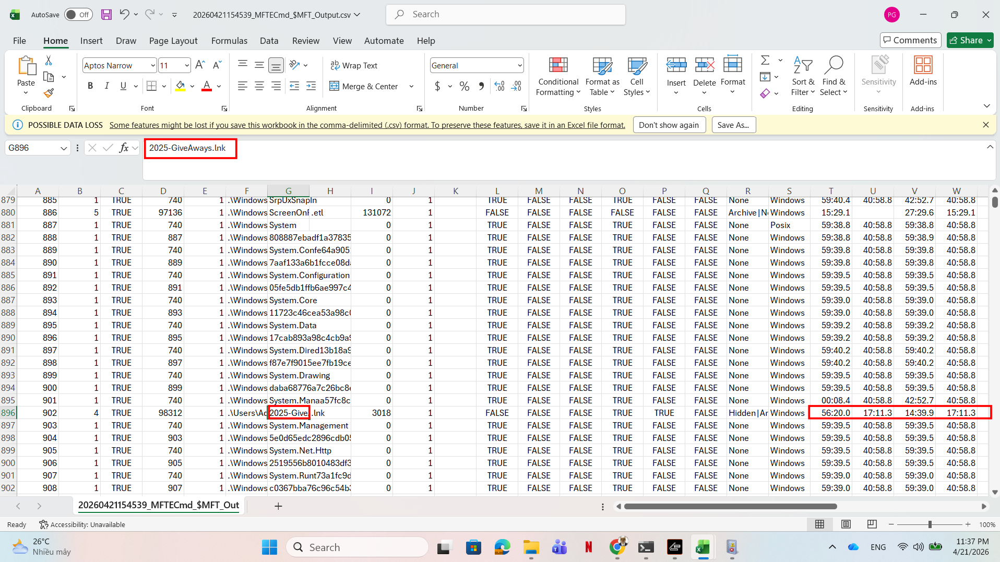

    * However, I tried all possibilities using `LastAccessed`, `LastModified`, ... columns but it didn't work, however I was sure about the date: `2025-01-26`, and the time ranged from `4:17:11 PM` to `4:39:20 PM`, till then I got a hint: Using `prefetch`
    * **Prefetch:** Prefetch is a directory records execution related information about recently run applications, such as their last run time, run count, and files loaded during startup.
    * After receiving the hint, I downloaded and used `PECmd` to parse the `prefetch` folder in `C:\Windows\prefetch`:
    ```powershell
    D:\tools\PECmd\PECmd.exe -d "D:\sv_it\htb\Sherlock\EasyMoney\C\Windows\prefetch" --csv "D:\sv_it\htb\Sherlock\EasyMoney\output"
    ```
    * This resulted in 2 files: `20260421160800_PECmd_Output.csv` and `20260421160800_PECmd_Output_Timeline.csv`
     
    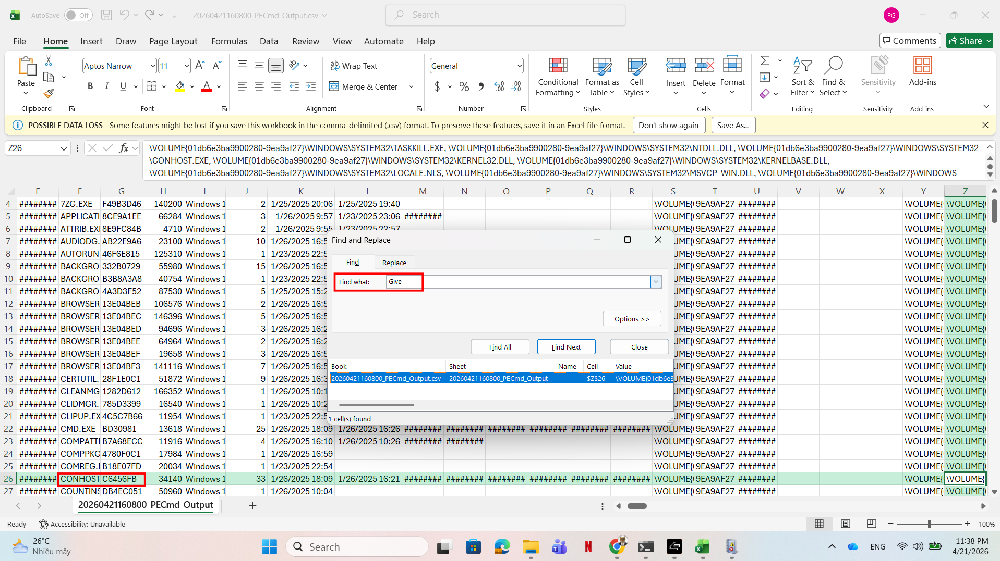

    * Open the normal output file, as the picture shows that the shorcut file was ran by `conhost.exe`, I used the timeline file to get the answer:
    
    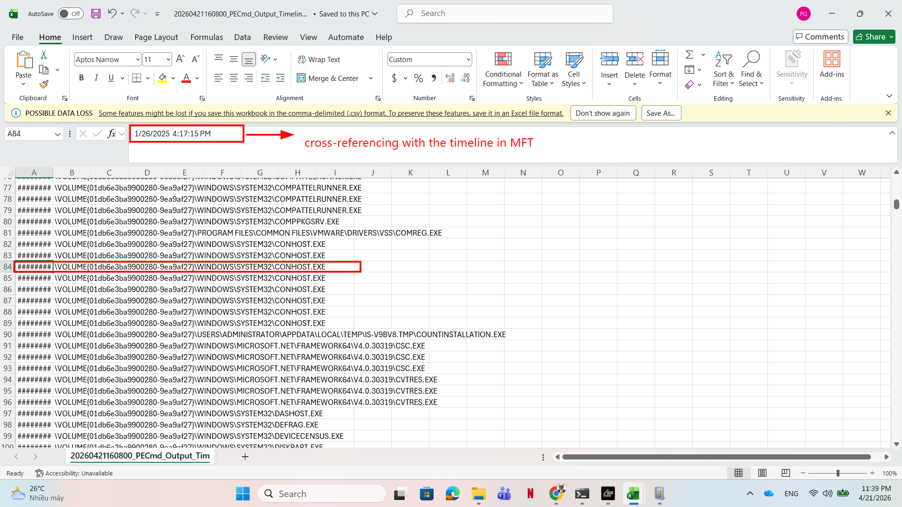 

The answer is: `2025-01-26 16:17:15`

* **Task 2:** `The previous malicious file executed an initial payload. What is the full path of this payload?`
    * Since I got the timestamp of the malicious shortcut file being ran, I filtered the timeline to see what payload was generated around that time:

    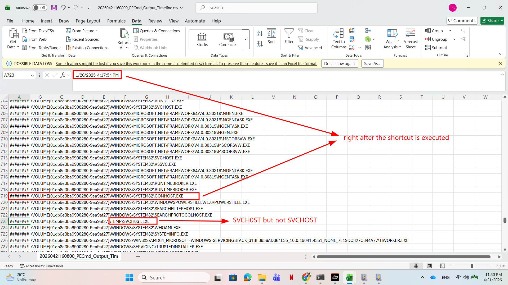 

    * As you can see, there's a suspicious `.exe` named `sv0host` created after few seconds after the shortcut being executed

    * Another way for you to identify the payload is using `Windows PowerShell.evtx` log, by filtering event ID 600 `Provider LifeCycle`, we can easily detect even the command line, the url the attacker download the payload from:

    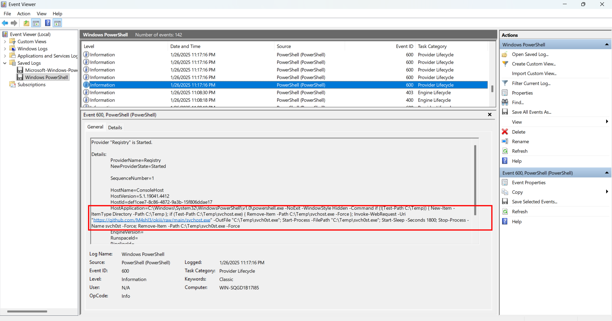

The answer is: `C:\Temp\svch0st.exe`

* **Task 3:** `At what timestamp did the payload execute and grant the attacker shell access?`
    * In the above question, in the timeline csv, we identified the payload so this should be easy:

The answer is: `2025-01-26 16:17:54`

* **Task 4:** `What is the command line the attacker used to enumerate installed packages on the system?`
    * Since the question mentioned command line, I returned to the `Windows PowerShell` log and got the answer:

    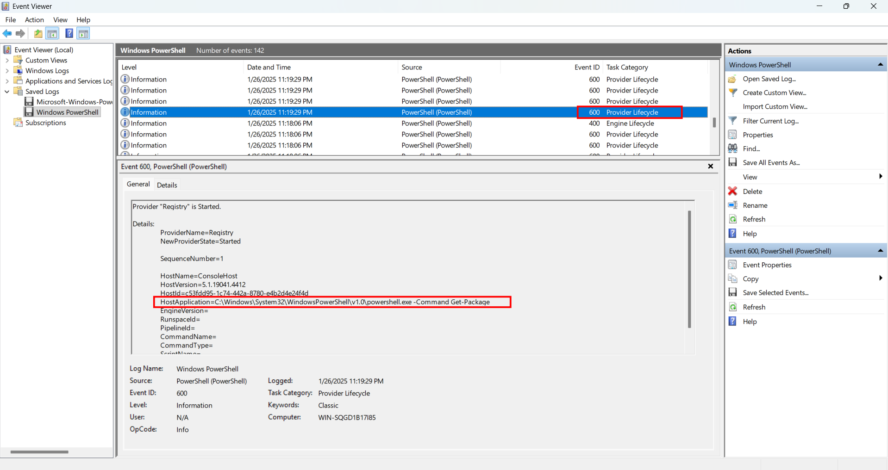 

The answer is: `C:\Windows\System32\WindowsPowerShell\v1.0\powershell.exe -Command Get-Package`

* **Task 5:** `Which application did the attacker identify as vulnerable?`
    * After few tries and missed, I acknowledged the MFT and Prefetch csv are no longer help, since there were a lot of applications downloaded such as `Foxit PDF Reader`, `PDF X`, ...
    * So I tried to use something new, this time I use `chainsaw` to parse all the logs and hunt for suspicious events:

    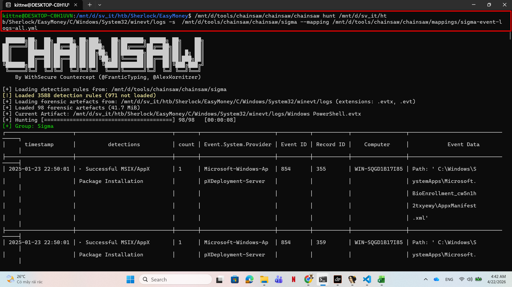

    * After filtering and reading the events, I found this event was so suspicious:

    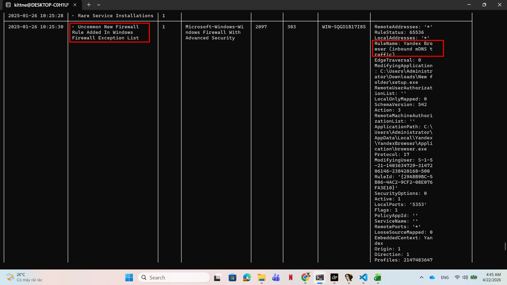  

    * This is event ID 2097 - `Uncommon new firewall rule added in windows firewall exeption list` in `Windows-Windows-Windows Firewall With Advanced Security` log, which is responsible for recording modifications made to the Windows Defender Firewall policies and rule sets. 
    * With this event I could acknowledge some information such as `Direction: 1`, `Action: 3` will allow other machines to establish a connection to victim's machine through a process `browser.exe` lied in `C:\Users\Administator\AppData\Local\Yandex\YandexBrowser\Application` in `Protocol: 17` - `UDP`, `Port: 5353` 
    * That's enough evidence for me to try `YandexBrowser`

The answer is: `YandexBrowser`

* **Task 6:** `What version of that vulnerable application did the attacker identify?`
    * After identifying the application used by the attacker, first I tried look for it by using `FTK Imager`, however I didn't see the file nor the path
    * So I returned to the MFT csv to get the version of `YandexBrowser`:

    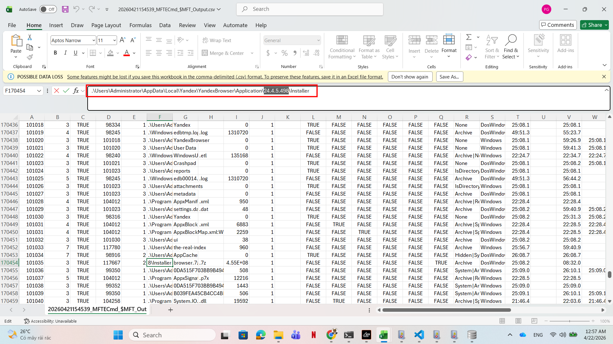 

The answer is: `24.4.5.498`

* **Task 7:** `What is the CVE associated with this vulnerability?`
    * I did a small research on the Internet to get the answer:

    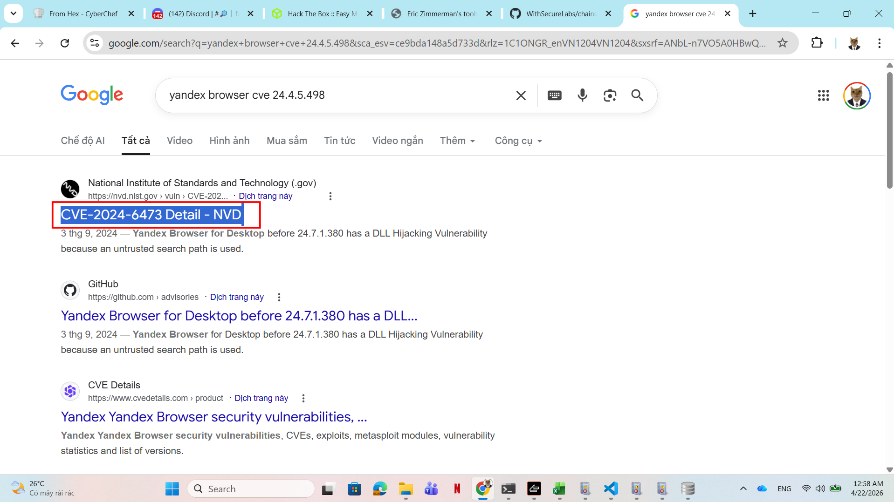 
    
    * To sum up, this CVE refers to a DLL hijacking vulnerability in Yandex Browser because an untrusted search path is used. Because the application may load a malicious DLL from an attacker-controlled location instead of the legitimate one, the attacker can achieve code execution by placing a crafted DLL where the vulnerable binary will load it.
The answer is: `CVE-2024-6473`

* **Task 8 & Task9:** `What is the name of the legitimate binary that the attacker used to deliver the malicious payload and establish persistence on the compromised system?` & `What is the name of the malicious Portable Executable (PE) file that enabled him to accomplish his objective?`
    * This one is the trickiest one, at first glance, `browser.exe` looks sus since it is the process that loads the malicious DLL, however this answer got rejected.
    * After that, I tried to use `Registry Viewer` to see if there's any key written in `Run`, `RunOnce` since the question mentioned persistence, but it sitll pointed to `browser.exe`
    * After that, I tried to list all files relate to `Yandex`, some lied in `C\Windows\System32\Tasks`, ran strings on them provide more binary such as `service_update.exe`, ... but they got no uses.
    * At this point I was too tired, so I did a research on the Internet, after a few time, I found this repo:

    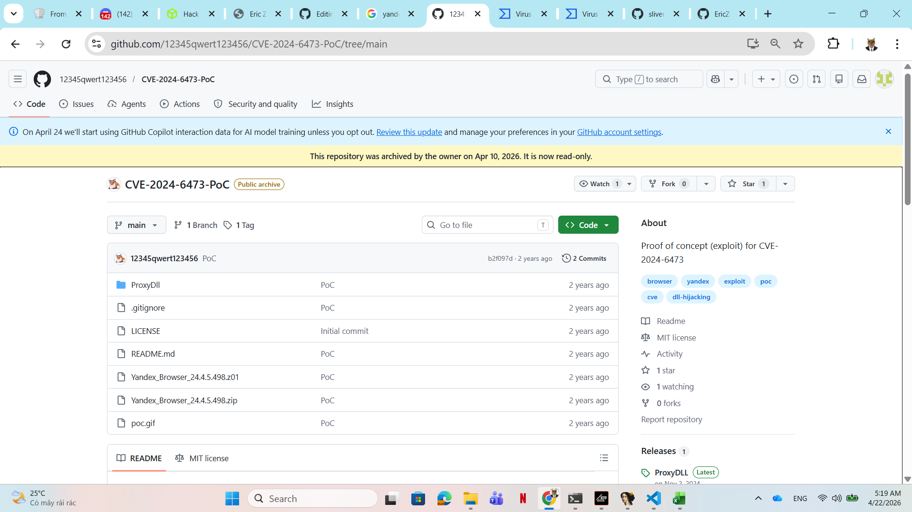

    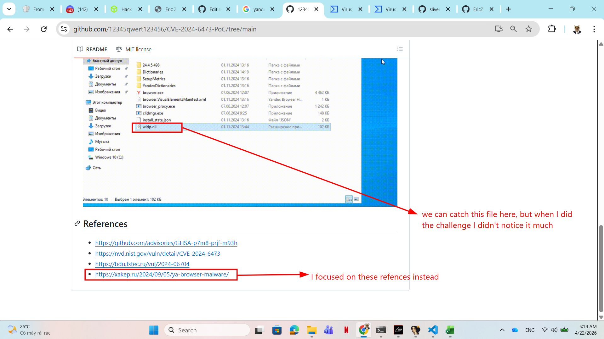

    * In the reference is a Russian article, you can read more about it here: [ya-browser-malware](https://xakep.ru/2024/09/05/ya-browser-malware/), after translating it I saw a brighter picture of the attack chain using this vul:

    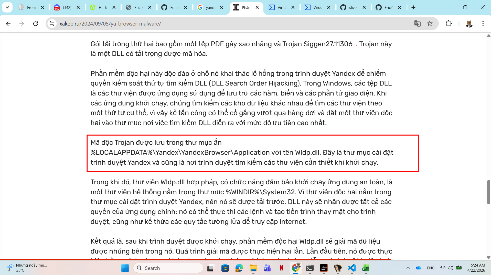 

    * This attack was quite similar to our case, the victim opened a `.lnk`, then it secretly executed a PowerShell script. The script downloaded a dropper here was `YandexUpdater.exe` and a malicious DLL `Wldp.dll` besides the decoy `PDF`. The malware placed the DLL into the `Yandex Browser` installation folder. When the browser ran, it was hijacked to load the malicious DLL by CVE-2024-6473. This allowed the attackers to evade detection, bypass the firewall, and execute a .NET stager to establish a C2 connection.

    * Given a similar case, I returned to the MFT csv to see if there's actually a `.dll` in the folder:

    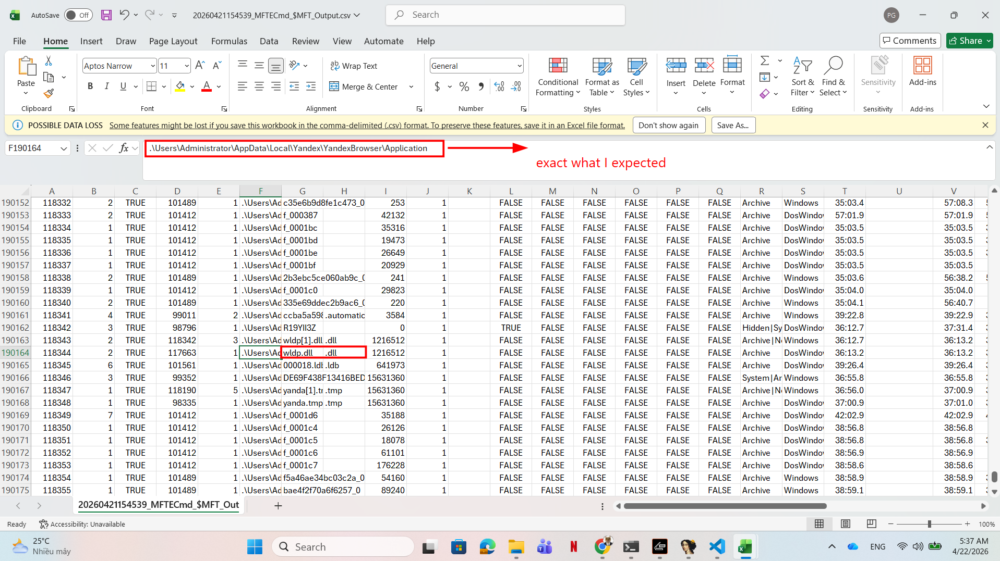 

    * So instead of completing the task8, I accidently identified the task9 first, which is `wldp.dll`

    * Now back to the task8, but since I knew the malicious dll, I just need to find what legitmate binary call this malicious PE by using the Prefetch csv:

    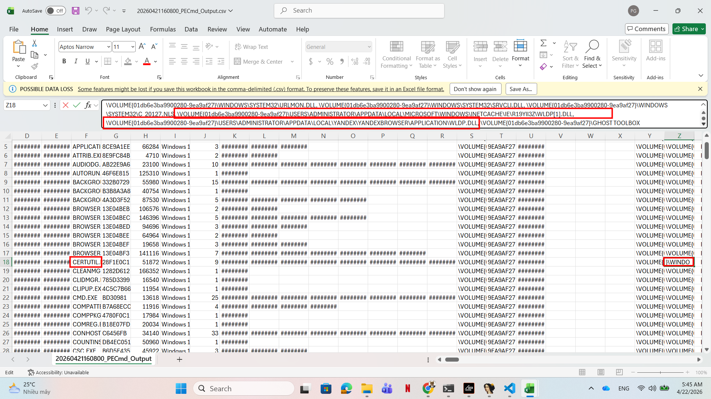 

    * Using find feature, in column `FileLoaded` of `certutil.exe`, we can saw the `wldp.dll` from `\USERS\ADMINISTRATOR\APPDATA\LOCAL\YANDEX\YANDEXBROWSER\APPLICATION\` is loaded instead of the real `.dll`.

The answer is: `certutil.exe` and `wldp.dll`

* **Task 10:** `What is the SHA-256 hash of that malicious file?`
    * In the previous question, since I got the name of the malicious file, first I ran `grep` to locate the file, however it didn't help me at all, look like the attacker had already deleted the payload.
    * However, I knew that the `certutil.exe` delivered the payload, after a few research I acknowledge there's a folder will log all files downloaded by this process: `CryptnetUrlCache` lies in `C\Users\Administrator\AppData\LocalLow\Microsoft`, you can read more about it here: (Certutil)[https://lolbas-project.github.io/lolbas/Binaries/Certutil/] 
    * After identifying the destination, I used `file *` to see if there's any executable, in this case, there were 2: `A16B2E6DE64B13EDF2C00F32C4559930` and `DE69F438F13416BEDB3F9D0DBC8165A8`
    
    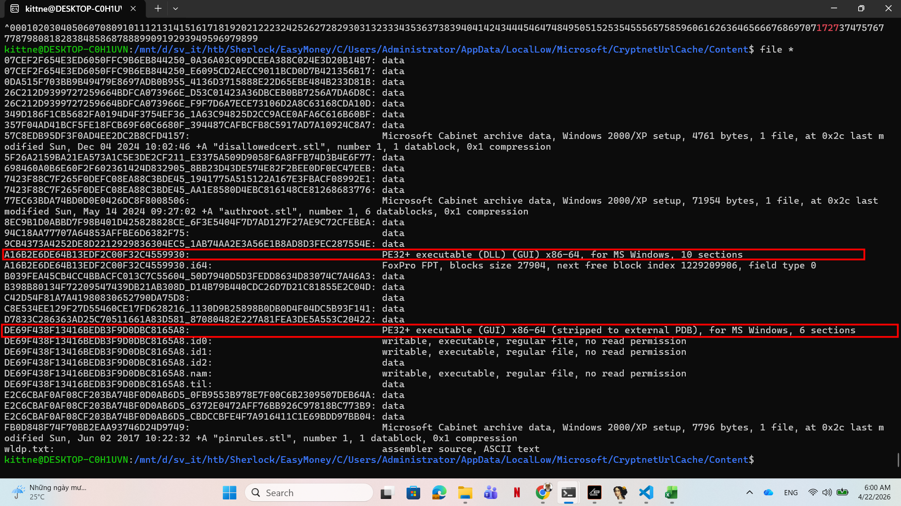

    * Using VirusTotal, I could kill two birds with one stone by identifying the SHA-256 and see if VirusTotal could identify the malware:

    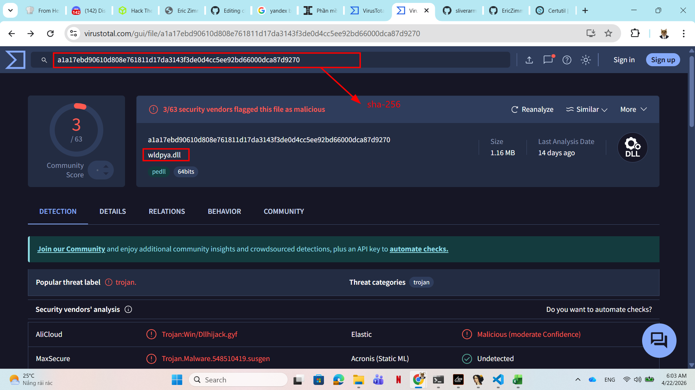

    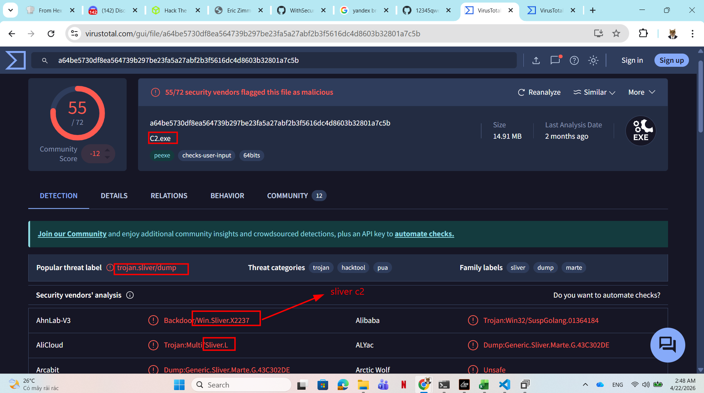 

    * The answer is quite obvious, one is the malicious `.dll` we found above, one is a C2 malware written using `Sliver` framework, let's focus on this question first, the `.dll` file was `A16B2E6DE64B13EDF2C00F32C4559930`
 
The answer is: `a1a17ebd90610d808e761811d17da3143f3de0d4cc5ee92bd66000dca87d9270`

* **Task 11:** `How many milliseconds of cumulative coded sleep delays occurred before the C2 binary provided a shell after the vulnerable application was launched?`
    * At this point it's quite obvious that the `.dll` is a dropper, so here I used `IDA Free` to static analyse it first (I used strings already btw).
    * Using `find` feature looking for keyword `Sleep`, I found this function:

    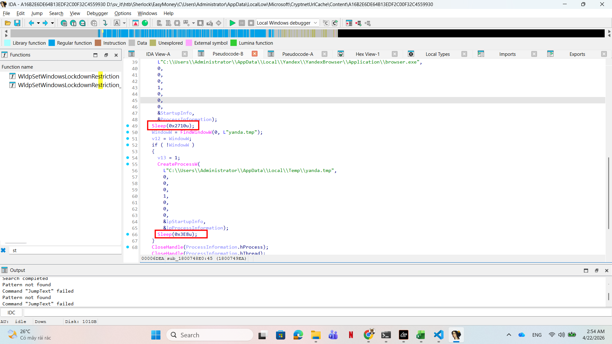 

    * We could see that the malware sleep 2 times with each time was `0x2710u` and `03xE8u` continously before create a process named `yanda.tmp` in `C:\Users\Administrator\AppData\Local\Temp`. Exchange these values to decimal we got the answer

The answer is: `11000`

* **Task 12:** `What is the mutex name used to ensure only one instance of the C2 binary runs at a time?`
    * In the same function I found this answer: 

    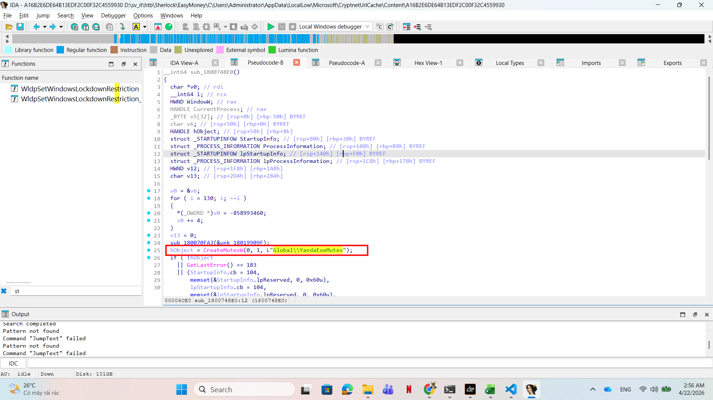 

    * **Mutex name:** A mutex is commonly used by malware to make sure only one copy of the program is running at a time. If another instance starts and finds that the mutex already exists, it knows the malware is already active and can exit instead of launching again. You can read more about it here: [Mutex Object](https://learn.microsoft.com/en-us/windows/win32/sync/mutex-objects)

The answer is: `Global\\YandaExeMutex`


    * In task11 question, I mentioned the information.

The answer is: `C:\Users\Administrator\AppData\Local\Temp\yanda.tmp`

* **Task 14:** `What is the name of the C2 framework used by the attacker?`
    * VirusTotal did all the work.

The answer is: `sliver`

* **Task 15:** `What is the IP address and port number of the malicious C2 server used by the attacker?`
    * At first I tried to static anlyse the `yanda.tmp` which is `DE69F438F13416BEDB3F9D0DBC8165A8`, but after a while I didn't think it was a good idea.  
    * So I found a new way which was Dynamic Analysis. Basically I just dragged the malware to my virtual machine, I set up Procmon a bit to filter only activity of the malware. After running it and filter the TCP connect I got this:
     
    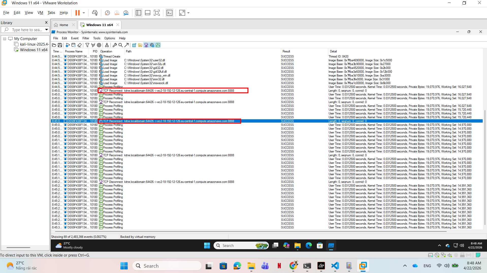 

    ```text
    8:45:06.5984268 AM
  DE69F438F13416BEDB3F9D0DBC8165A8.exe
  10180
  TCP Reconnect
  kitne.localdomain:64426 -> ec2-18-192-12-126.eu-central-1.compute.amazonaws.com:8888
  SUCCESS
  Length: 0, seqnum: 0, connid: 0
  ```
    * remote host: ec2-18-192-12-126.eu-central-1.compute.amazonaws.com
    * remote IP: 18.192.12.126
    * remote port: 8888
 
The answer is: `18.192.12.126:8888`

### 3. Attack Chain ###
* Here the attack chain:
```text
                ------------------------------------------------------------
                | PHASE 1: Initial Access                                  |
                | - User executed `2025-GiveAways.lnk`                     |
                | - Hidden PowerShell downloaded `C:\Temp\svch0st.exe`     |
                | - Shell access was granted at `2025-01-26 16:17:54`      |
                ------------------------------------------------------------
                                           |
                ------------------------------------------------------------
                | PHASE 2: Host Enumeration                                |
                | - The attacker ran `powershell.exe -Command Get-Package` |
                | - He identified `YandexBrowser 24.4.5.498` as vulnerable |
                | - The vulnerability was `CVE-2024-6473`                  |
                ------------------------------------------------------------
                                           |
                ------------------------------------------------------------
                | PHASE 3: Delivery & Persistence                          |
                | - The attacker used `certutil.exe` to deliver            |
                |   the malicious `wldp.dll`                               |
                | - The DLL hijack abused the Yandex Browser search path   |
                ------------------------------------------------------------
                                           |
                ------------------------------------------------------------
                | PHASE 4: Payload Execution                               |
                | - `wldp.dll` dropped and launched                        |
                |   `C:\Users\Administrator\AppData\Local\Temp\yanda.tmp`  |
                ------------------------------------------------------------
                                           |
                ------------------------------------------------------------
                | PHASE 5: C2 Server Connection                            |
                | - The payload established outbound TCP communication     |
                | - remote host: ec2-18-192-12-126.eu-central-1.compute.   |
                |  amazonaws.com                                           |
                | - remote IP: 18.192.12.126                               |
                | - remote port: 8888                                      |
                ------------------------------------------------------------                           
```                