# DDoS

## 1. Miêu tả bài

A bank's international payment application was hit by a DDoS attack. The investigation team extracted logs from that application to investigate the cause of the DDoS attack on the international payment gateway. Investigate how the attacker group carried out the DDoS attack on the bank's international payment gateway and find the attacker's IP address.

Format: MTA60{sha256(IP)}

## 2. Phân tích log

File log có dạng JSON theo từng dòng, trong đó các trường quan trọng gồm:

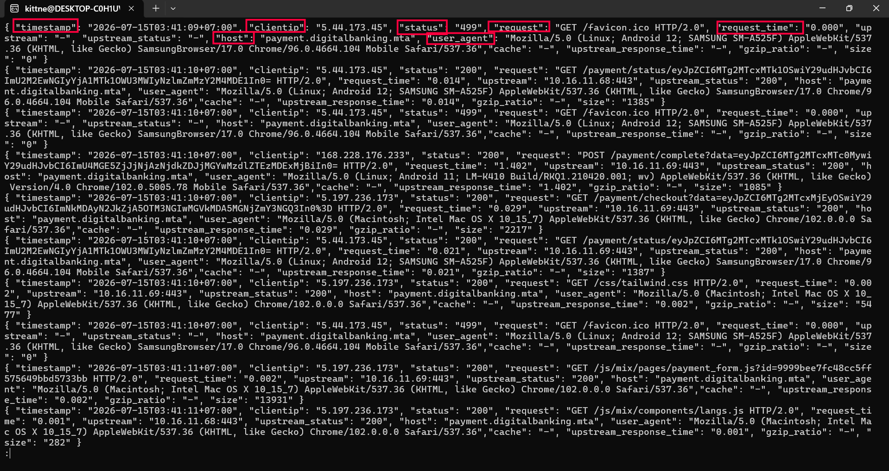

- `timestamp`: thời điểm request.
- `clientip`: IP gửi request.
- `request`: phương thức và đường dẫn request.
- `status`: HTTP status.
- `user_agent`: User-Agent.
- `request_time`, `upstream_status`, `upstream_response_time`: thời gian xử lý và trạng thái backend.

Các request lỗi 404 tăng mạnh từ khoảng `2026-07-15T23:15:25+07:00`. Dòng đầu tiên dễ nhận thấy của cụm DDoS là:

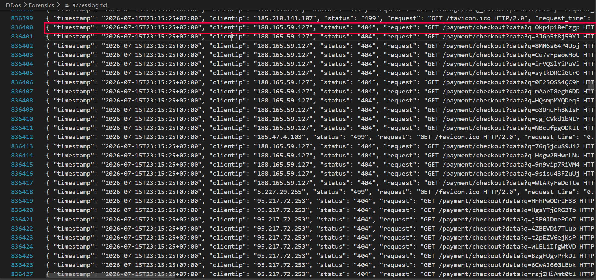

```text
timestamp: 2026-07-15T23:15:25+07:00
clientip: 188.165.59.127
status: 404
request: GET /payment/checkout?data?q=Okp4p18eFzgp HTTP/2.0
```

Khi thống kê các endpoint liên quan đến thanh toán, ta thấy có hai nhóm request bất thường:

```text
GET /payment/checkout?data?q=<random>
GET /payment/checkout?data=<token>
```

### Nhóm 1:

Nhóm đầu tiên có số lượng rất lớn. Tham số `q` luôn là chuỗi ngẫu nhiên 12 ký tự, ví dụ:

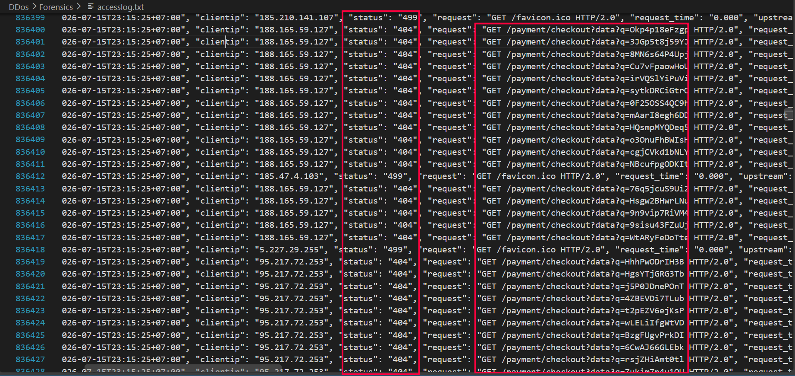

```text
/payment/checkout?data?q=Okp4p18eFzgp
/payment/checkout?data?q=3JGp5t8j59YJ
/payment/checkout?data?q=8MN6s64P4Upj
```

Đây là vector flood chính dùng để gây tải lên endpoint checkout. Tuy nhiên dễ thấy các IP gửi nhiều request trong nhóm này chỉ là các bot/proxy tham gia DDoS, không phải IP thật của attacker.

Khi nhờ AI phân tích, ta thu được hầu hết IP trong pha này gửi số request theo bội số của 64. Đây là dấu hiệu của công cụ DDoS chia việc thành các batch cố định qua danh sách proxy. Nhiều request còn bị chuyển qua cả hai upstream là `10.16.11.69:443` và `10.16.11.68:443`

Một request sai định dạng vẫn có thể khiến ứng dụng thử nhiều backend trước khi trả lỗi, làm tăng chi phí xử lý phía ngân hàng. Vì vậy đây là HTTP Layer-7 GET flood vào endpoint checkout, không phải volumetric DDoS tầng mạng.

### Nhóm 2:

Nhóm thứ hai là replay một token thanh toán hợp lệ:

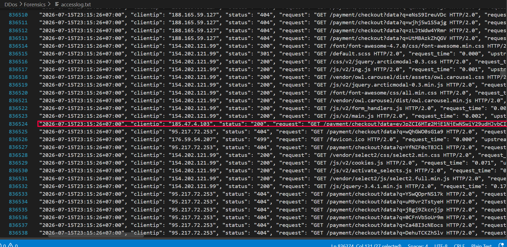

```text
eyJpZCI6MTg2MjE1NjEyOSwiY29udHJvbCI6ImEyYzcyMzBlODViYzU4M2UwNWRkMzc4OTFmYWNhZmRiIn0=
```

Giải mã Base64:

```json
{"id":1862156129,"control":"a2c7230e85bc583e05dd37891facafdb"}
```

Như vậy attacker dùng hai chiến thuật:

```text
Pha 1: malformed-query flood qua proxy pool
Pha 2: valid-token flood qua proxy/Tor/VPS pool
```

## Workflow của phiên thanh toán bình thường

Sau một lúc quan sát, ta thấy được một phiên thanh toán bình thường thường có flow:

```text
GET /payment/checkout?data=<token>
        ↓
Tải CSS, JavaScript, ảnh, favicon
        ↓
POST /payment/checkout
        ↓
/payment/status hoặc /payment/threeds
        ↓
/payment/complete
```

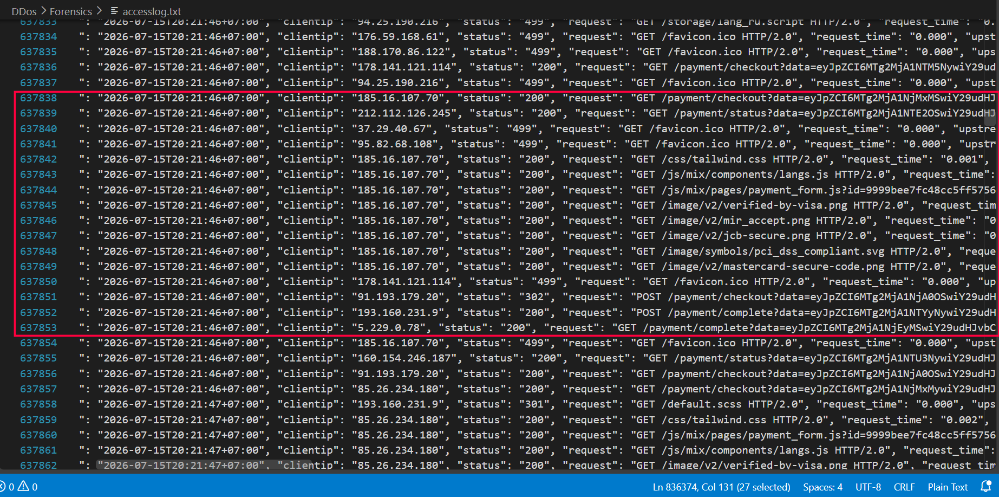

Người dùng thông thường chỉ làm việc với một token tại một thời điểm, có chuỗi tải asset và các bước thanh toán tiếp theo. Họ không phát token qua Telegram, không kích hoạt nhiều node kiểm tra hạ tầng, và không quay lại token cũ đúng lúc hệ thống đang bị DDoS để kiểm tra lỗi.

Từ baseline này, cần tìm IP có hành vi chuẩn bị khác biệt chứ không phải chỉ tìm IP gửi flood.

## Dấu vết operator

Khi kiểm tra các request trước thời điểm DDoS, ta thấy IP `42.114.215.243` có hành vi bất thường:

Tại `2026-07-15T21:48:46+07:00`, IP này truy cập hai checkout token khác nhau gần như cùng lúc:

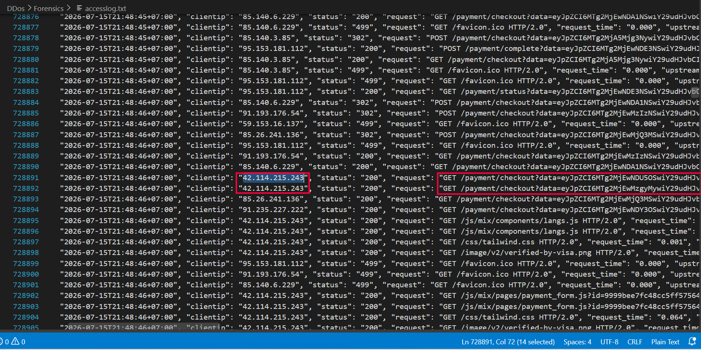

```text
728891:
timestamp: 2026-07-15T21:48:46+07:00
clientip: 42.114.215.243
status: 200
request: GET /payment/checkout?data=eyJpZCI6MTg2MjEwNDU5OSwiY29udHJvbCI6IjE5Y2M1MjFhZjU4MjU0NzVlNGFlYjA2ODU4N2M5NjY1In0%3D HTTP/2.0
user_agent: Mozilla/5.0 (iPhone; CPU iPhone OS 15_2_1 like Mac OS X) ...

728892:
timestamp: 2026-07-15T21:48:46+07:00
clientip: 42.114.215.243
status: 200
request: GET /payment/checkout?data=eyJpZCI6MTg2MjEwMzgyMywiY29udHJvbCI6IjUwZGE5NTg3ZmZlMjI5YjhjN2ZjNmJiMjgzMzQyODYwIn0%3D HTTP/2.0
user_agent: Mozilla/5.0 (iPhone; CPU iPhone OS 15_2_1 like Mac OS X) ...
```

Hai token này giải mã Base64 lần lượt là:

```json
{"id":1862104599,"control":"19cc521af5825475e4aeb068587c9665"}
{"id":1862103823,"control":"50da9587ffe229b8c7fc6bb283342860"}
```

Ngay sau đó, token `1862104599` xuất hiện từ TelegramBot:

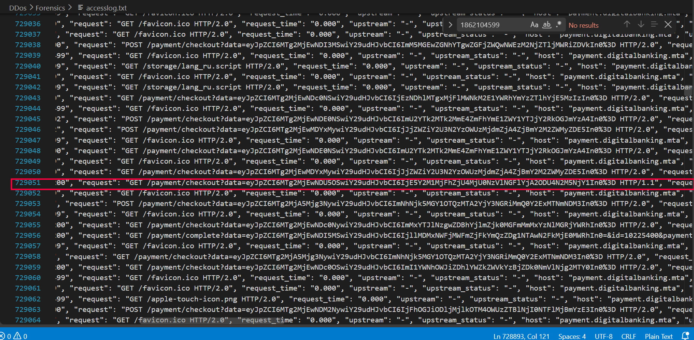

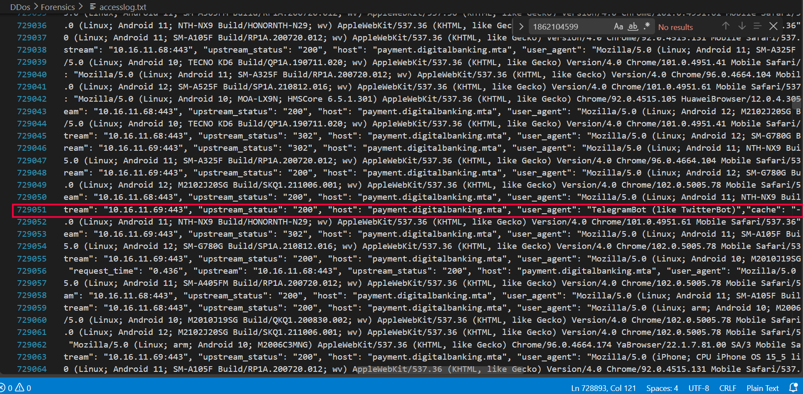

```text
729051:
timestamp: 2026-07-15T21:48:53+07:00
clientip: 149.154.161.20
status: 200
request: GET /payment/checkout?data=eyJpZCI6MTg2MjEwNDU5OSwiY29udHJvbCI6IjE5Y2M1MjFhZjU4MjU0NzVlNGFlYjA2ODU4N2M5NjY1In0%3D HTTP/1.1
user_agent: TelegramBot (like TwitterBot)
```

`149.154.161.20` là TelegramBot tạo preview cho đường link được gửi qua Telegram. Khoảng vài giây sau TelegramBot, token tiếp tục được mở bởi IP `5.18.87.231`:

```text
729189:
timestamp: 2026-07-15T21:48:58+07:00
clientip: 5.18.87.231
status: 200
request: GET /payment/checkout?data=eyJpZCI6MTg2MjEwNDU5OSwiY29udHJvbCI6IjE5Y2M1MjFhZjU4MjU0NzVlNGFlYjA2ODU4N2M5NjY1In0%3D HTTP/2.0
```

IP này có thể là thiết bị thứ hai hoặc một thành viên khác trong nhóm, nhưng không phải IP đầu tiên của chuỗi recon. Sau đó cùng token này tiếp tục được truy cập từ nhiều node `CheckHost`:

```text
729484:
timestamp: 2026-07-15T21:49:07+07:00
clientip: 185.209.161.169
user_agent: CheckHost (https://check-host.net/)

729487:
timestamp: 2026-07-15T21:49:07+07:00
clientip: 179.43.148.195
user_agent: CheckHost (https://check-host.net/)

729492:
timestamp: 2026-07-15T21:49:07+07:00
clientip: 88.119.179.10
user_agent: CheckHost (https://check-host.net/)
```

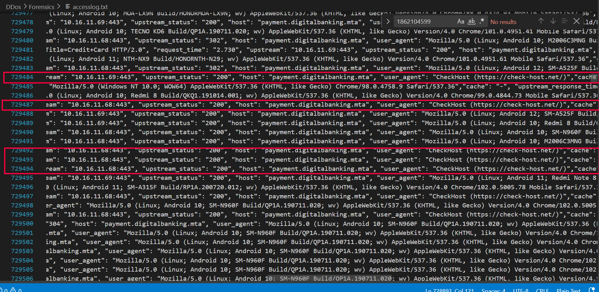

Điều này cho thấy link checkout được IP `42.114.215.243` mở trước, sau đó bị đưa ra Telegram và dịch vụ CheckHost để kiểm tra khả năng truy cập từ nhiều nơi. Đây là hành vi chuẩn bị và kiểm tra mục tiêu trước khi tấn công, không giống hành vi khách hàng bình thường.

Chuỗi recon có thể tóm tắt như sau:

```text
42.114.215.243
        │ khoảng 7 giây
        ▼
TelegramBot
        │ khoảng 5 giây
        ▼
5.18.87.231
        │ khoảng 9 giây
        ▼
nhiều node CheckHost
```

Đến `22:04:36`, `42.114.215.243` tiếp tục mở thêm một token thanh toán mới:

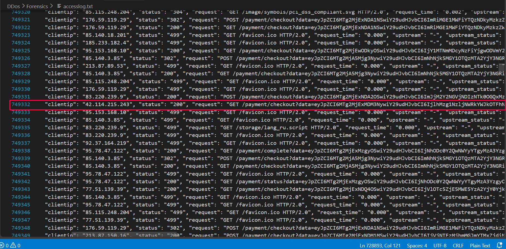

```text
749332:
timestamp: 2026-07-15T22:04:36+07:00
clientip: 42.114.215.243
status: 200
request: GET /payment/checkout?data=eyJpZCI6MTg2MjExMDM3NywiY29udHJvbCI6IjlhMzg1NzljNWRkYWJkOTFhNjhhNTExZGU2NTJlNGQ4In0%3D HTTP/2.0

749355:
timestamp: 2026-07-15T22:04:38+07:00
clientip: 42.114.215.243
status: 200
request: GET /payment/checkout?data=eyJpZCI6MTg2MjExMDM3NywiY29udHJvbCI6IjlhMzg1NzljNWRkYWJkOTFhNjhhNTExZGU2NTJlNGQ4In0%3D HTTP/2.0
```

Request được lặp lại sau hai giây nhưng không có flow hoàn tất giao dịch. Điều này tiếp tục củng cố giả thuyết IP này đang kiểm tra endpoint thanh toán, không thực hiện giao dịch bình thường.

## Liên hệ với thời điểm DDoS

Trong thời gian DDoS đang diễn ra, token `1862103823` mà `42.114.215.243` từng mở trước đó lại xuất hiện.

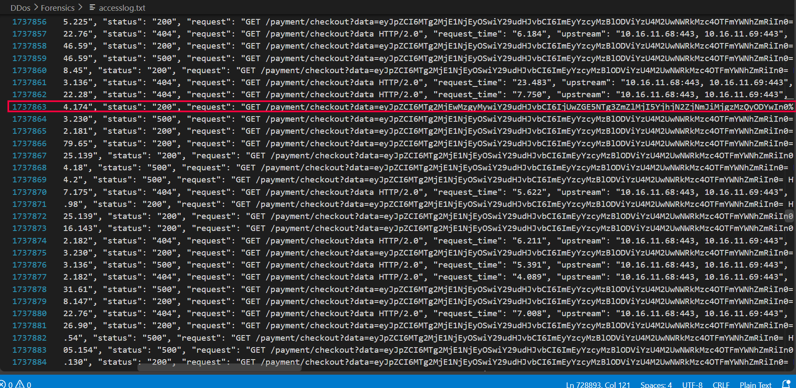

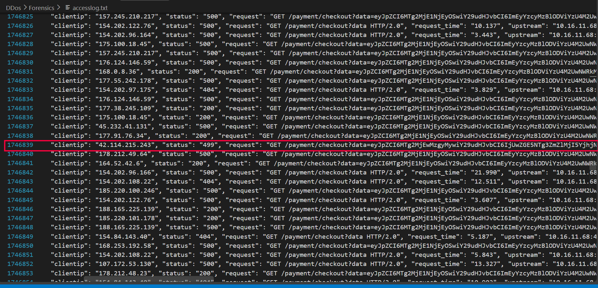

```text
1737863:
timestamp: 2026-07-15T23:24:52+07:00
clientip: 37.110.114.174
status: 200
request: GET /payment/checkout?data=...1862103823...

1743167:
timestamp: 2026-07-15T23:24:59+07:00
clientip: 37.110.114.174
status: 499
request: GET /payment/checkout?data=...1862103823...

1746839:
timestamp: 2026-07-15T23:25:08+07:00
clientip: 42.114.215.243
status: 499
request: GET /payment/checkout?data=eyJpZCI6MTg2MjEwMzgyMywiY29udHJvbCI6IjUwZGE5NTg3ZmZlMjI5YjhjN2ZjNmJiMjgzMzQyODYwIn0%3D HTTP/2.0
upstream_status: 500, -
```

Dòng cuối rất quan trọng: chính IP `42.114.215.243` quay lại kiểm tra token cũ trong lúc hệ thống đã bị ảnh hưởng bởi DDoS. Request trả về `499` và backend có `upstream_status: 500, -`, phù hợp với trạng thái gateway đang lỗi.

IP này không kiểm tra token DDoS `1862156129` trực tiếp. Thay vào đó, nó dùng token cũ làm một control URL để xem cổng thanh toán còn hoạt động hay không. Kết quả `500` rồi timeout cho thấy cuộc tấn công đã ảnh hưởng đến backend. Hành vi này phù hợp với attacker kiểm tra hiệu quả DDoS.

## Kết luận

Cuộc tấn công được thực hiện theo hướng:

1. Operator truy cập các link checkout hợp lệ để lấy/kiểm tra token.
2. Link checkout được đưa qua Telegram và CheckHost để kiểm tra khả năng truy cập từ nhiều vị trí.
3. Sau đó botnet/proxy flood endpoint:

```text
GET /payment/checkout?data?q=<random>
```

và replay các checkout token, gây lỗi `499`, `500`, `502`, `504` trên gateway.

Flow tổng quát:

```text
[42.114.215.243]
        │
        ├── Mở nhiều token thanh toán để recon
        ├── Gửi token thử qua Telegram
        │          └── TelegramBot tạo preview
        ├── Token được mở từ thiết bị/IP thứ hai
        ├── Kích hoạt CheckHost từ nhiều vị trí
        ▼
[Chuẩn bị proxy/Tor/VPS pool]
        │
        ├── Pha 1: malformed GET requests
        ├── Pha 2: GET requests replay token hợp lệ
        ▼
[Backend quá tải, xuất hiện 500/499/timeout]
        │
        ▼
[42.114.215.243]
Kiểm tra lại token cũ để xác nhận tác động
```

Các IP có lượng request lớn chỉ là bot/proxy trong DDoS. IP để lại dấu vết chuẩn bị và kiểm tra tấn công là:

```text
42.114.215.243
```

Ta tính được SHA-256 của chuỗi IP bằng lệnh sau:

```bash
printf '42.114.215.243' | sha256sum
# thu được: 5d8ff637aa91217932331185a75808fdc42762b0dd5173f25db0caca4383c403

```

## Flag

```text
MTA{5d8ff637aa91217932331185a75808fdc42762b0dd5173f25db0caca4383c403}
```
