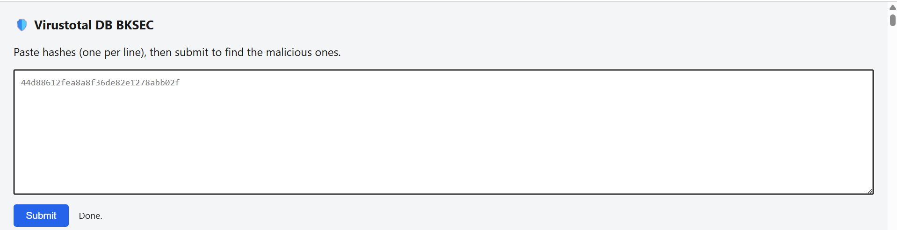
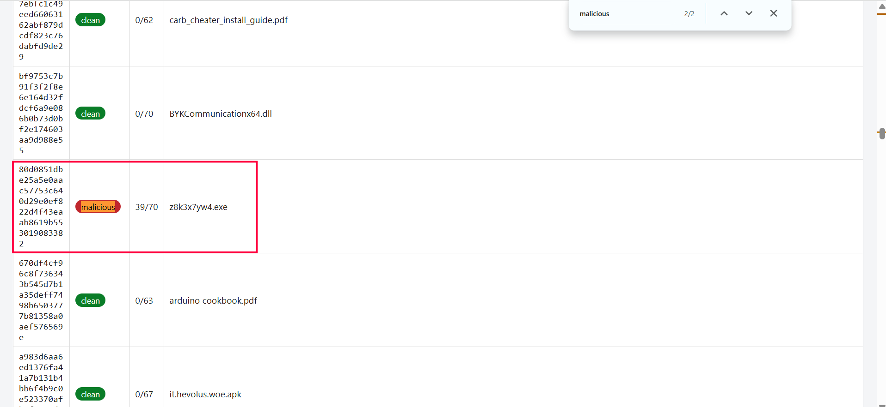

# HASHES

Đề cho 1 file hashes.txt dài 80k dòng, cần tìm malware hash. Bài này dùng tool nội bộ của clb bksec. Cắt file lớn thành các file nhỏ, mỗi file 10k dòng rồi up lên tool:

```bash
split -l 10000 -d -a 1 --additional-suffix=.txt hashes.txt hashes_
```



