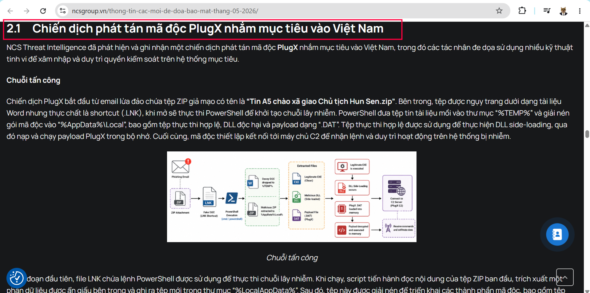
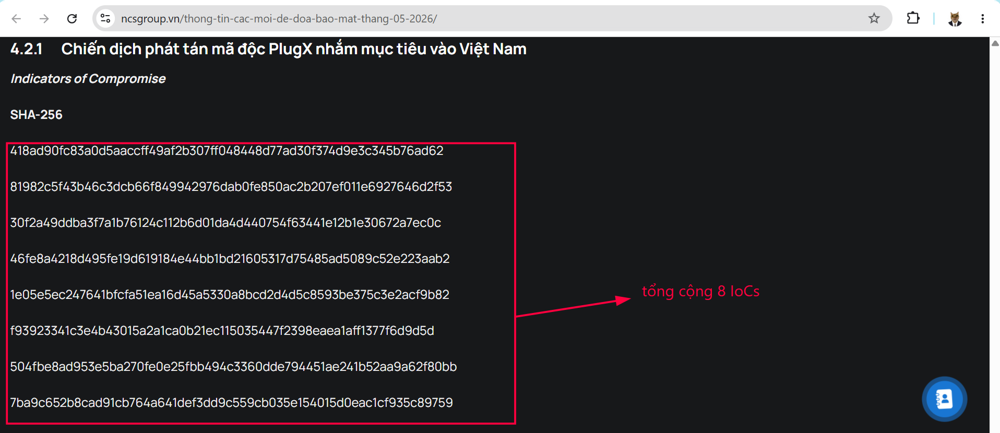
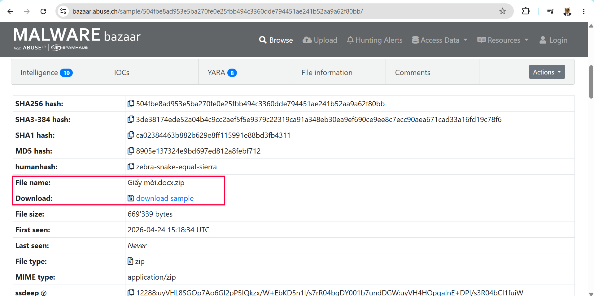
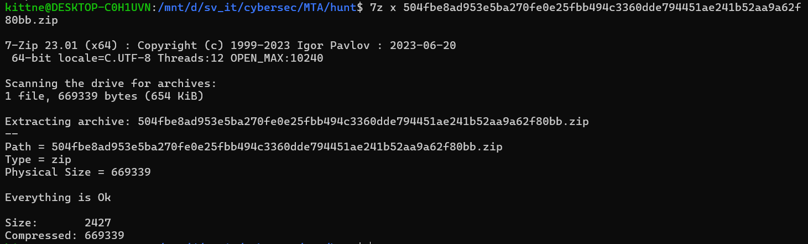
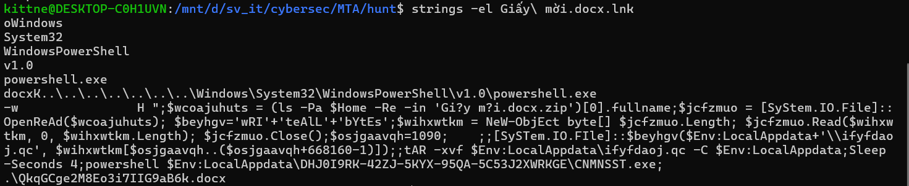
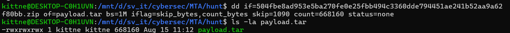
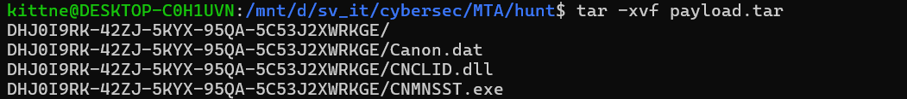
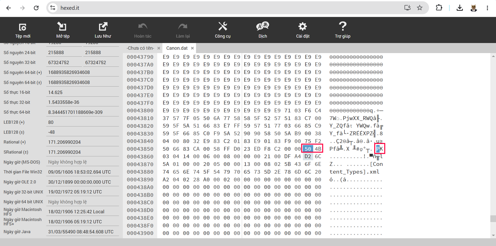
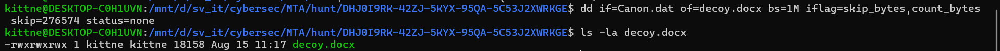
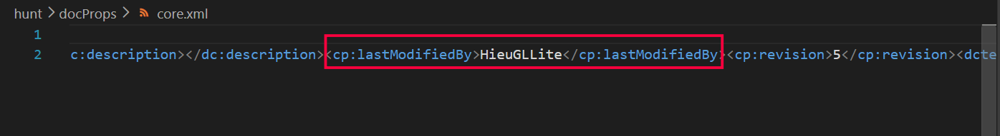

# Threat Hunting

## 1. Miêu tả bài

Trong quá trình Threat Hunting, chúng tôi phát hiện một địa chỉ C&C được kết nối bởi nhiều máy tính khác nhau trong tổ chức, có lưu lượng mạng đáng ngờ xuất hiện. Đồng thời, chúng tôi đã thu thập được một số tài liệu được cho là đã bị thu thập bởi mã độc có liên quan đến C&C này và bị mã độc lạm dụng. Bạn có thể tìm ra thông tin Username đã tạo tài liệu và hash SHA256 của tài liệu này được không? C&C: dalerocks.com

Format flag: MTA60{username_hash SHA256}

## 2. Phân tích domain `dalerocks.com`

Điểm xuất phát là tên miền `dalerocks.com`. Khi tìm kiếm tên miền này trên Internet, ta tìm thấy báo cáo [Thông tin các mối đe dọa bảo mật tháng 05/2026 của NCS Group](https://ncsgroup.vn/thong-tin-cac-moi-de-doa-bao-mat-thang-05-2026/). Báo cáo mô tả một chiến dịch phát tán PlugX nhắm vào Việt Nam, sử dụng tệp `LNK`, `PowerShell` và kỹ thuật `DLL side-loading`. Ở cuối chuỗi lây nhiễm, mã độc kết nối tới C2 `dalerocks.com`.

Phần **4.2.1 – Chiến dịch phát tán mã độc PlugX nhắm mục tiêu vào Việt Nam** cung cấp danh sách IoC gồm tám mã băm SHA-256 và chính tên miền trên:



Trong đó có 8 IOCs, sau khi thử qua thì đây là IoC cần dùng để phân tích:



```text
504fbe8ad953e5ba270fe0e25fbb494c3360dde794451ae241b52aa9a62f80bb
```

Mẫu này có thể tra cứu trên [MalwareBazaar](https://bazaar.abuse.ch/sample/504fbe8ad953e5ba270fe0e25fbb494c3360dde794451ae241b52aa9a62f80bb/) với tên `Giấy mời.docx.zip`. Đây là nhánh chứa tài liệu thật đã bị đánh cắp và được tái sử dụng làm mồi nhử.



## 3. Phân tích `Giấy mời.docx.zip`

Sau khi tải mẫu về và kiểm tra lại mã băm, kết quả khớp với IoC:

```powershell
sha256sum 'Giấy mời.docx.zip'
504fbe8ad953e5ba270fe0e25fbb494c3360dde794451ae241b52aa9a62f80bb  Giấy mời.docx.zip
```

Ta unzip tệp zip này sẽ thu được 1 tệp zip khác:

```bash
7z x Giấy\ mời.docx.zip -pinfected
# thu được: 504fbe8ad953e5ba270fe0e25fbb494c3360dde794451ae241b52aa9a62f80bb.zip
```

File `.zip` mới này nặng tới 654KB, tuy nhiên nếu extract tệp ZIP mới này như bình thường thì chỉ hiển thị một tệp shortcut có nội dung rất nhỏ so với chính file này:



```text
Giấy mời.docx.lnk
```



Đây là shortcut Windows. Phần đối số của LNK chứa lệnh PowerShell với các thao tác chính sau:

1. Đọc lại chính tệp ZIP ban đầu.
2. Lấy `668160` byte dữ liệu kể từ offset `1090`.
3. Ghi phần dữ liệu này thành `%LocalAppData%\ifyfdaoj.qc`.
4. Dùng `tar.exe` giải nén tệp vừa tạo vào `%LocalAppData%`.
5. Khởi chạy `%LocalAppData%\DHJ0I9RK-42ZJ-5KYX-95QA-5C53J2XWRKGE\CNMNSST.exe`.



Như vậy ta đã có payload TAR được nối ẩn phía sau dữ liệu ZIP. Sau khi tách và giải nén payload, thư mục thu được chứa bộ ba thành phần:



| Tệp | Vai trò |
|---|---|
| `CNMNSST.exe` | Tệp thực thi hợp lệ, có chữ ký số của Canon |
| `CNCLID.dll` | DLL độc hại được nạp bằng kỹ thuật DLL side-loading |
| `Canon.dat` | Payload PlugX đã mã hóa và dữ liệu tài liệu mồi |

Khi `CNMNSST.exe` chạy, chương trình nạp `CNCLID.dll` từ cùng thư mục. DLL này tiếp tục đọc, giải mã và thực thi payload trong `Canon.dat`. Chuỗi này phù hợp với mô tả kỹ thuật trong báo cáo NCS.

Các mã băm liên quan trực tiếp tới nhánh `Giấy mời` là:

| Thành phần | SHA-256 |
|---|---|
| `Giấy mời.docx.zip` | `504fbe8ad953e5ba270fe0e25fbb494c3360dde794451ae241b52aa9a62f80bb` |
| `Giấy mời.docx.lnk` | `7ba9c652b8cad91cb764a641def3dd9c559cb035e154015d0eac1cf935c89759` |
| `CNCLID.dll` | `f93923341c3e4b43015a2a1ca0b21ec115035447f2398eaea1aff1377f6d9d5d` |
| `Canon.dat` | `1e05e5ec247641bfcfa51ea16d45a5330a8bcd2d4d5c8593be375c3e2acf9b82` |

## 4. Tách tài liệu mồi khỏi `Canon.dat`

Khi kiểm tra `Canon.dat`, ta có thể tìm thấy chữ ký đầu tệp ZIP `PK\x03\x04` tại offset `276574`. Khác với phần payload bị mã hóa, vùng dữ liệu này là một tệp ZIP đọc được trực tiếp. Bên cạnh đó nội dung trong file zip còn thể hiện các thuộc tính của 1 file `.docx` đó là `[Content_Types].xml`, `rels\.rels`,... .Đây là dấu hiệu cho thấy một tài liệu Word đã được nối vào `Canon.dat`.



Có thể tách phần overlay bằng lệnh sau:

```bash
dd if=Canon.dat of=decoy.docx bs=1M skip=276574 status=none
file decoy.docx
sha256sum decoy.docx
```



Phần overlay có kích thước `18158` byte. Tệp thu được là một DOCX hợp lệ, chứa đầy đủ các thành phần như `[Content_Types].xml`, `word/document.xml` và `docProps/core.xml`. Mã băm của tài liệu là:

```text
0e1af119fcdf669dc18377ab346217b6b0d247c28d330a5a80f14aadc1d92225
```

Nội dung tài liệu là giấy mời của Viện Đào tạo và Phát triển nhân lực mời tham dự khai mạc. Nội dung có tính thực tế cao cho thấy đây chính là tài liệu bị thu thập rồi tái sử dụng làm mồi nhử, đúng với dữ kiện của đề bài.

## 5. Xác định username tạo tài liệu

Metadata của tài liệu nằm trong `docProps/core.xml`. Có thể đọc trực tiếp mà không cần mở tài liệu:

```bash
7z x decoy.docx
```

Các trường đáng chú ý:

```xml
<dc:creator>AutoBVT</dc:creator>
<cp:lastModifiedBy>HieuGLLite</cp:lastModifiedBy>
<dcterms:created>2026-04-14T07:03:00Z</dcterms:created>
<dcterms:modified>2026-04-14T07:13:00Z</dcterms:modified>
```



## 6. Flag

Trường `lastModifiedBy` là trường đáp án chứ không phải trường creator. Ghép username của người tạo tài liệu với SHA-256 của chính tài liệu theo định dạng đề bài:

```text
username = HieuGLLite
SHA-256 = 0e1af119fcdf669dc18377ab346217b6b0d247c28d330a5a80f14aadc1d92225
```

Flag:

```text
MTA60{HieuGLLite_0e1af119fcdf669dc18377ab346217b6b0d247c28d330a5a80f14aadc1d92225}
```
