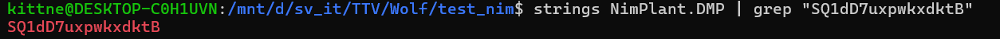
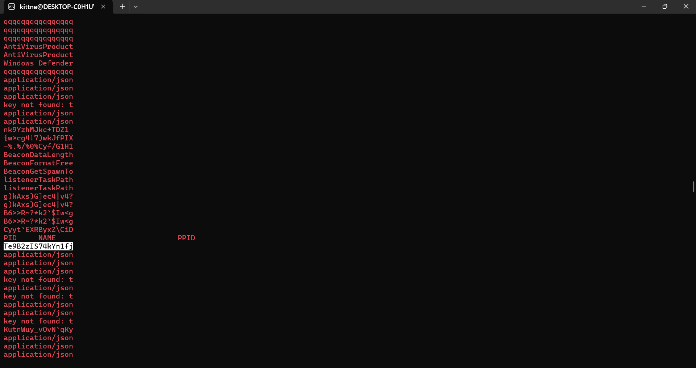

# Wolfenstein #

## 1. Analysis ##
* **Given:** a pcapng file named `Register` and a mini dump crash file named `Register.DMP`
* **Description:** Agent Hitler đang trong quá trình điều tra một vụ án. Trong quá trình thực hiện nhiệm vụ, chiếc máy cá nhân của đặc vụ này đã bị xâm nhập. Bạn có thể giúp điều tra không.

* **Hints:**   
    * No hints are given

## 2. Investigation ##
### THE FIRST PART ###
Started with the `Register.pcapng`, after a few scrolls, I found some HTTP traffics (only stream 3), looked like base64 but maybe it was xored or something else.

The server is `NimPlant C2 Server` (first time heard it btw - I did 1 chall about C2 before but it was `Havoc`), so I did some investigation and directed to `https://github.com/chvancooten/NimPlant`.

Of course I aint read all that so here something abt `NimPlant`: Essentially, NimPlant is a lightweight, first-stage C2 (Command & Control) framework. Attackers use it as an initial foothold to establish a connection between the victim's machine and their server.

I also found a `nimplant.py` , there's a function called `get_xor_key`:
```python
def get_xor_key(force_new=False):
    """Get the XOR key for pre-crypto operations."""
    if os.path.isfile(".xorkey") and not force_new:
        file = open(".xorkey", "r", encoding="utf-8")
        xor_key = int(file.read())
    else:
        print("Generating unique XOR key for pre-crypto operations...")
        print(
            "NOTE: Make sure the '.xorkey' file matches if you run the server elsewhere!"
        )
        xor_key = random.randint(0, 2147483647)
        with open(".xorkey", "w", encoding="utf-8") as file:
            file.write(str(xor_key))

    return xor_key
```
this will get a random number from 0 to 2147483647 for `pre-crypto operations`, however I didnt find any crypto functions on the `server`, so I tried to find it on the `client`. And there is one func named `crypto.nim`:
```python

import nimcrypto, base64, random
from strutils import strip

# Calculate the XOR of a string with a certain key
# This function is explicitly intended for use for pre-key exchange crypto operations (decoding key)
proc xorString*(s: string, key: int): string {.noinline.} =
    var k = key
    result = s
    for i in 0 ..< result.len:
        for f in [0, 8, 16, 24]:
            result[i] = chr(uint8(result[i]) xor uint8((k shr f) and 0xFF))
        k = k +% 1

# XOR a string to a sequence of raw bytes
# This function is explicitly intended for use with the embedded config file (for evasion)
proc xorStringToByteSeq*(str: string, key: int): seq[byte] {.noinline.} =
    let length = str.len
    var k = key
    result = newSeq[byte](length)

    # Bitwise copy since we can't use 'copyMem' since it will be called at compile-time
    for i in 0 ..< result.len:
        result[i] = str[i].byte

    # Do the XOR
    for i in 0 ..< result.len:
        for f in [0, 8, 16, 24]:
            result[i] = uint8(result[i]) xor uint8((k shr f) and 0xFF)
        k = k +% 1

# XOR a raw byte sequence back to a string
proc xorByteSeqToString*(input: seq[byte], key: int): string {.noinline.} =
    let length = input.len
    var k = key

    # Since this proc is used at runtime, we can use 'copyMem'
    result = newString(length)
    copyMem(result[0].unsafeAddr, input[0].unsafeAddr, length)

    # Do the XOR and convert back to character
    for i in 0 ..< result.len:
        for f in [0, 8, 16, 24]:
            result[i] = chr(uint8(result[i]) xor uint8((k shr f) and 0xFF))
        k = k +% 1

# Get a random string
proc rndStr(len : int) : string =
    randomize()
    for _ in 0..(len-1):
        add(result, char(rand(int('A') .. int('z'))))

# Converts a string to the corresponding byte sequence.
# https://github.com/nim-lang/Nim/issues/14810
func convertToByteSeq*(str: string): seq[byte] {.inline.} =
    @(str.toOpenArrayByte(0, str.high))

# Converts a byte sequence to the corresponding string.
func convertToString(bytes: openArray[byte]): string {.inline.} =
    let length = bytes.len
    if length > 0:
        result = newString(length)
        copyMem(result[0].unsafeAddr, bytes[0].unsafeAddr, length)

# Decrypt a blob of encrypted data with the given key
proc decryptData*(blob: string, key: string): string =
    let 
        blobBytes = convertToByteSeq(decode(blob))
        iv = blobBytes[0 .. 15]
    var
        enc = newSeq[byte](blobBytes.len)
        dec = newSeq[byte](blobBytes.len)   
        keyBytes = convertToByteSeq(key)
        dctx: CTR[aes128]

    enc = blobBytes[16 .. ^1]
    dctx.init(keyBytes, iv)
    dctx.decrypt(enc, dec)
    dctx.clear()
    result = convertToString(dec).strip(leading=false, chars={'\0'})

# Encrypt a input string with the given key
proc encryptData*(data: string, key: string): string =
    let 
        dataBytes : seq[byte] = convertToByteSeq(data)
    var
        iv: string = rndStr(16)
        enc = newSeq[byte](len(dataBytes))
        dec = newSeq[byte](len(dataBytes))   
    dec = dataBytes
    var dctx: CTR[aes128]
    dctx.init(key, iv)
    dctx.encrypt(dec, enc)
    dctx.clear()
    result = encode(convertToByteSeq(iv) & enc)
```
NimPlant will use a random 32-bit xorkey to decrypt to real crypto method: `AES 128 CTR-mode`:
1. IV Generation: First up, the malware generates a random 16-byte string using the rndStr(16) function to act as the Initialization Vector (IV).
2. Encryption: Next, it takes the AES key (which was securely exchanged earlier thanks to the pre-crypto XOR layer) and pairs it with the IV to encrypt the raw JSON command.
3. Packaging & Base64 Encoding: Finally, it slaps the 16-byte IV right in front of the resulting Ciphertext, and encodes the entire data blob into Base64 to ensure safe transport over the network.

The final structure of the payload transmitted over HTTP looks like this: `Base64(IV[16 bytes] + AES_Ciphertext)`

So basically if I got the xorkey I will able to decrypt the AES key and then use that key to decrypt all the traffic. 

But I didnt find it. So I tried something new with `Register.DMP` file, I used a tools called `Detect it Easy` to investigate and extract all artifacts from the memory dump.

After that, I got some `.exe` file and some `.png` file, however I noticed two file heavier than the others, with the `.png` file I open it and got the first part of the flag:


`BKSEC{h1tl3r_0nce_s4id_`

with the `.exe` one, I named `malice.exe`, uploaded the file to VirusTotal to analyze, the result is this file was written by `NimPlant`like the traffic I mentioned. 

I wasted so many times scroll through the logic of `NimPlant` to find whether the xorkey or the aeskey laid in the DMP file since that my only hope. So I literally decided to clone the `NimPlant` to my local machine and recreate the challenge. 

### THE SECOND PART ###
After did some set up, I turned on `WireShark` to start capturing packets, then I ran:
```bash
python3 nimplant.py server
```
As soon as I turned on the server, I noticed a `.xorkey` file created in the folder, click on the `.exe` I compile with `python3 nimplant.py compile exe`, then I ran 2 commands: `shell whoami` and `screenshot`, I dump the `NimPlant.exe` in `Task Manager`, stop capturing packets and got the whole challenge recreated.

Then I noticed the `.xorkey` created as soon as the server run, definitely the author dont give me the file, so I focused entirely on the AESKEY which I sure gonna be in the .DMP file, I write a small script to get the AESKEY from my `k` captured and `.xorkey`:
```python
import base64

def calculate_aes_key(k_base64: str, xor_key: int) -> bytes:
    try:
        k_bytes = base64.b64decode(k_base64)
    except Exception as e:
        return None

    result = bytearray(k_bytes)
    k = xor_key

    for i in range(len(result)):
        for f in [0, 8, 16, 24]:
            key_byte = (k >> f) & 0xFF
            result[i] = result[i] ^ key_byte
        
        k = (k + 1) & 0xFFFFFFFF

    return bytes(result)

if __name__ == "__main__":
    k_from_pcap = "trXqvp3vqqatq7iqtbujlA==" 
    extracted_xor_key = 2022903838 

    aes_key = calculate_aes_key(k_from_pcap, extracted_xor_key)

    if aes_key:
        print(f"{aes_key}")
```
Got my AES_KEY which is `SQ1dD7uxpwkxdktB`, then I try grep this string in file `NimPlant.DMP` to confirm my suspicion.

```bash
strings `NimPlant.DMP` | grep "SQ1dD7uxpwkxdktB"
```

As I thought, the string is there.



So I got the logic: the AES_KEY is a 16-bytes base64 string is in the `Register.DMP` near the `listenerTaskPath` , I turned back to the chal, using

```bash
strings Register.DMP | grep '^.\{16\}$'
```



Of course I found the string: `Te9B2zIS74kYn1fj`

**Decode:** After got the string, I wrote a python script to decoded the traffic
```python
try:
    from cryptography.hazmat.primitives.ciphers import Cipher, algorithms, modes
    from cryptography.hazmat.backends import default_backend
    import base64

    # The AES key
    AES_KEY_BYTES = b'Te9B2zIS74kYn1fj' 
    
    # The ciphertext
    CIPHERTEXT_B64 = "TE8sYGBAc3BTZ3VhLFlHaCEe71IiOn+MC4yr9zz+rH8pukSTqp/5LBTj+2qAbMWMXa9MuBA7GgKlSuhP8NNjaTTW3VRkOnrP0EWt5XyJ/G8UnXkfznreiURrlQTY4ClHXeRg6v+MA7EoLkCo4WuL/qPJ0Ewcj9YA1vwIXyCwEOf6IeEMBXca5xNX+ZuoZkjHXbcbBi8rdJxyJQ=="
    def decrypt_aes_ctr(ciphertext_b64, key_bytes):
        data = base64.b64decode(ciphertext_b64)
        iv = data[:16]
        ciphertext = data[16:]
        
        cipher = Cipher(algorithms.AES(key_bytes), modes.CTR(iv), backend=default_backend())
        decryptor = cipher.decryptor()
        plaintext = decryptor.update(ciphertext) + decryptor.finalize()
        return plaintext

    decrypted_text_2 = decrypt_aes_ctr(CIPHERTEXT_B64, AES_KEY_BYTES)
    print(f"Result: {decrypted_text_2.decode('utf-8')}")

except Exception as e:
    print(f"Error: {e}")
```

After some decryption, I noticed an upload command before a gzip file was sent:
```bash
{"guid": "1jOOMBeZ", "command": "upload", "args": ["99c72e04845c4c85a2a1e124cdd079e3", "backdoor.exe", "C:\\Users\\Public\\backdoor.exe"]}
```

However the gzip encryption is quite different from the others so I wrote another python script to decode the `.exe`:
```python
import base64
import zlib
from Crypto.Cipher import AES
from Crypto.Util import Counter

def decrypt_nimplant_upload(b64_blob: str, aes_key: bytes):
    try:
        raw_data = base64.b64decode(b64_blob)
    except Exception as e:
        print(f"Base64 Decoded Error: {e}")
        return None

    iv = raw_data[:16]
    ciphertext = raw_data[16:]

    iv_int = int.from_bytes(iv, byteorder='big')
    ctr = Counter.new(128, initial_value=iv_int)
    cipher = AES.new(aes_key, AES.MODE_CTR, counter=ctr)
    
    decrypted_bytes = cipher.decrypt(ciphertext)
    decrypted_bytes = decrypted_bytes.rstrip(b'\x00')

    try:
        plaintext = decrypted_bytes.decode('utf-8')
        print(plaintext)
        return plaintext
    except UnicodeDecodeError:
        try:
            # Decompressed
            decompressed_data = zlib.decompress(decrypted_bytes, wbits=zlib.MAX_WBITS | 32)            

            output_filename = "backdoor.exx"
            with open(output_filename, "wb") as f:
                f.write(decompressed_data)
            print(f"Saved: {output_filename}")
            
            return decompressed_data
        except zlib.error as ze:
            print(f"Error")
            return decrypted_bytes

if __name__ == "__main__":
    # Key
    AES_KEY_BYTES = b'Te9B2zIS74kYn1fj' 
    CIPHERTEXT_B64 = "ZG9Abz1EfmgpYF1gOFI3VXTOyJo2FJ8RI8UztG8t4tezYW+lTHRpGv93zb06EWBybrc+TKKsyqTuczPl+1oAeUXXeVOfkqyRPyDamM0Xi6JE0juS2lJV0BdZ761FLVhSd/m4vdCZVLLaXNwWYKaTWWb/0disXMIkkQzAGPnvCqZInnMC7j8CYsEqCdlq6AhlBZZikoRnTz950TWtfSFjgfVoNIhrGSLFMOCGQjA+motqddZhDwT+s4qkgukqONVaBFrL1l7V/ZUfkKjGMKckdnSLAVOHG+HZ+XY2nHCxzLkee8sRY74qyGkzTXil3bp+b2T0Em+Im6s2+00rWlOMr3r3t5p16q41drd88yCk/px93PRusVUtpk3jxU61sCLDmnwMNiqlmDmyuUG5kPFVNg8k/QUMsT4EaxIgwmj7p03Hrg70qa2dIvG4eOLgISMMZbUk8k6gvY+dL8bV5wrbWU1mJNq7KiX01apj6TLs8ax7AOLZQPea8YCzoAoCU+RbLOAcL0O/z9Rt0XRAhzCwo0UlhEkDk1H5Oq/...5ifciOkIZUb6"
    decrypt_upload(CIPHERTEXT_B64, AES_KEY_BYTES)
```
Then, I got the `backdoor.exe` file, to use `IDA Free` to decompile the file to readable pseudocode:
1. The `start` func call `sub_140001190`
2. The `sub_140001190` call `sub_140001698` which is `main`
3. In the `sub_140001698` I noticed this branch:
```C
if ( strcmp(v4, "--help") )
    {
      v7 = strcmp(v4, "0xDEADBEEF");
      if ( v7 )
      {
        sub_1400015E3("[!] Unknown command: %s\n", v4);
        puts("[*] Run with --help for usage.");
      }
      else
      {
        v8 = "PzM0BQxqNjEFPzM0BQhpMzkyBT8zNAUcLzIoaSh7Jw==";
        do
        {
          v28 = sub_1400015B6((unsigned int)*v8);
          v29 = sub_1400015B6((unsigned int)v8[1]);
          v30 = v8[2];
          if ( v30 == 61 )
            v26 = 0;
          else
            v26 = sub_1400015B6((unsigned int)v30);
          v31 = v8[3];
          if ( v31 == 61 )
            v27 = 0;
          else
            v27 = sub_1400015B6((unsigned int)v31);
          if ( (v29 | v28) < 0 )
            break;
          v32 = v7 + 1;
          *((_BYTE *)&v34 + v7) = (v29 >> 4) | (4 * v28);
          if ( v30 != 61 )
          {
            *((_BYTE *)&v34 + v32) = (v26 >> 2) | (16 * v29);
            v32 = v7 + 2;
          }
          if ( v31 == 61 )
          {
            v7 = v32;
          }
          else
          {
            v7 = v32 + 1;
            *((_BYTE *)&v34 + v32) = v27 | ((_BYTE)v26 << 6);
          }
          v8 += 4;
        }
        while ( v8 != "" );
        *((_BYTE *)&v34 + v7) = 0;
        for ( j = 0; v7 > (int)j; ++j )
          *((_BYTE *)&v34 + j) ^= 0x5Au;
        sub_1400015E3("[+] FLAG: %s\n", (const char *)&v34);
      }
      return 0;
    }
```

To sum up the code:
1. You are provided with an executable file. Running it normally or with random/incorrect arguments will result in an error.
2. To retrieve the flag, you must open a Terminal and execute the binary with the exact magic argument:
```bash
./backdoor.exe 0xDEADBEEF
```
3. Once executed with the correct argument, the program automatically triggers a decoding routine (Base64 Decode followed by a single-byte XOR with the key 0x5A) and prints out the result as [+] FLAG: ... .
   

`ein_V0lk_ein_R3ich_ein_Fuhr3r!}`


## 3. Solution ##
1. **Result:** The flag is `BKSEC{h1tl3r_0nce_s4id_ein_V0lk_ein_R3ich_ein_Fuhr3r!}`