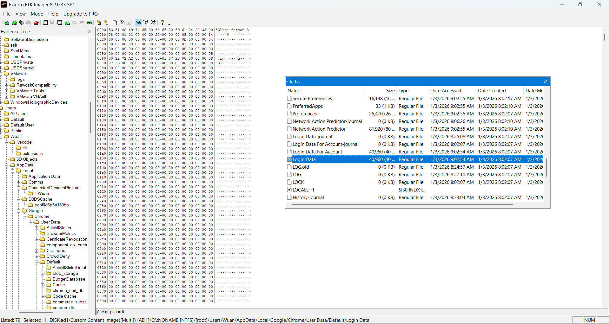
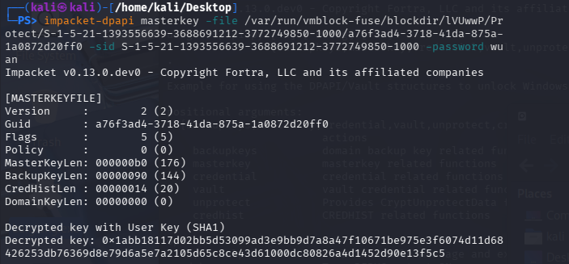
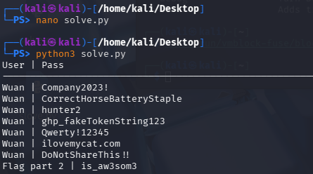
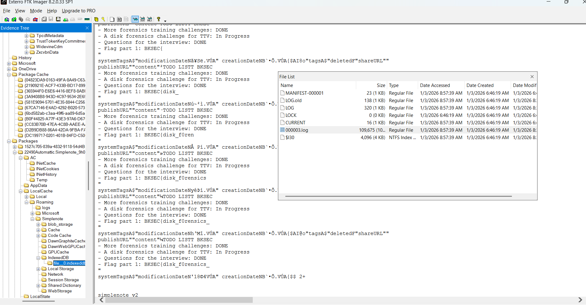

# "disk"ombobulate #

## 1. Analysis ##
* **Given:** a 7z file named `diskombobulate.7z` and a password `toiyeuphunu`, unzip to `DISK1.ad1` 
* **Description:** Đang thưởng thức một tập Sherlock Holmes thì chuông điện thoại reo - một cuộc gọi khẩn từ phòng điều tra. Họ vừa bắt giữ một nghi phạm và thu được ổ cứng của hắn. Theo lời khai ban đầu, nghi phạm đang truy cập một trang web bí mật để nhận nhiệm vụ tiếp theo thì bị ập vào bắt, chưa kịp trở tay. Bằng nghiệp vụ, đồng đội tôi đã lấy được mật khẩu truy cập máy tính của nghi phạm: wuan. Tuy nhiên đồng bọn của y đã can thiệp được vào quá trình điều tra và xóa dữ liệu trên máy. May mắn là tôi vẫn khôi phục được một vài dữ liệu. Chúng tôi cần biết kế hoạch tiếp theo của hắn ta.

"Elementary, my dear Watson" - Sherlock vẫn thường nói vậy. Lần này bạn có thể giúp tôi được không?

* **Hints:**   
    * No hints are given 

## 2. Investigation ##
### THE THIRD FLAG ###
Whenever given an `ad1` file, in my experience, I always look for the `Users\Roaming\Microsoft\Windows\PowerShell\PSReadLine` to check the `Console_history.txt`, in this chal, I did nothing but the same and got the part 3 of the flag:
```bash
pip
pip install sqlite
pip install pycryptodomex
pip install pywin32
python .\decrypt_chrome_password.py
echo _isnt_it?}>fake_flag.txt:flag_part_3
Set-Content -Path .\fake_flag.txt -Stream flag_part_3 -Value "_isnt_it?}"
dir /r
dir /R
wevtutil cl "Microsoft-Windows-PowerShell/Operational"
wevtutil cl "Windows PowerShell"

```
So this is an example about **NTFS Alternate Data Streams (ADS)** which allows files to contain more than one stream of data: 
* When you run the command:
```bash
Set-Content -Path .\fake_flag.txt -Stream flag_part_3 -Value "_isnt_it?}"
```
* Primary Data Stream: By default, when you open a file in a text editor, you are viewing the primary stream (often referred to as $DATA).
* Alternate Stream (-Stream flag_part_3): This command creates a hidden "sidecar" stream attached to fake_flag.txt. The data _isnt_it?} is stored here, separate from the main content.


### THE SECOND FLAG ###

Moreover, with the `console_history.txt`, I acknowledged that the user's intention which is `decrypt_chrome_password` through a python script (The description remind us to find what he's about to do), and all the libs he downloaded by pip: `sqlite`, `pycryptodomex`, `pywin32` will being used for decryption:
* Chrome stores user passwords in a SQLite database.
* These passwords are encrypted using the AES standard, which requires the pycryptodomex library for decryption. 
* The AES Master Key itself is protected by Windows' DPAPI (Data Protection API) mechanism; therefore, the pywin32 library is essential to invoke Windows APIs and retrieve the key.


With some investigations, I knew the password SQLite database is `Login Data` in `Users\Wuan\AppData\Local\Google\Chrome\User Data\Default`:


  
Using DB Browser for SQLite to open, in the `logins` table, we can clearly see that the `username_value` of the website `https://earlybird.bksec.vn/` is `Flag part 2`, while the others is `Wuan`, and next to it is the `password_value` (BLOB)

So we can somehow imagine the users will use the python script to decrypt this blob, and that's what I will do to gain the part 2, however, I used hours and can't find the python script so I decided to write my own. 

But before decrypt the password, I need something called `dpapi masterkey` which could be found with:
1. `dpapi guid` in file `C:\Users\Wuan\AppData\Roaming\Microsoft\Protect\<SID>\`
2. `SID`,since before focusing on this path I spent 2 hours read `.evtx` logs so I knew that Wuan's SID is `S-1-5-21-1393556639-3688691212-3772749850-1000` which you could find in only 5 seconds
3. `user password` which is `wuan` as the description said.

Got all 3 of them, I run my `kali-linux vmware` since it has already install `impacket-dpapi` - a tool use for cracking dpapi:



```shell
impacket-dpapi masterkey -file /var/run/vmblock-fuse/blockdir/lVUwwP/Protect/S-1-5-21-1393556639-3688691212-3772749850-1000/a76f3ad4-3718-41da-875a-1a0872d20ff0 -sid S-1-5-21-1393556639-3688691212-3772749850-1000 -password wuan
Impacket v0.13.0.dev0 - Copyright Fortra, LLC and its affiliated companies 

[MASTERKEYFILE]
Version     :        2 (2)
Guid        : a76f3ad4-3718-41da-875a-1a0872d20ff0
Flags       :        5 (5)
Policy      :        0 (0)
MasterKeyLen: 000000b0 (176)
BackupKeyLen: 00000090 (144)
CredHistLen : 00000014 (20)
DomainKeyLen: 00000000 (0)

Decrypted key with User Key (SHA1)
Decrypted key: 0x1abb18117d02bb5d53099ad3e9bb9d7a8a47f10671be975e3f6074d11d68426253db76369d8e79d6a5e7a2105d65c8ce43d61000dc80826a4d1452d90e13f5c5
```

`DPAPI masterkey`: 1abb18117d02bb5d53099ad3e9bb9d7a8a47f10671be975e3f6074d11d68426253db76369d8e79d6a5e7a2105d65c8ce43d61000dc80826a4d1452d90e13f5c5

This `masterkey` will be used to decrypt DPAPI blobs such as the **Chrome Password** like I mentioned before. 
Here are some more info about the **Chromium encrypt mechanism**:
* **Layer 1 - AES Key (The Asset):**
    * Chrome generates a random AES-256 key used to encrypt all stored passwords.
    * This key is stored in the Local State (JSON) file, within the os_crypt.encrypted_key field.
    * To secure this, Chrome utilizes Windows DPAPI (CryptProtectData). This is why you need the Windows MasterKey (decrypted using the system password, e.g., wuan) to unlock this layer and retrieve the actual AES key.

* **Layer 2 - Password Blob (The Final Data):**
    * Once the AES key is obtained, passwords are encrypted using the AES-256-GCM algorithm.
    * The data stored in the password_value column of the SQLite database is a binary structure (Blob) consisting of:
        * Prefix (3 bytes): Typically v10 or v11.
        * Nonce/IV (12 bytes): A unique Initialization Vector used to ensure cryptographic randomness.
        * Ciphertext: The actual encrypted password content.
        * Auth Tag (16 bytes): An authentication tag used to verify data integrity (a standard feature of GCM mode).

In order to crack the password, we (again) need 3 artifacts:
1. `DPAPI masterkey`
2. file `Local State` in `Wuan\AppData\Local\Google\Chrome\User Data`: This file contains `Chrome AES key`
3. the previous file `Login Data` 

Here my python script to decript the blob:
```python
import os
import json
import sqlite3
import base64
from impacket.dpapi import DPAPI_BLOB
from binascii import unhexlify
from Cryptodome.Cipher import AES

local_state_path = '/var/run/vmblock-fuse/blockdir/nZMsIT/Local State'
login_data_path = '/var/run/vmblock-fuse/blockdir/lNkqGz/Login Data'
masterkey = unhexlify("1abb18117d02bb5d53099ad3e9bb9d7a8a47f10671be975e3f6074d11d68426253db76369d8e79d6a5e7a2105d65c8ce43d61000dc80826a4d1452d90e13f5c5")

def get_encrypted_key(path):
    with open(path, 'r') as f:
        js = json.load(f)
        encrypted_key = base64.b64decode(js['os_crypt']['encrypted_key'])
        return encrypted_key[5:]

def decrypt_creds(key, value):
    try:
        if value.startswith(b'v10') or value.startswith(b'v11'):
            nonce = value[3:3+12]
            ciphertext = value[3+12:-16]
            tag = value[-16:]
            cipher = AES.new(key, AES.MODE_GCM, nonce)
            return cipher.decrypt_and_verify(ciphertext, tag).decode("utf-8")
        else:
            return DPAPI_BLOB.decrypt(value).decode("utf-8")
    except Exception as e:
        return f"[Lỗi giải mã: {e}]"

# 1. Cut the first 5-bytes
key_data = get_encrypted_key(local_state_path)

# 2. Use Master Key to decrypt the real AES Key
enc_key_blob = DPAPI_BLOB(key_data)
localstate_key = enc_key_blob.decrypt(masterkey)

conn = sqlite3.connect(login_data_path)
cursor = conn.cursor()
cursor.execute('SELECT username_value, password_value FROM logins')

print(f"{'User':} | {'Pass'}")
print("-" * 80)

for row in cursor.fetchall():
    user, enc_pass = row
    if enc_pass:
        password = decrypt_creds(localstate_key, enc_pass)
        print(f"{user:} | {password}")

conn.close()
```



`Flag part 2: is_aw3som3`

### THE FIRST FLAG ###
So there is 5 apps downloaded in the `Users\Wuan\Downloads` which are: `VsCode`,`python3-13`,`git`,`chrome`, `simple note`, in previous phase, we acknowledged that the user used almost every of them including `chrome`, `vscode`, ... and only `SimpleNote` that I didnt see before (an interesting part is in the description, the author has said "Elementary, my dear Watson" indicates something simple ???), therefore I pretty sure the last part is somewhere in SimpleNote data.

At first I wasted so many more times reading garbage file and folder, and then after quiet a few times a finally found this folder `Wuan\AppData\Local\Packages\22490Automattic.SimpleNote_9h07f....`

After more quite a few times I finally got the last part in `file__0.index`:


`Flag part 1: BKSEC{d1sk_f0rensics_`

## 3. Solution ##
1. **Result:** The flag is `BKSEC{d1sk_f0rensics_is_aw3som3_isnt_it?}`